## 入门

### bit

8 bit = 1 byte;

32 bit = 4 bytes = 1 word;

一个 8 进制数字等于 2 进制的 3 bit，一个 16 进制的数字等于 2 进制的 4 bit，所以常用两个 16 进制数字表示一个 byte。

32 为机器的每个地址都用 32 bit，也就是 1 word 来表示，前后两个地址相差的单位是 byte

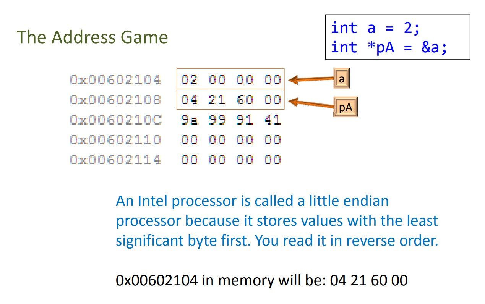


### hello world

```c
#include<stdlib.h> //system需要
#include<stdio.h> //printf需要

int main(){
    printf("hello world\n"); //不会自动换行
    system("pause");

    return 0;
}
```

system()用来调用其他语言。

### 预处理指令

以`#`开头的指令都是预处理指令，这是在程序编译前就由编译器进行的工作。

#### include

用于引入头文件。系统的头文件用`<>`包围，编译器会直接到系统库中寻找，自己写的头文件用`""`包围，编译器会现在当前目录寻找，然后再去系统库中寻找。还可以在双引号中指定引用的头文件路径。

#### define宏定义

```c
#include<stdio.h> //printf需要

#define PI 3 //PI是常量
int main(){
    int i;
    i = Pi*2;
	//Pi = 2;错误，常量不能修改
    printf("PI=%d",PI);
    printf("i=%d",i);
    return 0;
}
```

visual studio中右键单击对应的项目，选择“属性”选项，将“预处理到文件”设置为“是”，这样就可以开启预编译了。这样编译之后会有一个`.i`文件，打开后如图所示：

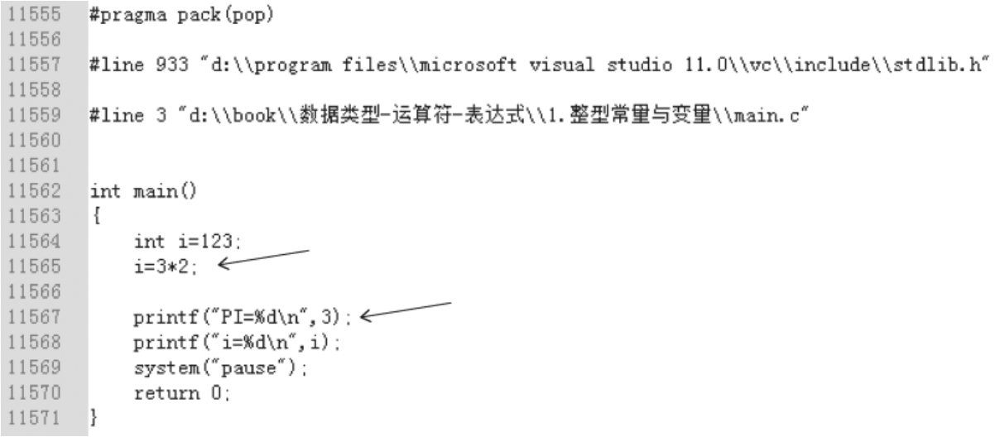

可以发现define已经不存在，这是因为预处理时会消除所有的define。同时我们用define将PI定义为3，编译器在预处理后会把代码中出现的所有常量PI都替换为3，所以PI是常量，不可修改。

`#define a b`称为对象式宏，作用是由编译器在预处理时将程序中所有的宏名a全部替换成值b。对象式宏的作用是在一个地方统一管理常量，在需要的时候可以将常量替换，比如指定数组长度的时候。下面这段计算班级平均分的程序：

```c
#include <stdio.h>

#define Numbers 10 //班级的人数，可以随时改变
int main(){
    double sum = 0.0;
    for (int i = 1; i <= Numbers; i ++) {
        double x = 0.0;
        printf("输入第%d名学生的成绩: ", i);
        scanf("%.2f", &x);
        sum += x;
    }
    printf("平均分是: %.2f", sum/Numbers);
    return 0;
}
```

宏也可以定义表达式，需要括起来：`#define RECIPROCAL_OF_PI (1.0f/3.14)`

宏也可以带参数，称为函数式宏，相当于简单的函数。不过宏的比函数更好的地方是没有参数类型限制：

```c
#define MAX(x,y) ((x)>(y)?(x):(y))
#define IS_EVEN(n) ((n)%2==0)
#define PR_INT(n) printf("%d\n", n) //简化繁琐的代码

#define getchar() getc(stdin) //这是stdio.h里的getchar源码
```

因为编译器的原因，宏定义中的参数、运算符都需要放在括号中，以防止出现错误。

如果函数式宏要替换为多个表达式，使用逗号表达式 `a,b`，会按顺序判断a和b，所得结果为对b进行判断的结果。

宏定义可以包含两个专用的运算符：#和##。编译器不会识别这两种运算符，它们会在预处理时被执行。#运算符将宏的一个参数转换为字符串字面量，只有函数式宏可以使用。下面代码的 3/2 被变成字符串字面量和后面的字符串合在一起被输出了。

```c
#define PR_INT(n) printf(#n" =%d\n", n)
//调用
PR_INT(3/2) //输出：3/2 =1
```

##运算符可以将两个记号（如标识符）“粘合”在一起，成为一个记号。（无需惊讶，##运算符被称为“记号粘合”。）如果其中一个操作数是宏参数，“粘合”会在形式参数被相应的实际参数替换后发生。

```c
#define ID(n) id##n
int ID(1), ID(2), ID(3);
//预处理后变成
int i1, i2, i3
```

#define的作用域为自#define那一行起到源程序结束。如果要终止其作用域可以使用#undef命令：`#undef 标识符`

#### 预定义宏

C语言有一些预定义宏，每个宏表示一个整数常量或字符串字面量。这些宏提供了当前编译或编译器本身的信息。

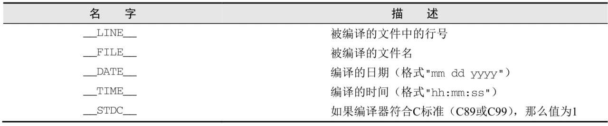

### 数据类型能表示的数值范围

C语言没有规定 int、double等数据类型占用的字节数，而是交给编译器自己实现，只是规定了 long 大于等于 int、int 大于等于 short 等。

编译器在 `<limits.h>`头文件中以宏定义的形式定义了字符型以及其他整型所能表示的数值范围。下面为 <limits.h> 头文件的内容：

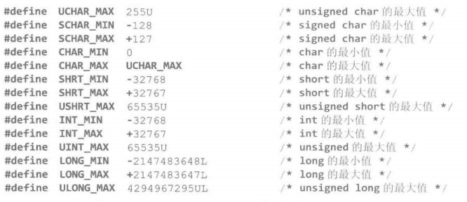

通过查看这些宏的值，就可以知道自己的编译器中各数据类型所能表示的数值范围。

### 命名空间

C语言中的命名空间不同，就可以使用相同的标识符。命名空间有四类：

1. 标签名label
2. 小标签名tag
3. 成员名
4. 一般性标识符

```c
int main(){
    struct x{ //tag
        int x; //成员名
        int y;
    }x; //变量名
    x: //label，break和goto使用的
    	x.x = 1; //变量名.成员名
    	x.y = 5; //变量名.成员名
    return 0;
}
```

### / 和 % 运算

当/运算符和%运算符的操作数是负数时，规则十分复杂。有的编译器认为：`-9 / 7为-1且-9% 7为-2`，有些认为：`-9 / 7为-2且-9% 7为5`。

这是因为c89只要求编译器满足：`(a / b) * b + a% b的结果总是等于a`，上面的两种编译器都可以满足。在第一种情况下，(-9 / 7) * 7 + -9%7的值为-1 × 7+ -2= -9；在第二种情况下，(-9 / 7) * 7 + -9% 7的值为-2 × 7+5= -9。

c99出现后有了统一，因为大多数编译器会对除法向0取整，所以第一种情况成为了C99的标准。

### 比较运算符

比较运算符的优先级都要低于算术运算符但是大于赋值运算符，而比较运算符中 `==` 是优先级最低的。所以下面程序的运行结果是：

```c
int i,j,k;
i=2;j=3;
k = i*j==6;
printf("%d\n", k); //1
```

比较运算符返回的结果是int类型的值 0 或 1。因为 0 或 1 也可以参与比较，所以比较运算符可以连续使用：

```c
int n = 20;
printf("%d", 1 < n < 10); //1
```

因为 1 < 5，所有返回 1，然后 1 再和 10 比较，最终返回 1。可以上面表达式的并不能用来判断 n 是否在 [1, 10] 。

### printf()

%d 以十进制输入整型，%o、%x 以八进制、16进制输出整型。%x和%X的区别前者输出小写的数字abcde，后者输出大写。
%#x和%x都是输出16进制整数，前者还会加上前缀：0x。
如果想要输出 `%d`，就再加一个%，写成`%%d`
%ld：输出长整型数据。
%md:m为指定的输出字段的宽度。如果数据的位数小于m，则左端补以空格，若大于m，则按实际位数输出。如果是浮点数，小数点也算一个宽度。
%-md:-靠左对齐，默认是靠右对齐。
%u：输出无符号整型(unsigned)。
%c：用来输出一个字符。
%f：用来输出实数，包括单精度和双精度。但是double型变量用 “%f” 精度会降低。而且在scanf中，double型变量只能用 `%lf`，不能使用 `%f`，因为double是8字节的，float是4字节的，所以%f 不够存放double。
%.mf：输出实数时小数点后保留m位，注意m前面有个点。默认是小数点后6位。看下面的代码：因为浮点型数据存储的是近似值，所以不能直接判断它是不是2.3。最标准的写法是“如果它跟2.3相差非常非常小，那么就可以近似是2.3”。

```c
#include <stdio.h>
#include <math.h>
int main() {

    //判断 i 的值是不是2.3
    //因为浮点数精度的问题，只要 i 和 2.3 的差值精确到小数点后6位就行。
    float i = 2.3;
    if(abs(i - 2.3) < 0.000001) { //abs()返回绝对值
        printf("i equals 2.3");
    } else {
        printf("i not equals 2.3");
    }
    return 0;
}
```

### scanf()

scanf 很容易出错，比如

```c
scanf("input:%d", &age);
```

我们必须先输入 input: 然后再输入数字才能被程序读取到。因为scanf的所有非输入控制符也必须被原样输入，就像printf的所有非控制输出符都会被原样输出。

所以，scanf中双引号内除了“输入控制符”之外不要加任何“非输入控制符”，比如想要输入两个整数：`scanf("%d%d",&i,&j);`使用两个%d即可。

但是需要注意的是，虽然scanf中没有加任何“非输入控制符”，但是从键盘输入数据时，给多个变量赋的值之间一定要用空格、回车或者Tab键隔开，用以区分是给不同变量赋的值。而且空格、回车或Tab键的数量不限，只要有就行。一般都使用一个空格。

看下面的程序：

```c
int main() {
    int i;
    char j;
    scanf("%d", &i);
    printf("i = %d\n", i);
    scanf("%c", &j);
    printf("j = %c\n", j);
    return 0;
}
```

运行结果：

```
a
i = 0
j = a
```

在scanf中，从键盘输入的一切数据，不管是数字、字母，还是空格、回车、Tab等字符，都会被当作数据存入缓冲区。存储的顺序是先输入的排前面，后输入的依次往后排。按回车键的时候scanf开始进入缓冲区取数据，从前往后依次取。

但scanf中%d只识别“十进制整数”。对%d而言，空格、回车、Tab键都是区分数据与数据的分隔符。当scanf进入缓冲区中取数据的时候，如果%d遇到空格、回车、Tab键，那么它并不取用，而是跳过继续往后取后面的数据，直到取到“十进制整数”为止。对于被跳过和取出的数据，系统会将它从缓冲区中释放掉。未被跳过或取出的数据，系统会将它一直放在缓冲区中，直到下一个scanf来获取。但是如果%d遇到字母，那么它不会跳过也不会取用，而是直接从缓冲区跳出。所以上面这个程序，虽然scanf进入缓冲区了，但用户输入的是字母a，所以它什么都没取到就出来了，变量 i 输出了默认的初始值0。而因为a还在缓冲区中，当遇到%c，就被取出来了。

### 输入缓冲区

所有从键盘输入的数据，不管是字符还是数字，都是先存储在内存中的一个缓冲区，叫作“键盘输入缓冲区”，简称“输入缓冲区”或“输入流”。我们先来看一个程序：
```c
# include ＜stdio.h＞

int main(void)
{
    int a, b, c;

    scanf("%d", &a);
    printf("a = %d\n", a);

    scanf("%d", &b);
    printf("b = %d\n", b);

    scanf("%d", &c);
    printf("c = %d\n", c);

    return 0;
}
/＊
    在VC++ 6.0中的输出结果是：
    --------------------------------------
    1
    a = 1
    2
    b = 2
    3
    c = 3
    --------------------------------------
    1 2 3
    a = 1
    b = 2
    c = 3
    --------------------------------------
＊/
```

从输出结果可以看出，不管是一个一个地输入：1（回车）2（回车）3（回车）；还是三个数字一次性输入：1（空格）2（空格）3（回车），这两种输入方法的结果都是一样的。原因就是从键盘输入的数据都会被依次存入缓冲区，不管是数字还是字符都会被当成数据存进去。但只有按回车，scanf才会进去取数据，所取数据的个数取决于scanf中“输入参数”的个数。因此不在于怎么输入，我们可以存一个取一个，也可以一次性全存入进去，然后一个个取。

那么一次性全存进去scanf是怎么取的呢？这就好比开闸放水，我们将水一次性全部放到闸里以后，开一次闸就放掉一点，开一次闸就放掉一点，直到放光了为止。开闸的动作就相当于调用一次scanf，开闸的开关就是回车；每开一次闸放掉多少水，取决于scanf中“输入参数”的个数。

所以，首先我们输入的数据是放在输入缓冲区中的，先输入的排在最前面，后输入的依次往后排。如果scanf中“输入参数”的个数只有一个，那么我们调用一次scanf就把缓冲区中离出口最近的一个数据输出给scanf，也就是把排在最前面的一个数据输出给scanf。输出后，缓冲区中就没有这个数据了。如果scanf中“输入参数”的个数为n，那么就从排在最前面的开始，依次往后取n个数据输出给scanf。没取完的仍旧放在缓冲区中，直到取用完毕为止。如果缓冲区中的数据全被取完了，但还有scanf要取数据，那就要再从键盘输入数据。

#### %d和%c的区别

但是我们需要注意的是，对于%d，在缓冲区中，空格、回车、Tab键都只是分隔符，不会被scanf当成数据取用。%d遇到它们就跳过，取下一个数据。但是如果是%c，那么空格、回车、Tab键都会被当成数据输出给scanf取用，例如下面这个程序：

```c
# include ＜stdio.h＞
int main(void)
{
    int a, c;
    char b;

    scanf("%d%c%d", &a, &b, &c);

    printf("a = %d, b = %c, c = %d\n", a, b, c);

    return 0;
}
/＊
    在VC++ 6.0中的输出结果是：
    --------------------------------------
    1 5 6
    a = 1, b =   , c = 5
    --------------------------------------
    1
    5 6
    a = 1, b =
    , c = 5
    -------------------------------------
    1         5         6
    a = 1, b =          , c = 5
    -------------------------------------
    1a6
    a = 1, b = a, c = 6
    -------------------------------------
＊/
```

原本我们希望的是将数字1赋给变量a，将字符'5'赋给变量b，将数字6赋给变量c。但从输出结果可以看出，按一下回车，scanf开始到缓冲区中取数据，因为“输入参数”有三个，所以scanf从缓冲区中取三个数据。数字1赋给变量a，而因为变量b是%c，所以前三种情况分别将空格、回车和Tab键赋给变量b，然后数字5赋给变量c，而数字6仍然在缓冲区中，等待下一个scanf来取。这样的话就会有一个问题，我们看下面这个程序：

```c
# include ＜stdio.h＞

int main(void)
{
    int a;
    char i;

    while (1)
    {
        printf("请输入一个数字：");
        scanf("%d", &a);
        printf("a = %d\n", a);
        printf("您想继续吗(Y/N):");
        scanf("%c", &i);

        if ((' Y' == i) —— (' y' == i))
        {
            ;
        }
        else
        {
            break;  // 跳出本层循环体
        }
    }

    return 0;
}
    /＊
    在VC++ 6.0中的输出结果是：
    --------------------------------------
    请输入一个数字：10
    a = 10
    您想继续吗(Y/N):
    --------------------------------------
    ＊/
```

当我们输入“10”之后希望系统问：“您想继续吗(Y/N):”，然后输出“Y”就再重新输入一个值，然后输出，否则就跳出本循环体。但是执行的时候我们发现，刚按完“10”然后回车，直接就结束了，都不给我们输入“Y”和“N”的机会，这是为什么？

因为输入“10”然后回车，“10”赋给了a，但是回车遗留在了缓冲区，所以等下面又遇到“scanf("%c", &i); ”的时候就直接把字符'\n'赋给变量i了（注意，按回车不是把回车符'\r'存到缓冲区，而是把换行符'\n'存进去了，因为按回车确实就是换行）。字符'\n'明显不等于字符'Y'，所以直接break跳出本层循环体。

那么该怎么办呢？方法有两个：第一，既然不想将字符'\n'赋给变量i，那么就先定义一个字符变量ch，然后用scanf将字符'\n'取出来给变量ch，这样就有机会输入“Y”或者“N”了；第二，直接清空输入缓冲区。

#### 用 scanf 吸收回车

```c
# include ＜stdio.h＞

int main(void)
{
    int a;
    char i;
    char ch;
    while (1)
    {
        printf("请输入一个数字：");
        scanf("%d", &a);
        printf("a = %d\n", a);

        printf("您想继续吗(Y/N):");
        scanf("%c", &ch);  //用scanf吸收回车
        scanf("%c", &i);

        if ((' Y' == i) —— (' y' == i))
        {
            ;
        }
        else
        {
            break;  // 跳出本层循环体
        }
    }
    return 0;
}
    /＊
    在VC++ 6.0中的输出结果是：
    ------------------------------------------
    请输入一个数字：10
    a = 10
    您想继续吗，Y想，N不想：Y
    请输入一个数字：5
    a = 5
    您想继续吗，Y想，N不想：Y
    请输入一个数字：333
    a = 333
    您想继续吗，Y想，N不想：N
    ------------------------------------------
    ＊/
```

这时有人说，如果缓冲区前面排了三个字符'\x20'（空格），我都不需要，想先把它们取出来，那是不是要先定义三个变量呢？当然不是！存储不需要的垃圾字符只需要一个变量即可，因为它们都是垃圾，所以直接覆盖就行了。取一个后，再取一个就把第一个覆盖，再取一个就再覆盖。

但是在实际编程中我们一般不会用scanf吸收回车，也不会用scanf给一个字符变量赋值，因为有更简单的方法，就是用getchar()。getchar()是专门从缓冲区读取一个字符的函数。它是“吸收回车专业户”，简单、方便、好用。

#### getchar()

这个函数的功能是从缓冲区中读取一个字符，非常好用。

```c
# include ＜stdio.h＞

int main(void)
{
    int a;
    char ch;

    while (1)
    {
        printf("请输入一个数字：");
        scanf("%d", &a);
        printf("a = %d\n", a);

        printf("您想继续吗(Y/N):");
        getchar();   /＊用getchar吸收回车，简单、方便、好用，都不需要定义变量用来存储获
            取的回车符＊/
            ch = getchar();  //用getchar从缓冲区中读取一个字符赋给字符变量ch

        if ((' Y' == ch) —— (' y' == ch))
        {
            ;
        }
        else
        {
            break;  // 跳出本层循环体
        }
    }

    return 0;
}
    /＊
    在VC++ 6.0中的输出结果是：
    --------------------------------------
    请输入一个数字：10
    a = 10
    您想继续吗(Y/N):y
    请输入一个数字：5
    a = 5
    您想继续吗(Y/N):y
    请输入一个数字：333
    a = 333
    您想继续吗(Y/N):n
    --------------------------------------
    ＊/
```

在程序中，“ch=getchar(); ”这句之前我们先用getchar()清空缓冲区，然后重新从键盘输入一个字符。同样，必须按回车getchar()才会进去取这个字符。这时候需要注意的是，同scanf一样，按的这个回车也会被遗留在缓冲区中，大家要注意。

这时有人会说，如果前面有多个scanf给int型变量赋值，那么每个scanf都会遗留一个回车，那这时是不是有几个scanf就要用几个getchar()呢？不需要，仍然只需要一个getchar()！这是为什么呢？我们前面说过，当scanf用%d取缓冲区数据的时候，如果遇到空格、回车或Tab键就跳过去。那么被跳过去的这些空白符去哪了呢？系统会如何处置它们呢？它们是不是还在缓冲区中呢？事实上，这些被跳过去的空白符都被释放了。所以假如前面有三个scanf给int型变量赋值，那么第一个scanf输入回车后把回车遗留在了缓冲区，而第二个scanf取值时会越过第一个scanf遗留在缓冲区中的回车，那么这个回车就会从缓冲区中释放。但第二个scanf取完值后也在缓冲区中留下了一个回车，而当第三个scanf到缓冲区中取值时会跳过第二个scanf遗留的回车，这个回车同样也会从缓冲区中释放，所以归根结底最后缓冲区中只有一个回车，也就是说，缓冲区中永远不可能遗留多个回车。

下面的程序可以证明：

```c
# include ＜stdio.h＞

int main(void)
{
    int a, b, c, d;
    char ch;

    printf("请输入第一个数：");
    scanf("%d", &a);

    printf("请输入第二个数：");
    scanf("%d", &b);
    printf("请输入第三个数：");
    scanf("%d", &c);

    printf("您想继续吗(Y/N):");

    getchar();  //只需要用一个getchar吸收回车

    ch = getchar();  //用getchar获取一个字符赋给ch
    if ((' Y' == ch) —— (' y' == ch))
    {
        printf("请输入密码：");
        scanf("%d", &d);
        printf("恭喜成功获得密码%d\n", d);
    }

    return 0;
}
    /＊
    在VC++ 6.0中的输出结果是：
    --------------------------------------
    请输入第一个数：1
    请输入第二个数：2
    请输入第三个数：3
    您想继续吗(Y/N):y
    请输入密码：5678
    恭喜成功获得密码5678
    ------------------------------------
    ＊/
```

这时有人会说，从键盘给三个int变量赋值用一个scanf不就行了吗？为什么要用三个scanf呢？这里我只是给大家演示一下，目的不是用三个scanf给三个int变量赋值，而是为了讲述“缓冲区中永远不可能遗留多个回车”。因为在实际编程中，在同一个程序中经常会有多个scanf，而且还不能写在一起，这时我们吸收回车时只需要一个getchar()即可。

注意，上面讲述了如何吸收回车，但是并不是任何时候我们都需要吸收回车。那么到底什么时候才需要这么做呢？我们知道，当用%d获取输入流中的数据的时候，如果遇到字符（空格、回车、Tab除外），则直接从输入流中退出来，什么都不取。但如果是用%c获取，那么任何数据都会被当作一个字符。所以如果你要从输入流中取一个字符，但在之前使用过scanf，那么此时就必须要先用getchar()吸收回车。否则取到的将不是你想要的字符，而是scanf遗留在输入流中的回车。但是，如果你要从输入流中取的不是字符，那就不需要用getchar()吸收回车了。

此外还有一点在这里跟大家说一下。后面讲字符串的时候会讲到字符数组的赋值，给字符数组赋值时可以用scanf，也可以用gets或fgets。这时候问题就是，在用这三个函数给字符数组赋值的时候，如果之前使用过scanf，那么：

1）当使用scanf给字符数组赋值时，之前scanf遗留的回车对其不会产生影响，所以无需吸收回车。因为用scanf将从键盘输入的字符转化为字符串时，输入的内容是以第一个非空白符开始，直到下一个空白符之间的全部字符。空白符指的是空格、回车、Tab键。

2）但是如果使用gets或fgets给字符数组赋值，那么之前scanf遗留的回车将会被它们取出并赋给字符串，并且只能取到这个回车，不再有机会从键盘输入想要的字符串。所以当使用gets或fgets给字符数组赋值时，如果前面使用过scanf，那么必须先用getchar()将回车吸收。这点大家先了解一下，gets和fgets函数稍后再讲。

上面详细分析了什么时候需要吸收回车，什么时候不需要。但是在实际编程中，程序往往很长，我们很难预测到下一次到缓冲区中取数据的是%d还是%c或者是gets()、fgets()。所以为了避免忘记吸收回车或耗费精力考虑回车的问题，习惯上scanf后面都加上getchar()。

####  fflush(stdin)

前面介绍了使用getchar()吸收回车的方法，除此之外还有一个更强大、更直接的方法，就是直接将输入缓冲区全部清空。那么如何清空缓冲区呢？加一句fflush(stdin)即可。fflush是包含在文件stdio.h中的函数。stdin是“标准输入”的意思。std即standard（标准）, in即input（输入），合起来就是标准输入。fflush(stdin)的功能是：清空输入缓冲区。

```c
# include ＜stdio.h＞

int main(void)
{
    int a;
    char i;

    while (1)
    {
        printf("请输入一个数字：");
        scanf("%d", &a);  //因为读取的是数字，所以不需要清空缓冲区
        printf("a = %d\n", a);

        printf("您想继续吗，Y想，N不想：");
        fflush(stdin);
        scanf("%c", &i);

        if (' Y' ==i —— ' y' ==i)
        {
            ;
        }
        else
        {
            break;  // 跳出本层循环体
        }
    }

    return 0;
}
    /＊
    在VC++ 6.0中的输出结果是：
    ------------------------------------------
    请输入一个数字：10safa
    a = 10
    您想继续吗，Y想，N不想：Y
    请输入一个数字：58jlkj\＊&＊＊^
    a = 58
    您想继续吗，Y想，N不想：N
    ------------------------------------------
    ＊/
```

但是使用fflush(stdin)吸收缓冲区遗留的回车有一点“杀鸡用牛刀”的感觉，我们用getchar()足以应付。所以fflush一般用于清除用户前面遗留的垃圾数据，提高代码的健壮性。因为如果是我们自己编程的话，我们一般都会按要求输入。但对于用户而言，难免会有一些误操作，多输入了一些其他没有用的字符，如果程序中不对此进行处理的话往往会导致程序瘫痪。所以我们在编程的时候一定要考虑到各种情况，提高代码的健壮性和容错性。使用fflush就可以将用户输入的垃圾数据全部清除。

但是fflush有一个问题，就是可移植性。并不是所有的编译器都支持fflush，比如gcc就不支持。那么此时怎么办？还是用getchar()。但是getchar()一次不是只能吸收一个字符吗？我们怎么知道用户会胡乱输入多少个字符呢？就算知道，难道用户胡乱输入100个垃圾字符，我们就要用100个getchar()吗？这个问题问得很好，下面给大家推荐一个getchar()的高级用法：

```c
    while (getchar() ! = ' \n' )
    {
        ;
    }
```

如果想省事的话可以直接将分号写在while那行的后面。这种用法其实我们在前面也使用过，它可以完全代替fflush(stdion)来清空缓冲区。不管用户输入多少个没用的字符，他最后都得按回车，而且只能按一次。只要他按回车那么回车之前的字符就都会被getchar()取出来。只要getchar()取出来的不是回车（' \n'）那么就会一直取，直到将用户输入的垃圾字符全部取完为止。这里再次强调一下，从键盘按回车不是将回车符'\r'放到了缓冲区中，而是将换行符'\n'放到了缓冲区中，因为回车本身就是换行。

### 布尔类型

c89没有定义布尔类型，常用的办法是声明int变量，将其赋值为0或1。或者使用宏定义，常见下面的代码：

```c
#define TRUE 1
#define FALSE 0
#define BOOL int
int main(){
    BOOL flag = TRUE;
    if(flag){
        ......
    }
}
```

长期缺乏布尔类型的问题在C99中得到了解决。C99提供了_Bool型，所以在C语言的这一版本中，布尔变量可以声明为：`_Bool flag;`。

\_Bool变量实际上就是整型变量；但是和一般的整型不同，\_Bool只能赋值为0或1。一般来说，往_Bool变量中存储非零值会导致变量赋值为1。`_Bool flag = 5; //flag实际值为1`。

除了\_Bool类型的定义，C99还提供了一个新的头<stdbool.h>，这使得操作布尔值更加容易。该头提供了bool宏，用来代表\_Bool。如果程序中包含了<stdbool.h>，可以这样写：`bool flag; //same as _Bool flag;`。<stdbool.h>头还提供了true和false两个宏，分别代表1和0。

### getchar()和putchar()

C语言还提供了另外一些读/写单个字符的方法。可以使用getchar函数和putchar函数来取代scanf函数和printf函数。putchar函数用于写单个字符：`putchar(ch)`

每次调用getchar函数时，它会读入一个字符并将其返回。事实上，getchar函数返回的是一个int类型的值。因此，可以用一个int变量存储getchar函数读取的字符。

执行程序时，使用getchar函数和putchar函数（胜于scanf函数和printf函数）可以节约时间。getchar函数和putchar函数执行速度快有两个原因。第一个原因是，这两个函数比scanf函数和printf函数简单得多，因为scanf函数和printf函数是设计用来按不同的格式读/写多种不同类型数据的。第二个原因是，为了额外的速度提升，通常getchar函数和putchar函数是作为==宏==来实现的。

getchar函数对于搜索字符的循环和跳过字符的循环都很有用。C语言常见这样的代码：

```c
while(getchar()!='\n'){
    ...
}
```

### typedef类型定义

前面我们使用#define指令创建了一个宏，可以用来定义布尔型数据：`#define Bool int`。但更好的方法是使用类型定义：`typedef int Bool;`注意这回要把int写在Bool前面。

采用typedef定义Bool会导致编译器在它所识别的类型名列表中加入Bool。现在，Bool类型可以和内置的类型名一样用于变量声明、强制类型转换表达式和其他地方了。

```c
//类型定义可以让程序更好理解
typedef double Dollars;
Dollars balance = 899.9;
```

类型定义是编写可移植程序的一种重要工具。程序从一台计算机移动到另一台计算机可能引发的问题之一就是不同计算机上的类型取值范围可能不同。为了更大的可移植性，可以考虑使用typedef定义新的整数类型名。

```c
typedef long Integer; //16位机器上
typedef int Integer; //32位机器上
Integer i = 10000;
```

可惜的是，这种技术无法解决所有的问题，比如使用printf函数和scanf函数，还是要修改%ld和%d。

### 数组

1. 数组不需要new，`int a[10]`，在指定了大小之后就自动开辟了空间。

2. 不能在数组变量之间赋值，例如有 a 、b 两个数组，不能令 a = b。因为数组名本质是一个 const 指针。

3. 索引越界不报错，内存中有什么就输出什么。


C语言数组初始化的格式和Java一样，如果初始化式比数组短，那么数组中剩余的元素赋值为0。利用这一特性，可以很容易地把数组初始化为全0。

```c
int a[10] = {1,2,3,4} //相当于{1,2,3,4,0,0,0,0,0,0}
int b[10] = {0} //全为0
```

Java的int数组元素会被默认初始化为0，C语言的数组如果没有初始化，那么编译器不会赋予默认值。

```c
int a[10]; //没有默认值
printf("%d", a[0]); //不知道是什么值
```

C99还提供了为某几个索引元素赋值，其他元素全部使用默认赋值的方法：

```c
int a[10] = {[3]=10, [8]=24};
```

括号中的数字称为指示符。这样处理稀疏数组比较方便。

二维数组可以用花括号嵌套花括号的方式初始化，也可以用C99的方式。其他规则和一维数组一样，没有初始化的元素默认为0。二维数组的行大小可以省，列的大小不能省。比如 `int a[][3] {{1}, {2}, {3}}`是一个 3行3列的数组，每行第一个元素指定了，其他元素被默认初始化为0。

==注意：C语言数组索引越界不会报错。==

数组作为函数的参数时，应该有两个参数，一个是数组名，另一个是数组长度。因为我们在main函数中使用数组时，可以使用 sizeof(a)/sizeof(a[0]) 来获得数组的长度，但如果数组作为参数，传入的只是一个地址，32位程序的地址都是4个字节，所以 sizeof(a) 永远都是4，我们不能得到数组的长度。因此才必须要一个额外的参数，来传入数组的长度。看下面的代码：

```c
#include <stdio.h>

int getArrayLength(int []);
int main() {
    int a[10];
    getArrayLength(a);

    return 0;
}

int getArrayLength(int a[]) {
    printf("the length of array is %d", sizeof(a));
}
```

结果是：

```
warning: 'sizeof' on array function parameter 'a' will return size of 'int *'
the length of array is 8
```

### 变长数组

C89数组的初始化大小只能是常量，不能用变量，除非使用`#define`。C99提供了使用变量为数组初始化大小的方式，称为变长数组。

```c
int n;
n = 10;
int a[n];
printf("%d\n", sizeof(a)/sizeof(a[0])); //10
n = 20;
printf("%d\n", sizeof(a)/sizeof(a[0])); //还是10，虽然n变为20
```

==注意：变长数组是指用整型变量或表达式声明或定义的数组，而不是说数组的长度会随时变化，变长数组在其生存期内的长度同样是固定的。==

### sizeof

C语言不能用 array.length 得到数组长度，需要使用sizeof()函数。此函数可以获取入参占用的内存大小。注意sizeof是一个运算符，编译器本身就能确定它的值，`sizeof num` 和 `sizeof(num)` 都可以，加括号只是为了清晰。

```c
int data[4];
int length;
length = sizeof(data)/sizeof(a[0]); //数组占用总空间除以单个元素占用空间

int a[][3] = {{1},{1},{1}};
    //整个二维数组的大小 / 二维数组第一行的大小
    for(int i = 0; i < sizeof(a)/sizeof(a[0]); i ++) {
        //一行的大小 / 一个元素的大小
        for(int j = 0; j < sizeof(a[0])/sizeof(a[0][0]); j ++) {
            printf("%d ", a[i][j]);
        }
        printf("\n");
    }

//但是通过传递数组名到函数中获取长度是不行的
int getLength(int a[]){
    int length;
    length = sizeof(a)/sizeof(a[0]); //错误，结果永远是2(在64位机)
    return length;
}
/*因为，a是函数参数，到了本函数中，a只是一个指针（地址，系统在本函数运行时，是不知道a所表示的地址有多大的数据存储空间，这里只是告诉函数：一个数据存储空间首地址），所以，sizoef(a)的结果是指针变量a占内存的大小，64位机上是8个字节。a[0]是int类型，sizeof(a[0])是4个字节，所以，结果永远是2。*/
```

### const

const用来声明常量，比Java的final效果更强，可以用在数组上。Java的数组声明为final之后可以修改元素，但是C语言就不能修改了。

### 存储期和作用域

程序中声明的变量不是从程序开始到结束都一直有效的，变量也有生命周期，体现为存储期这个概念。

在代码块内部声明的变量也只在代码块内部存活，被赋予了**自动存储期**，程序在执行到对象声明的时候就创建出了相应的对象，而执行到了代码块的结尾，此对象就会消失，这种变量保存在栈中。自动存储期的变量称为自动变量，使用auto声明，但常常省略。

在函数中使用 static 定义的对象，或者在函数外面声明的变量都被赋予**静态存储期**，它们在程序开始执行的时候，也就是main函数执行之前的准备阶段被创建出来，在程序结束的时候消失。这种变量保存在静态存储区中。

同时变量有作用域的概念，局部变量有**块作用域**，只能在代码块内部访问。而全局变量有**文件作用域**，可以在整个.c 文件中访问。

```c
#include <stdio.h>

static int fx = 0; //静态存储期 + 文件作用域（全局变量）

void func(){
    static int sx = 0; //静态存储期 + 块作用域
    int ax = 0; //自动存储期 + 块作用域（局部变量）
    
    printf("%3d,%3d,%3d\n", ax++, sx++, fx++);
}

int main(){
    //printf("%d\n", fx); //可以直接访问全局变量，因为有文件作用域
    //printf("%d\n", sx); //不能直接访问sx，因为它是局部变量
    puts(" ax sx fx");
    puts("--------");
    for(int i = 0; i < 10; i ++){
        func();
    }
    puts("--------");
    return 0;
}
//cosole:
 ax sx fx
--------   
  0,  0,  0
  0,  1,  1
  0,  2,  2
  0,  3,  3
  0,  4,  4
  0,  5,  5
  0,  6,  6
  0,  7,  7
  0,  8,  8
  0,  9,  9
--------
```

注意上面的 `static int sx = 0;`这个变量只在第一次调用函数时定义并初始化，此后再次调用时不再定义和初始化。

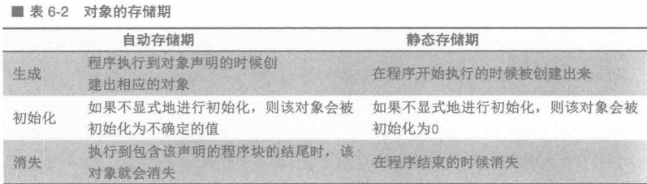

虽然全部变量保存在静态存储区中，但是它仍然可以使用static修饰，而且有没有static修饰的全局变量是不一样的。用static修饰全局变量时，会限定全局变量的作用范围，使它的作用域仅限于本文件中。这个是使用static修饰全局变量的主要目的。那么不用static修饰，全局变量不也是只能在本文件中使用吗？这么说不完全对，因为虽然全局变量的作用范围不会自己主动作用到其他文件中，但不代表其他文件不会使用它。如果不用static进行修饰，那么其他文件只需要用extern对该全局变量进行一下声明，就可以将该全局变量的作用范围扩展到该文件中。但是当该全局变量在定义时用static进行修饰后，那么其他文件不论通过什么方式都不能访问该全局变量。

而且如果一个项目的多个.c文件中存在同名的全局变量，那么在编译的时候就会报错，报错的内容是“同一个变量被多次定义”。但是如果在这些全局变量前面都加上static，那么编译的时候就不会报错。因为用static修饰后，这些全局变量就只属于各自的.c文件了，它们是相互独立的，所以编译的时候就不会发生冲突而产生“多次定义”的错误。所以使用static定义全局变量是非常有用的，因为当一个项目中有很多文件的时候，重名不可避免。这时候只要在所有的全局变量前面都加上static就能很好地解决这个问题。定义全局变量时用static进行修饰可以大大提高代码的质量。不过最好还是少使用全局变量。

#### auto和register

在函数中通过存储类说明符 auto 或者 register 声明的变量也被赋予自动存储期。`int x = 0;`这样的表达式默认添加了 auto ，所以 auto 显得多余了。而使用 register 定义的变量 `register int x = 0;`在编译的过程中，不是保存在内存中，而是保存在cpu的高速寄存器中。但是寄存器数量有限，所以也不是绝对的，cpu会自动决定存放位置，所以 register 用处也不大了。

#### static 的作用

static 关键字有三种用法：

- static 修饰局部变量 - 静态局部变量
- static 修饰全局变量 - 静态全局变量
- static 修饰函数 - 静态函数

在函数内部定义的变量，如果希望在函数结束后还可以保存的话，就定义为静态局部变量。最常见的用法就是在用一个静态局部变量保存函数的调用次数。

全局变量拥有文件作用域，它可以被访问的范围从定义处开始到文件结尾，但是并不是说出了这个文件就不能访问全局变量了，因为它有外部链接属性，即全局变量的作用域是整个工程。

比如 `#include <stdio.h>`之后，再使用 extern 声明，就可以访问stdio.h 文件里的全局变量了。（其实函数默认就是extern的，所以引用外部文件的函数时不需要使用extern声明）但是如果用 static 修饰全局变量，就会使得全局变量失去外部链接属性，变成内部链接属性，即只能在自己的文件中使用，所以 static 修饰的全局变量时，只能在自己的 .c 文件中使用。

函数默认是有外部链接属性的，但是被 static 修饰后，会使得函数失去外部链接属性，变成内部链接属性。所以 static 修饰的函数只能在自己所在的 .c 文件内部使用，不能在其他文件中使用。和 static 修饰全局变量 很像。

## 进阶

### 函数原型

C语言函数的语法和Java一样，但是去掉了权限修改符。而且C语言函数的定义应该在调用之前，也就是main( )的前面，因为C语言的编译器都是从上到下来依次编译的。其实函数的定义也可以放在调用处后面，这样编译器在处理到调用点的时候，不知道此函数有多少形式参数，形式参数的类型是什么，也不知道函数的返回值是什么类型。但是，编译器不会报错，而是假设此函数返回int型的值（函数返回值的类型默认为int型）。我们可以说编译器为该函数创建了一个隐式声明（implicit declaration）。如果当编译器编译到函数定义处时，发现真正的返回值类型是double，就会给出错误信息。

所以最好不要把函数定义放在调用后面。幸运的是，C语言提供了一种更好的解决办法：在调用前声明每个函数。函数声明（function declaration）使得编译器可以先对函数进行概要浏览，而函数的完整定义以后再给出。函数声明类似于函数定义去掉了花括号，就像Java的抽象方法一样。这种函数声明还有个专业名字：函数原型（function prototype）。**顺便提一句，函数原型不需要说明函数形式参数的名字，只要显示它们的类型就可以了，在大的项目中，为了防止参数名被宏替换了，通常不指定名字。**不过个人项目为了清晰，还是不要省略的好。

更进一步，C语言的函数原型甚至可以不写形参，这样编译器会在第一次调用这个函数的时候来判断参数类型。

```c
int add(int x, int y); //函数声明,不写参数名也行：int add(int, int);
int main(){
    printf("%d\n", add(1,2));
    return 0;
}
int add(int x, int y){
    return x + y;
}
```

数组经常被用作参数。当形参是一维数组时，可以不说明数组的长度。不过如果需要在函数中遍历数组时，最好还是把数组的长度作为额外的参数提供进来，因为C语言没有简便的办法确定数组的长度，而数组索引越界又不会报错。==虽然前面介绍了用 sizeof 获取数组长度的办法，但是它无法给出关于数组型形式参数的正确答案==，具体原因见指针。

```c
//数组元素求和的函数
int sum(int a[], int n){
    int sum = 0;
    for(int i = 0; i < n; i ++){
        sum += a[i];
    }
    return 0;
}

int main(){
    int a[100] = {...}; //初始化了长度为100的数组
//虽然将数组的长度传入了函数，但是编译器无法检测这个长度是否正确
//所以我们可以对有100个元素的数组的前50个元素求和
    printf("%d", sum(a, 50));
    //也可以在使用时在初始化数组，和就java一样
    int result = sum((int []){1,2,3,4,5}, 5);
}
```

C语言大多数参数传递的方式都是值传递，但是数组是引用传递。值传递和引用传递的根本区别在于是否创建了副本，Java全都是值传递。

### 指针变量

计算机都将内存分割为字节（byte），每个字节可以存储8位的信息。每个字节都有唯一的地址（address），用来和内存中的其他字节相区别。

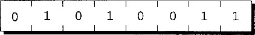

可执行程序由代码（原始C程序中与语句对应的机器指令）和数据（原始程序中的变量）两部分构成。程序中的每个变量占有一个或多个字节内存，把第一个字节的地址称为是变量的地址。下图中，变量i占有地址为2000和2001的两个字节，所以变量i的地址是2000：

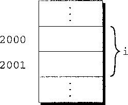

这就是指针的出处。虽然用数表示地址，但是地址的取值范围可能不同于整数的范围，所以一定不能用普通整型变量存储地址。但是，可以用特殊的指针变量（pointer variable）存储地址。在用指针变量p存储变量i的地址时，我们说p“指向”i。换句话说，指针就是地址，而指针变量就是存储地址的变量。

对指针变量的声明与对普通变量的声明基本一样，唯一的不同就是必须在指针变量名字前放置星号：

```c
int *p1; //p是指向int类型对象的指针变量
int* p2; //这种Java风格的也行
```

### &和*

为使用指针，C语言提供了一对特殊设计的运算符。为了找到变量的地址，可以使用`&`（取地址）运算符。如果x是变量，那么&x就是x在内存中的地址。为了获得对指针所指向对象的访问，可以使用`*`（间接寻址）运算符。如果p是指针，那么*p表示p当前指向的对象。

初始化指针变量的方法是使用&运算符把某个变量的地址赋给它。甚至可以把i的声明和p的声明合并，但是需要首先声明 i ：

```c
#include <stdio.h>

int main(){
    int i, *p = &i;
    i = 100;
    printf("i的地址是：%p\n", p); //000000000061FE14
    printf("%d\n", i==*p); //1
    printf("%d", &i==p); //1

}
```

可以把`*`和`&`想象成逆运算，同时使用二者相当于直接使用原始变量：`j = *&i; //same as j = i`。

两个指针之间可以互相赋值，这样它们就指向了同一个变量。

```c
int i, *p = &i;
int* q;
q = p; //两个指针都指向了变量 i。别写成*q = *p，这相当于两个指针指向的变量互相赋值
```

### 指针作为参数

指针作为函数的参数就可以直接操作原始变量，方法是：声明函数的形参为指针，同时实参需要传入变量的地址。

```c
//交换两个变量值的函数
void swap(int *p1, int *p2)
{
    int temp = *p1;
    *p1 = *p2;
    *p2 = temp;
}
int main()
{
    int i = 10;
    int j = 20;
    swap(&i, &j);
    printf("i = %d, j = %d", i, j);
}
```

用指针作为函数的实际参数实际上不新鲜，前面在scanf函数调用中使用过了。

```c
int i, j, *p=&j;
scanf("%d", &i); //读取输入为i赋值
scanf("%d", p); //读取输入为j赋值，因为p的值就是j的地址
```

使用register声明的寄存器对象，不能使用取地址符&。

#### 用const保护参数

当调用函数并且把指向变量的指针作为参数传入时，通常会假设函数将修改变量（否则，为什么函数需要指针呢？）。例如，如果在程序中看到语句`f(&x)`，大概是希望f改变x的值。但是，f仅需要检查x的值而不是改变它的值也是可能的。指针可能高效的原因是：如果变量需要大量的存储空间，那么传递变量的值会浪费时间和空间。

可以使用单词const来表明函数不会改变指针参数所指向的对象。const应放置在形式参数的声明中，后面紧跟着形式参数的类型说明：

```c
void f(const int *p){
    *p = 0; //wrong,可以使用值，但不能改变
    int j;
    p = &j; //这是可以的
}
```

这一用法表明p是指向“常整数”的指针。试图改变*p，编译器会报错。注意：==此用法说明不能改变指针p指向的整数，但是并不阻止f改变p自身。==

### 指针作为返回值

```c
//当给定指向两个整数的指针时，下列函数返回指向两整数中较大数的指针。
int *max(int *a, int *b){
    return *a>*b?a:b;
}
//调用max函数时，用指向两个int类型变量的指针作为参数，并且把结果存储在一个指针变量中
int main(){
    int i=10, j=20, *p;
    p = max(&i, &j);
    printf("%d", *p); //20
}
```

### 指针和数组

可以声明一个数组并让指针指向数组中的一个元素，然后可以进行指针算术运算使其移动。指针支持三种算术运算：加上整数、减去整数、两个指针相减。

可以用关系运算符（<、<=、>和>=）和判等运算符（==和!=）进行指针比较。只有在两个指针指向同一数组时，用关系运算符进行的指针比较才有意义。比较的结果依赖于数组中两个元素的相对位置。

```c
int a[] = {1,2,3,4,5};
int *p = &a[0]; //指针指向第一个元素
int *q = &a[5]; //指向最后一个元素
p += 1; //指针加一，现在指向第二素
p = q - 1; // p指针指向q前面一个元素
int i = q - p; //i is 1。两个指针相减时，结果为指针之间的距离，并不是
printf("%d\n", p < q); //1
```

==在一个不指向任何数组元素的指针上执行算术运算会导致未定义的行为。此外，只有在两个指针指向同一个数组时，把它们相减才有意义。==.

C99可以用指针指向一个匿名的数组：`int *p = (int []){1,2,3,4};`。p指向此匿名数组的第一个元素。

指针的算术运算是数组和指针之间相互关联的一种方法，但这不是两者之间唯一的联系。下面是另一种关键的关系：**可以用数组的名字作为指向数组第一个元素的指针。**这种关系简化了指针的算术运算，而且使数组和指针更加通用。

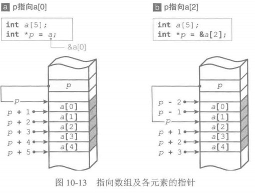

```c
int a[10];
*a = 7; //a[0] = 7
*(a+3) = 7; //a[3] = 7
```

> a + i等同于&a[i]（两者都表示指向数组a中元素i的指针），并且*(a+i)等价于a[i]（两者都表示元素i本身）。但是数组指针不能改变，比如a++，a+=3。

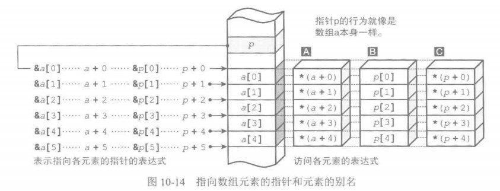

数组和指针的这种关系可以用来遍历数组：

```c
int a[N], *p; //初始化略
for(int i = 0, p = a; i < N; i ++){
    sum += p[i] //可以把指针当成数组的别名
}
for(p = &a[0]; p <= &a[N-1]; p++){
    sum += *p;
}
//or
for(p = a; p < a + N; p ++){
    sum += *p;
}
```

大多数情况下可以使用数组名代替指向数组的指针，但是不同点是不可以对数组名是用赋值运算符（数组名相当于一个const 的指针），而指向数组的指针却可以指向另一个数组：

```c
int *p, x[5];
p = x; //ok

int a[5], b[5];
a = b; //wrong
```

### 数组作为参数

C语言中数组作为实参时不是值传递，而是传入了数组第一个元素的指针，这样可以优化内存。但是这样就可以在数组内部改变数组本身了，如果不想改变数组本身，只想访问，可以加上const。

```c
int max(const int a[], int n){
    int max = a[0];
    for(int i = 0; i < n; i ++){
        if(a[i] > max){
            max = a[i];
        }
    }
    return max;
}
int main(){
    int a[10];//初始化略
    max = max(a, 10);
}
```

声明a是指针就相当于声明它是数组。编译器把这两类声明看作是完全一样的。`void f(int a[]) 和 void f(int *a)`完全一样。

多维数据作为形参，可以省略相当于开头下标的n维的元素个数。但是（n-1）维之下的元素个数必须使用常量：

```c
void fun1(int v[], int n); //元素类型为int, 个数为n
void fun2(int v[][3], int n); //元素类型为int[3]，个数为n
void fun3(int v[][2][3], int n);//元素类型为int[2][3], 个数为n
```

所接受的元素类型必须固定，但元素的个数是自由度。

### 指针和二维数组

二维数组在内存中是按行主序存储的，先是0行的元素，接着是1行的，依此类推。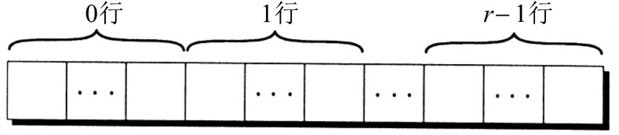

使用指针时可以利用这一布局特点。如果使指针p指向二维数组中的第一个元素（即0行0列的元素），就可以通过重复自增p的方法访问数组中的每一个元素。

```c
int a[r][c], *p;
for(int i = 0; i < r; i ++){
    for(int j = 0; j < c; j ++){
        printf("%d\n", a[i][j]);
    }
}
//等同于
for(*p = &a[0][0]; p <= &a[r-1][c-1]; p ++){
    printf("%d\n", *p);
}
```

虽然上面这种写法是可行的，但是破坏了程序的可读性，而且在执行速度上没有什么优势。

处理二维数组的一行中的元素，该怎么办呢？对于任意的二维数组a来说，由于表达式a[i]是指向第i行中第一个元素（元素0）的指针，所以这样就行：`p = a[i];// p指向二维数组的第i行`

```c
//将数组的第二列所有元素变为0
int a[row][col], *p;
for(p = &a[0]; p < &a[row]; p ++){
    (*p)[1] = 0;
}
```

这里把p声明为指向长度为 col 的整型数组的指针。在(\*p)[i]中，\*p是需要使用括号的；如果没有括号，编译器将认为p是指针数组，而不是指向数组的指针。表达式p++把p移到下一行的开始位置。在表达式(\*p)[i]中，\*p代表a的一整行，因此(\*p)[i]选中了该行第i列的那个元素。(\*p)[i]中的括号是必要的，因为编译器会将\*p[i]解释为*(p[i])。

就像一维数组的名字可以用作指针一样，无论数组的维数是多少都可以采用任意数组的名字作为指针。但是，需要特别小心。思考下列数组：`int a[row][col];`

a不是指向a[0][0]的指针，而是指向a[0]的指针。从C语言的观点来看，这样是有意义的。C语言认为a不是二维数组而是一维数组，且这个一维数组的每个元素又是一维数组。用作指针时，a的类型是int (*)[col]（指向长度为col的数组的指针）。

### 字符串

字符串字面量底层是一个字符数组，并在末尾添加一个空字符。空字符是一个所有位都为0的字节，因此用转义序列`\0`表示。例如，字符串字面量"abc"是作为有4个字符的数组来存储的`a、b、c和\0`。

> 注意不要混淆空字符（'\0'）和零字符（'0'）。空字符的码值为0，而零字符码值(ASCII)为48。

既然字符串字面量是作为数组来存储的，那么编译器会把它看作是char *类型的指针。例如，printf函数和scanf函数都接收char *类型的值作为它们的第一个参数。

#### 字符数组与指针

一起来比较一下下面这两个看起来很相似的声明：

``` c
char data[]= "june 14";
char *p = "june 14";
```

前者声明date是一个数组，后者声明date是一个指针。正因为有了数组和指针之间的紧密关系，才使上面这两个声明中的date都可以用作字符串。尤其是，任何期望传递字符数组或字符指针的函数都能够接收这两种声明的date作为参数。

然而，需要注意，不能错误地认为上面这两种date可以互换。两者之间有很大的差异：

>在声明为数组时，就像任意数组元素一样，可以修改存储在date中的字符。在声明为指针时，date指向字符串字面量，而字符串字面量是不可以修改的。
>
>在声明为数组时，date是数组名。在声明为指针时，date是变量，这个变量可以在程序执行期间指向其他字符串。

如果希望可以修改字符串，那么就要建立字符数组来存储字符串，声明指针变量是不够的。

#### 字符串的读写

使用printf函数来写字符串是很容易的。读字符串却有点麻烦，主要是因为输入的字符串可能比用来存储它的字符串变量长。为了一次性读入字符串，可以使用scanf函数或gets函数，也可以每次读入一个字符。

printf函数不是唯一一个字符串输出函数。C函数库还提供了puts函数，此函数可以按如下方式使用：`puts(str);`puts函数会自动换行。

转换说明%s允许scanf函数把字符串读入字符数组：`scanf("%s", str);`不需要在str前添加运算符&，因为str是数组名，编译器在把它传递给函数时会把它当作指针来处理。

调用时，scanf函数会跳过空白字符，然后读入字符并存储到str中，直到遇到空白字符为止。scanf函数始终会在字符串末尾存储一个空字符。所以用scanf函数读入字符串永远不会包含空白字符。因此，scanf函数通常不会读入一整行输入。换行符、空格符或制表符会使scanf函数停止读入。为了一次读入一整行输入，可以使用gets函数。

gets函数不会在开始读字符串之前跳过空白字符（scanf函数会跳过）。gets函数会持续读入直到找到换行符才停止（scanf函数会在任意空白字符处停止）。此外，gets函数会忽略掉换行符，不会把它存储到数组中，用空字符代替换行符。

下面的代码展示了scanf和gets的区别：

```c
char sentence[N];
printf("Enter a sentence: \n");
scanf("%s", sentence);
//或
gets(sentence);
//用户输入：To C, or not to C: that is the question.
```

scanf函数会把字符串"To"存储到sentence中。下一次scanf函数调用将从单词To后面的空格处继续读入这行。而gets函数会把字符串 `To C, or not to C: that is the question.` 全部存起来。

#### 访问字符串中的字符

字符串是以数组的方式存储的，因此可以使用下标来访问字符串中的字符。例如，为了对字符串s中的每个字符进行处理，可以设定一个循环来对计数器i进行自增操作，并通过表达式s[i]来选择字符。

```c
int count_spaces(const char s[]){
    int count = 0;
    for(; *s != '\0'; s ++){
        if(*s == '\0'){
            count ++;
        }
    }
    return count;
}
```

字符串数组作为形参时不需要第二个参数指定长度了，因为可以用空字符的位置来确定长度。

#### 字符串库

C语言提供了string.h 库。有下面的一些常用函数：

```c
#include <string.h>
char* strcpy(char *s1, const char *s2); //把字符串s2复制给字符串s1。
strncpy(str1, str2, n); //将str2前n个字符复制到str1

strlen(str1); //返回字符串的长度。如果参数时数组，返回的不是数组本身的长度，只是其中保存的字符串长度

char* strcat(char *s1, const char *s2); //字符串拼接
strncat(str1, str2, n); //将str2的前n个字符拼接到str1上

int strcmp(const char* str1, const char* str2); //比较字符串大小,返回一个大于0、小于0、等于0d
```

### 动态内存分配 malloc()


### 枚举enum

枚举表示了所有可用值的集合。下面的animal被称为枚举名，后面的Dog等是枚举常量，各枚举常量依次赋值0、1、2、3。枚举常量的数据类型是int，所以返回值类型是 enum animal 的函数可以直接返回一个int，为了明确，也可以强制转换：

```c
enum animal {Dog, Cat, Monkey, Invalid};

enum animal select(int number){
    //return number;
    return (enum animal)number;
}
int main(){
    enum animal selected = 1;
    if(selected < Invalid){
        printf("你选择了一个正确的动物！");
    }
}
```

### 结构

结构是可能具有不同类型的值（成员）的集合，就像是Java类中的field。

```c
struct {
    int id;
    char name[20];
    int sex;
} stu1, stu2;
struct {
    int id;
    char name[20];
    char class[20];
} teacher1, teacher2;
```

上面的第一个结构变量有三个field，同时有两个实例化的变量 stu1, stu2。结构的成员在内存中是按照声明的顺序存储的。

每个结构代表一种新的作用域。任何声明在此作用域内的名字都不会和程序中的其他名字冲突。（用C语言的术语可表述为，每个结构都为它的成员设置了独立的名字空间（namespace）。）

结构变量也可以在声明的同时进行初始化，把待存储到结构中的值的列表准备好并用花括号把它括起来。初始化式中的成员数可以少于它所初始化的结构，就像数组那样，未被初始化的成员默认值为0，字符数组默认是空字符。

```c
struct {
    int number;
    char name[20];
} part1 = {1001, "Tom Jack"}, 
  part2 = {.number = 1002, .name = "Mary Rose"};

printf("%s\n", part1.name);
//结构可以使用 = 赋值
part1 = part2; //这样两个变量的field就一样了
```

上面代码中使用了指定初始化：`.fieldName = value`，就像python的关键词参数一样。

上面代码中的struct都是匿名的，只能在定义时指定要使用的变量数量，无法再增加。但是也可以为struct添加一个名字，就可以再需要的时候自己添加新的struct变量。起名的方式有两种：

```c
//第一种起名方式:结构标记
struct student {
    int number;
    char name[20];
};
//变量类型要加上struct
struct student stu1;

//第二种起名方式:类型别名
typedef struct {
    int number;
    char name[20];
} teacher;
//变量类型不需要加上struct
teacher tea1;
```

结构作为参数都是值传递，内存开销很大，最好把参数设置成结构指针。

```c
struct student {
    int number;
    char name[20];
};
int getNumber(struct student *stu){
    //return (*stu).number;
    return stu -> number;
}
int main(){
    struct student xiaoming = {1001, "小明"};
    printf("%d\n", getNumber(xiaoming));
    return 0;
}
```

在指针前加上解引用符就代表了指针指向的对象，所以`*stu`就代表了要操作的结构对象，因为 `*` 的优先级低于 `.` ，所以要把 *stu 括起来。

C语言提供了 `->`，称为访问运算符，可以轻松的访问指针指向的对象成员。

### 程序编译过程

gcc编译一个程序的过程，主要包括四个过程。1）预处理（Pro-Processing）。2）编译（Compiling）。3）汇编（Assembling）。4）链接（Linking）生成可执行程序文件。

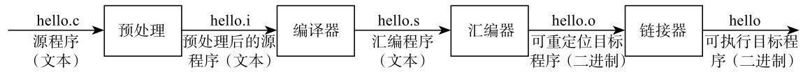

1）第一步是预处理，将源程序.c文件预处理成．i文件。预处理实际上是将头文件和宏进行展开。被预处理后的源程序还是文本文件。

2）第二步是调用对应语言的编译工具对预处理过的源程序进行编译，生成一个．s汇编程序，它还是一个文本文件。

3）.s文件经过第三步汇编器进行汇编后，就生成.o目标文件（VC++ 6.0中的.obj文件）。这个目标文件就是二进制文件了，通常将它称为可重定位目标文件。为什么称为可重定位目标文件呢？因为.o文件中代码的地址是从0开始的。如果程序要运行的话，它的地址肯定不能从0开始，所以需要重新定位，重新分配地址，将它定位成在内存中可以运行的程序。这个任务是由链接器完成的。

4）最后一步链接就是对.o文件进行重新定位，将里面的代码、数据重新定位到内存中的某个地址，这样文件就可以执行了。所以链接是将.o文件链接成可执行文件。在编译大型项目的时候，往往会有多个.c文件，经过前面几个步骤就会生成多个.o文件，这时通过链接就可以将它们链接到一起，从而生成一个可执行文件。如果程序比较小，只有一个.c文件，那么就只会生成一个.o文件，并将这个.o文件单独链接成可执行文件。然后将可执行文件加载到内存，或者说复制到内存后即可运行。

