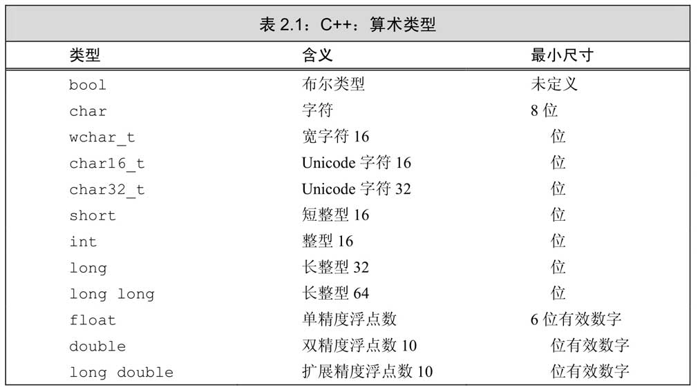

## 基础

### Hello World

```cpp
#include <iostream>
int main(){ //每个.cpp文件都要有一个main(),其返回值类型必须是int
    
    int v1, v2;
    std::cin>>v1>>v2;
    std::cout<<"你输入的数字是："<<v1<<"和"<<v2<<std::endl;
    return 0; //返回值用来只是状态，0表示成功。
    //非0的返回值含义由系统确定，通常用来指出错误类型。
    //一般返回-1就表示出错了
}
```

c++没有定义任何IO语句，但是提供了一个全面的标准库来提供IO机制。通常使用<iostream>库，此库包含两个基础类型istream 和 ostream，分别表示输入流和输出流。

标准库定义了4个IO对象。为了处理输入，我们使用一个名为 cin 的 istream 对象。这个对象也被称为标准输入（standardinput）。对于输出，我们使用一个名为cout 的 ostream 对象。此对象也被称为标准输出（standard output）。标准库还定义了其他两个ostream对象，名为cerr和clog（发音分别为see-err和see-log）。

endl 是一个被称为操纵符（manipulator）的特殊值。写入endl的效果是结束当前行，并将与设备关联的缓冲区（buffer）中的内容刷到设备中。

前缀std：：指出名字cout和endl是定义在名为std的命名空间（namespace）中的。命名空间可以帮助我们避免不经意的名字定义冲突，以及使用库中相同名字导致的冲突。标准库定义的所有名字都在命名空间std中。`::`称为作用域运算符。如果加一行`using namespace std`，就不同在输入`std::`了。

通过输入运算符（>>）我们将数据读入到了整型变量中，这里比Java 和 Python 都方便。Python 读取的都是字符串类型，Java 要通过 nextInt( ) 等方法明确要读取的数据类型。

include 用来引入外部的文件，标准库文件用 <> 包起来，自定义的头文件用双引号包起来，例如：`#include "myClass.h"`，头文件通常以 .h 结尾，其实用 .cpp 也可以。

c++ 可以对运算符进行重载。例如：我们有一个抽象产品类和他的两个对象，通过重载 "+" 运算符，obj1 + obj2 就能得出产品的总销售额。

### 基本数据类型



C++数据类型和C差不多，最显著的特点是提供了bool类型，使用true和false来表示真假，比C99通过宏定义的_Bool类型方便多了。

C语言的字符串是字符数组，操作数组处处受限，即不能使用`=`赋值，也没有索引越界提示，也不保存字符串长度，每次都要使用strlen()计算。C++提供了string类型，cin/cout可以直接读写string类型，但不能读写字符数组。string类型还可以使用 + 拼接，再也不需要strcat()了。

#### 中文字符

C++提供了几种字符类型，基本的字符类型是char，可以放一个ASCII码。如果想保存中文，需要拓展字符集，如wchar_t、char16_t、char32_t。wchar_t类型用于确保可以存放机器最大扩展字符集中的任意一个字符，类型char16_t和char32_t则为Unicode字符集服务（Unicode是用于表示所有自然语言中字符的标准）。

#### unsigned

除去布尔型和扩展的字符型之外，其他整型可以划分为带符号的（signed）和无符号的（unsigned）两种。带符号类型可以表示正数、负数或0，无符号类型则仅能表示大于等于0的值。默认都是带符号的。**当一个算术表达式中既有无符号数又有int值时，那个int值就会转换成无符号数。**

#### 进制

0b开头的整数代表二进制数，以0开头的整数代表八进制数，以0x或0X开头的代表十六进制数。Python 是0b、0o、0x。

整型字面值具体的数据类型由它的值和符号决定。默认情况下，十进制字面值是带符号数，八进制和十六进制字面值既可能是带符号的也可能是无符号的。十进制字面值的类型是int、long和long long中尺寸最小的那个（例如，三者当中最小是int），当然前提是这种类型要能容纳下当前的值。八进制和十六进制字面值的类型是能容纳其数值的int、unsigned int、long、unsignedlong、long long和unsigned long long中的尺寸最小者。

### 变量

C++定义了几种不同的初始化形式。比如下面几条语句都可以初始化一个变量：

```cpp
int num = 10;
int num = {10};
int num{10};
int num(10);
```

作为C++11的新标准，用花括号来初始化变量得到了全面应用，这种形式称为**列表初始化**。

#### 声明和定义的关系

为了允许把程序拆分成多个逻辑部分来编写，C++支持分离式编译（separate compilation）机制，该机制允许将程序分割为若干个文件，每个文件可以独立编译。

为了支持分离式编译，C++将声明和定义区分开来，声明使得名字为程序所知，一个文件如果想要使用别处定义的名字则必须包含对那个名字的声明。而定义负责创建与名字关联的实体。

### struct和class

C++除了支持struct还支持class。C++不需要再使用typedef的方式定义一个struct了，因为C++引入了using namespace，所以定义结构体不用再写struct了。

C++的struct除了field，还可以有成员函数。一个项目，一般使用struct定义纯数据类型，只包含较少的辅助函数，而用class定义较为复杂的类型。而且struct也可以有构造器等。

C++中的 struct 和 class 基本是通用的，唯有几个细节不同：

1. 使用 class 时，类中的成员默认都是 private 属性的；而使用 struct 时，结构体中的成员默认都是 public 属性的。
2. class 继承默认是 private 继承，而 struct 继承默认是 public 继承。
3. class 可以使用模板，而 struct 不能。

```cpp
#include <iostream>
using namespace std;

struct Point
{
    int x, y;
    //构造器
    //参数添加了默认值，相当于java的无参构造
    //this是指向当前对象的指针，this -> x 相当于 (*this).x
    Point(int x = 0, int y = 0)
    {
        this->x = x;
        this->y = y;
    }
    //Point(int x = 0, int y = 0): x(x), y(y) {}
};

//运算符重载
Point operator + (const Point &A, const Point &B)
{
    return Point(A.x + B.x, A.y + B.y);
}

int main()
{
    Point a, b(1,2); //相当于Java的 a = new Point(); b = new Point(1,2);
    a.x = 3;
    a = a + b;
    cout<<"Point a is : ("<<a.x<<","<<a.y<<")"<<endl;
    return 0;
}
```

### 参数引用传递

Java的参数都是值传递，但是C++支持引用传递，只要在形参前面加上`&` 即可。

C++的引用功能比指针弱，但是减少了出错的可能，其实引用就是变量的别名。

```cpp
#include<iostream>
using namespace std;
//交换两个变量数值的函数
void swap(int& x, int& y) {
	x = x ^ y;
	y = x ^ y;
	x = x ^ y;
}
int main() {
	int a = 1;
	int b = 2;
	cout << "交换前" << "a=" << a << endl;
	cout << "交换前" << "b=" << b << endl;
	swap(a, b);
	cout << "交换后" << "a=" << a << endl;
	cout << "交换后" << "b=" << b << endl;
	return 0;
}
```

```cpp
#include <iostream>
//将字符串转为大写
void toUpperCase(std::string &s){
    for(int i = 0; i < s.length(); i ++){
        if(s[i]>='a'&&s[i]<='z'){
            s[i] -= 32;
        }
    }
}
int main(){
    std::string hello = "hello world";
    toUpperCase(hello);
    std::cout<<hello<<std::endl;
    return 0;
}
```

### 函数模板

这东西的作用和Java里的泛型差不多。

```cpp
#include <iostream>
using namespace std;

template <typename T> //模板
T add(T x, T y){
    return x + y;
}
template <typename T> //模板，每个用到的函数前都要声明
T multi(T x, T y){
    return x * y;
}

int main(){
    int a = 1, b = 2;
    double c = 2.0, d = 2.0;
    cout<<add(a,b)<<'\t'<<multi(c,d)<<endl;
    return 0;
}
```

