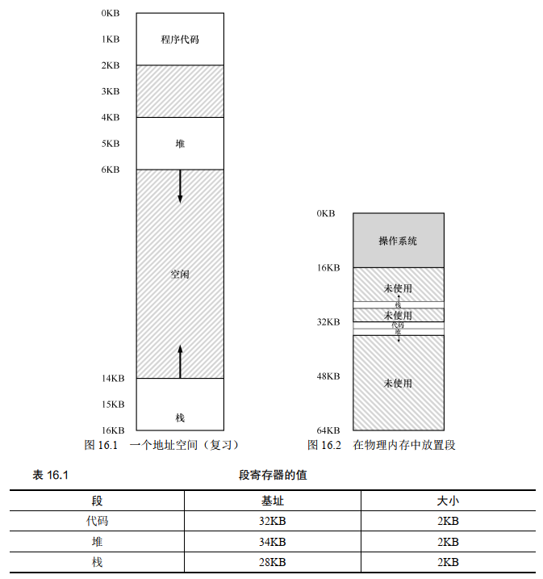
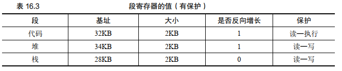
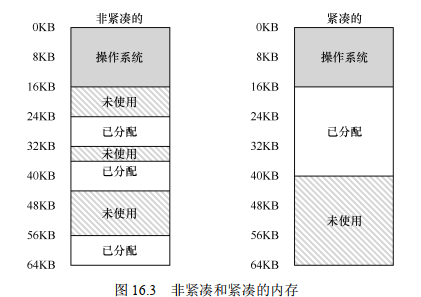
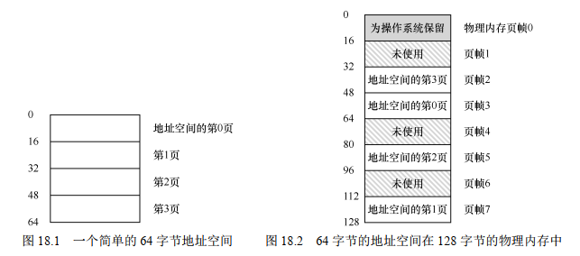

## 概述

大部分计算机有两种运行模式：`内核态`和`用户态`，软件中最基础的部分是`操作系统`，它运行在`内核态`中，内核态也称为`管态`和`核心态`，它们都是操作系统的运行状态，只不过是不同的叫法而已。操作系统具有硬件的访问权，可以执行机器能够运行的任何指令。软件的其余部分运行在`用户态`下。


`用户接口程序(shell或者GUI)`处于用户态中，并且它们位于用户态的最低层，允许用户运行其他程序，例如Web浏览器、电子邮件阅读器、音乐播放器等。而且，越靠近用户态的应用程序越容易编写，如果你不喜欢某个电子邮件阅读器你可以重新写一个或者换一个，但你不能自行写一个操作系统或者是中断处理程序。这个程序由硬件保护，防止外部对其进行修改。

操作系统与运行操作系统的内核硬件关系密切。操作系统扩展了计算机指令集并管理计算机的资源。因此，操作系统因此必须足够了解硬件的运行。

虚拟化（virtualization）、并发（concurrency）和持久性（persistence）。这是操作系统的 3 个关键概念。通过学习这 3 个概念，我们将理解操作系统是如何工作的，包括它如何决定接下来哪个程序使用 CPU，如何在虚拟内存系统中处理内存使用过载，虚拟机监控器如何工作，如何管理磁盘上的数据。

通过虚拟化CPU、虚拟化内存，好像一个进程在独占CPU和内存一样。多个进程同时运行，会涉及到上下文切换、资源竞争等问题，操作系统有大量的底层机制和高级策略应对并发导致的问题。IO往往成为程序运行的的瓶颈，操作系统会使用缓冲区、碎片整理等操作加速IO。

## 虚拟化CPU

### 受限直接执行

一个进程占用CPU开始运行时，操作系统就无法控制CPU了。怎么确保这个进程不会做一些危害计算机的事情，同时怎么确保这个进程不会一直占用CPU不放手？OS提供了受限直接执行机制来解决这个问题。

受限直接执行（limited direct execution）是实现 CPU 虚拟化的关键底层机制。基本思路很简单：就让你想运行的程序在 CPU 上运行，但首先确保设置好硬件，以便在没有操作系统帮助的情况下限制进程可以执行的操作。

进程启动时首先运行在用户模式，这一模式有很多限制。例如，在用户模式下运行时，进程不能发出 I/O 请求。这样做会导致处理器引发异常，操作系统可能会终止进程。与用户模式不同的内核模式（kernel mode），操作系统（或内核）就以这种模式运行。在此模式下，运行的代码可以做它喜欢的事，包括特权操作，如发出 I/O 请求和执行所有类型的受限指令。

OS 首先（在启动时）设置陷阱处理程序（trap table）并启动时钟中断，然后仅在受限模式下运行进程，以此为 CPU 提供防护。当一个进程想要进入内核模式时，它可以进行的操作都会受到陷阱表的限制。通过设置陷阱表，操作系统可以决定是继续运行进程还是切换其他进程。

当然如果OS想实现强制的进程切换还需要硬件的支持，硬件提供时钟中断，使得CPU的控制权重新回到OS手中。

### 调度策略

OS的底层机制是实现进程切换的保证，但具体要如何切换进程还取决于OS的调度策略。OS X为系统动画赋予了更高的调度优先级，使得系统看起来更加流畅。

首先定义 $T_{周转时间} = T_{完成时间} - T_{到达时间}$。假设有三个任务a、b、c同时到达，每个任务需要10秒运行时间，那么第10秒a运行完成，第20秒b运行完成，第30秒c运行完成，平均的周转时间是 $(10 + 20 + 30)/3 = 20$秒。

同样是上面的例子，这次a任务运行时间需要100秒，如果还是FIFO的策略，平均的周转时间是 $(100 + 110 + 120)/3 = 110$秒。显然因为a运行的时间太长，b、c不得不等待很长的时间，所以现代的OS都不会采用FIFO调度策略了。

一种非常简单的想法是把运行时间最短的任务先执行，这个新的调度准则被称为最短任务优先（Shortest Job First，SJF），先运行最短的任务，然后是次短的任务，如此下去。我们用上面的例子，但以SJF作为调度策略，我们先运行b和c，最后运行a，SJF将平均周转时间从110s 降低到50s（（10 + 20 + 120） /3 = 50）。事实上，考虑到所有工作同时到达的假设，我们可以证明SJF确实是一个最优（optimal）调度算法。

> 在过去的批处理计算中，开发了一些非抢占式（non-preemptive）调度程序。这样的系统会将每项工作做完，再考虑是否运行新工作。几乎所有现代化的调度程序都是抢占式的（preemptive），非常愿意停止一个进程以运行另一个进程。这意味着调度程序采用了我们之前学习的机制。特别是调度程序可以进行上下文切换，临时停止一个运行进程，并恢复（或启动）另一个进程。

上面的例子有个问题：如果a先到达并开始执行了，然后b、c才到达，我们需要中断a并切换运行b和c吗？向 SJF 添加抢占，称为最短完成时间优先（Shortest Time-to-Completion First，STCF）。每当新工作进入系统时，它就会确定剩余工作和新工作中，谁的剩余时间最少，然后调度该工作。

如果我们知道任务长度，而且任务只使用 CPU，而我们唯一的衡量是周转时间，STCF 将是一个很好的策略。事实上，对于许多早期批处理系统，这些类型的调度算法有一定的意义。然而，引入分时系统改变了这一切。现在，用户将会坐在终端前面，同时也要求系统的交互性好。因此，一个新的度量标准诞生了：响应时间（response time）。$T_{响应时间} = T_{首次运行} - T_{到达时间}$。

例如，如果我们有上面的调度（ A 在时间 0 到达， B 和 C 在时间 10 达到），每个作业的响应时间如下：作业 A 为 0， B 为 0， C 为 10（平均： 3.33）。你可能会想，STCF和相关方法在响应时间上并不是很好。例如，如果 3 个工作同时到达，第三个工作必须等待前两个工作全部运行后才能运行。这种方法虽然有很好的周转时间，但对于响应时间和交互性是相当糟糕的。假设你在终端前输入，不得不等待 10s 才能看到系统的回应，只是因为其他一些工作已经在你之前被调度：你肯定不太开心。因此，我们还有另一个问题：如何构建对响应时间敏感的调度程序？

为了解决这个问题，我们将介绍一种新的调度算法，通常被称为轮转（ Round-Robin，RR）调度。基本思想很简单：RR 在一个时间片（time slice，有时称为调度量子，scheduling quantum）内运行一个工作，然后切换到运行队列中的下一个任务，而不是运行一个任务直到结束。它反复执行，直到所有任务完成。请注意，时间片长度必须是时钟中断周期的倍数。因此，如果时钟中断是每 10ms 中断一次，则时间片可以是 10ms、20ms或10ms的任何其他倍数。

时间片长度对于 RR 是至关重要的。越短，RR 在响应时间上表现越好。但是时间片太短，将会有更多资源浪费在上下文切换，这需要系统的设计者去衡量。

### 多级反馈队列 MLFQ

多级反馈队列（Multi-level Feedback Queue，MLFQ）是现代OS中使用的调度策略。它需要解决两方面的问题。首先，它要优化周转时间。这通过先执行短工作来实现。然而，操作系统通常不知道工作要运行多久，而这又是SJF（或 STCF）等算法所必需的。其次，MLFQ 希望给交互用户（如用户坐在屏幕前，等着进程结束）很好的交互体验，因此需要降低响应时间。然而，像 RR 这样的算法虽然降低了响应时间，周转时间却很差。

MLFQ 中有许多独立的队列（queue），每个队列有不同的优先级（priority level）。任何时刻，一个工作只能存在于一个队列中。MLFQ 总是优先执行较高优先级的工作（即在较高级队列中的工作）。当然，每个队列中可能会有多个工作，因此具有同样的优先级。在这种情况下，我们就对这些工作采用轮询调度。

MLFQ 调度策略的关键在于如何设置优先级。MLFQ 没有为每个工作指定不变的优先级，而是根据运行情况不断调整优先级。例如，如果一个工作不断放弃CPU 去等待键盘输入，这是交互型进程的可能行为，MLFQ 因此会让它保持高优先级。相反，如果一个工作长时间地占用 CPU，MLFQ 会降低其优先级。通过这种方式， MLFQ 在进程运行过程中学习其行为，从而利用工作的历史来预测它未来的行为。

一些经过优化的MLFQ规则是：

1. 如果A的优先级 > B的优先级，运行A
2. 如果A的优先级 = B的优先级，运行B
3. 工作进入系统时，放在最高优先级
4. 一旦工作用完了在某一层中的时间额度，就降低其优先级
5. 经过一段时间S，就将系统中所有工作重新加入最高优先级队列 

设计规则3的原因：如果不知道工作是短工作还是长工作，那么就在开始的时候假设其是短工作，并赋予最高优先级。如果确实是短工作，则很快会执行完毕，否则将被慢慢移入低优先级队列，而这时该工作也被认为是长工作了。通过这种方式，MLFQ 近似于 SJF。

设计规则4和5的原因是：会有饥饿（starvation）问题。如果系统有“太多”交互型工作，就会不断占用CPU，导致长工作永远无法得到 CPU（它们饿死了）。即使在这种情况下，我们希望这些长工作也能有所进展。

关于 MLFQ 调度算法还有一些问题。其中一个大问题是如何配置一个调度程序，例如，配置多少队列？每一层队列的时间片配置多大？为了避免饥饿问题以及进程行为改变，应该多久提升一次进程的优先级？这些问题都没有显而易见的答案，因此只有利用对工作负载的经验，以及后续对调度程序的调优，才会导致令人满意的平衡。

例如，大多数的 MLFQ 变体都支持不同队列可变的时间片长度。高优先级队列通常只有较短的时间片（比如 10ms 或者更少），因而这一层的交互工作可以更快地切换。 相反、低优先级队列中更多的是 CPU 密集型工作，配置更长的时间片会取得更好的效果。

### 比例份额

比例份额（proportional-share）调度程序，有时也称为公平份额（fair-share）调度程序。比例份额算法基于一个简单的想法：调度程序的最终目标，是确保每个工作获得一定比例的 CPU 时间，而不是优化周转时间和响应时间。

比例份额调度有两种实现：彩票调度和步长调度。

彩票调度就是给每个任务分配一定数量的彩票，每个任务获得的彩票数量占总彩票数量的比例就是它能够使用CPU的时间比例。每隔一段时间就随机抽出一张彩票，谁拥有这张彩票就获得了运行的机会。

步长调度也很简单。系统中的每个工作都有自己的步长，这个值与票数值成反比。假设 A、 B、 C 这 3 个工作的票数分别是 100、 50 和 250，我们通过用一个大数分别除以他们的票数来获得每个进程的步长。比如用 10000 除以这些票数值，得到了 3 个进程的步长分别为 100、 200 和 40。我们称这个值为每个进程的步长（stride）。每次进程运行后，我们会让它的计数器 [称为行程（pass）值] 增加它的步长，记录它的总体进展。之后，调度程序使用进程的步长及行程值来确定调度哪个进程。基本思路很简单：当需要进行调度时，选择目前拥有最小行程值的进程，并且在运行之后将该进程的行程值增加一个步长。

彩票调度通过随机值，聪明地做到了按比例分配。步长调度算法能够确定的获得需要的比例。虽然两者都很有趣，但由于一些原因，并没有作为 CPU 调度程序被广泛使用。

一个原因是这两种方式都不能很好地适合 I/O；另一个原因是其中最难的票数分配问题并没有确定的解决方式，例如，如何知道浏览器进程应该拥有多少票数？通用调度程序（像前面讨论的 MLFQ 及其他类似的 Linux 调度程序）做得更好，因此得到了广泛的应用。

结果，比例份额调度程序只有在这些问题可以相对容易解决的领域更有用（例如容易确定份额比例）。例如在虚拟（virtualized）数据中心中，你可能会希望分配 1/4 的 CPU 周期给 Windows 虚拟机，剩余的给 Linux 系统，比例分配的方式可以更简单高效。

## 虚拟化内存

### 地址空间

操作系统提供一个易用的物理内存抽象。这个抽象叫作地址空间（ address space），是运行的程序看到的系统中的内存。理解这个基本的操作系统内存抽象，是了解内存虚拟化的关键。

一个进程的地址空间包含运行的程序的所有内存状态。比如：程序的代码（ code，指令）必须在内存中，因此它们在地址空间里。当程序在运行的时候，利用栈（ stack）来保存当前的函数调用信息，分配空间给局部变量，传递参数和函数返回值。最后，堆（ heap）用于管理动态分配的、 用户管理的内存， 就像你从 C 语言中调用 malloc()或面向对象语言（如 C ++或 Java）中调用 new 获得内存。当然，还有其
他的东西（例如，静态初始化的变量），但现在假设只有这 3 个部分：代码、栈和堆。

下面的示意图和代码展示了进程在内存中的占用的位置。


```c
#include <stdio.h>
#include <stdlib.h>

int main(void) {
    printf("location of code : %p\n", (void *)main);
    printf("location of heap : %p\n", (void *) malloc(1));
    int x = 3;
    printf("location of stack : %p\n", (void *) &x);
    return 0;
}
```

每个进程会被 OS 加载到内存的任意物理地址，但他们都拥有相同的地址空间：从0开始（不考虑随机化内存地址）。这是 OS 在虚拟化内存。

虚拟内存（VM）系统的一个主要目标是透明（transparency）。操作系统实现虚拟内存的方式，应该让运行的程序看不见。因此，程序不应该感知到内存被虚拟化的事实，相反，程序的行为就好像它拥有自己的私有物理内存。在幕后，操作系统（和硬件）完成了所有的工作，让不同的工作复用内存，从而实现这个假象。

虚拟内存的另一个目标是效率（efficiency）。操作系统应该追求虚拟化尽可能高效（efficient），包括时间上（即不会使程序运行得更慢）和空间上（即不需要太多额外的内存来支持虚拟化）。在实现高效率虚拟化时，操作系统将不得不依靠硬件支持，包括 TLB 这样的硬件功能。

最后，虚拟内存第三个目标是保护（protection）。操作系统应确保进程受到保护（protect），不会受其他进程影响，操作系统本身也不会受进程影响。当一个进程执行加载、存储或指令提取时，它不应该以任何方式访问或影响任何其他进程或操作系统本身的内存内容（即在它的地址空间之外的任何内容）。因此，保护让我们能够在进程之间提供隔离（isolation）的特性，每个进程都应该在自己的独立环境中运行，避免其他出错或恶意进程的影响。

### 地址转换

我们利用了一种通用技术，有时被称为基于硬件的地址转换（hardware-based address
translation），简称为地址转换（address translation）。它可以看成是受限直接执行这种一般方
法的补充。利用地址转换，硬件对每次内存访问进行处理（即指令获取、数据读取或写入），将指令中的虚拟（virtual）地址转换为数据实际存储的物理（physical）地址。因此，在每次内存引用时，硬件都会进行地址转换，将应用程序的内存引用重定位到内存中实际的位置。

当然，仅仅依靠硬件不足以实现虚拟内存，因为它只是提供了底层机制来提高效率。操作系统必须在关键的位置介入，设置好硬件，以便完成正确的地址转换。因此它必须管理内存（manage memory），记录被占用和空闲的内存位置，并明智而谨慎地介入，保持对内存使用的控制。

为了更好地理解基于硬件的地址转换，我们先来讨论它的第一次应用。在 20 世纪 50年代后期，它在首次出现的时分机器中引入， 那时只是一个简单的思想，称为基址加界限机制（base and bound），有时又称为动态重定位（dynamic relocation）。

具体来说，每个 CPU 需要两个硬件寄存器：基址（base）寄存器和界限（bound）寄存器，有时称为限制（limit）寄存器。这组基址和界限寄存器，让我们能够将地址空间放在物理内存的任何位置，同时又能确保进程只能访问自己的地址空间。

采用这种方式，在编写和编译程序时假设地址空间从零开始。但是，当程序真正执行时，操作系统会决定其在物理内存中的实际加载地址，并将起始地址记录在基址寄存器中。在上面的例子中，操作系统决定加载在物理地址 32KB 的进程，因此将基址寄存器设置为这个值。当进程运行时，有趣的事情发生了。现在，该进程产生的所有内存引用，都会被处理器通过以下方式转换为物理地址：`physical address = virtual address + base`。

因为这种地址转换是在运行时发生的，我们甚至可以在进程开始运行后改变其地址空间，所以这种技术被称为动态重定位。以前还有一种静态重定位技术，是在编译时进行地址转换。静态重定位技术的问题是不提供访问保护，进程中的错误地址可能导致对其他进程或操作系统内存的非法访问。一般来说，真正的内存访问保护需要硬件的支持。静态重定位还有一个问题是一旦完成，就很难再将内存空间重定位到其他位置。

界限寄存器提供了访问保护。在上面的例子中，界限寄存器被置为 16KB。如果进程需要访问超过这个界限或者为负数的虚拟地址， CPU 将触发异常，进程最终可能被终止。界限寄存器的用处在于，它确保了进程产生的所有地址都在进程的地址“界限”中。界限寄存器有两种使用方式，一种是记录地址空间的大小，在每次地址转换前检查虚拟地址是否超出界限；另一种是记录最大的实际物理地址，在将虚拟地址加上基址之后再和最大的物理地址比较。显然这两种方式效果是一样的。

这种基址寄存器配合界限寄存器的硬件结构是芯片中的（每个 CPU 一对）。有时我们将CPU 的这个负责地址转换的部分统称为内存管理单元（Memory Management Unit， MMU）。

### 分段

通过基址加界限就可以实现简单的地址转换了，但是这种方式对内存的使用很低效。比如分配一块地址空间，堆地址从小到大增加，栈地址从大到小，显然位于堆和栈中间的地址空间都被浪费了。但是界限的大小在进程开始时就决定了，如果嫌浪费空间打算分配小点的地址，一旦不够用就麻烦了。为了高效管理内存，引入了分段（segment）的设计。

分段的想法很简单，在 MMU 中引入不止一个基址和界限寄存器对，而是给地址空间内的每个逻辑段（segment）一对。一个段只是地址空间里的一个连续定长的区域，在典型的地址空间里有 3 个逻辑不同的段：代码、栈和堆。分段的机制使得操作系统能够将不同的段放到不同的物理内存区域，从而避免了虚拟地址空间中的未使用部分占用物理内存。

我们来看一个例子。假设我们希望将图 16.1 中的地址空间放入物理内存。通过给每个段一对基址和界限寄存器，可以将每个段独立地放入物理内存。如图 16.2 所示， 64KB 的物理内存中放置了 3 个段（为操作系统保留 16KB）。

从图中可以看到，只有已用的内存才在物理内存中分配空间，因此可以容纳巨大的地址空间， 其中包含大量未使用的地址空间（有时又称为稀疏地址空间， sparse address spaces）。
你会想到，需要 MMU 中的硬件结构来支持分断：在这种情况下，需要一组 3 对基址和界限寄存器。表 16.1 展示了上面的例子中的寄存器值，每个界限寄存器记录了一个段的大小。



硬件在地址转换时使用段寄存器。 它如何知道段内的偏移量， 以及地址引用了哪个段？
一种常见的方式，有时称为显式（explicit）方式，就是用虚拟地址的开头几位来标识不同的段。比如我们分成代码、栈、堆，那么需要占用虚拟地址的头两位来区分不同的段。硬件还有其他方法来决定特定地址在哪个段。在隐式（implicit）方式中，硬件通过地址产生的方式来确定段。例如，如果地址由程序计数器产生（即它是指令获取），那么地址在代码段。如果基于栈或基址指针，它一定在栈段。其他地址则在堆段。

还要注意一个问题，就是栈的地址是反向增长的，所以我们还需要记录每个段的地址是否反向增长。

随着分段机制的不断改进，系统设计人员很快意识到，通过再多一点的硬件支持，就能实现新的效率提升。具体来说，要节省内存，有时候在地址空间之间共享（share）某些内存段是有用的。尤其是，代码共享很常见，今天的系统仍然在使用。为了支持共享，需要一些额外的硬件支持，这就是保护位（protection bit）。通过将代码段标记为只读，同样的代码可以被多个进程共享，而不用担心破坏隔离。虽然每个进程都认为自己独占这块内存，但操作系统秘密地共享了内存，进程不能修改这些内存，所以假象得以保持。

表 16.3 展示了一个例子，是硬件（和操作系统）记录的额外信息。可以看到，代码段的权限是可读和可执行，因此物理内存中的一个段可以映射到多个虚拟地址空间。



分段确实节约了地址空间，但是由于各段的大小不同，物理内存很快充满了许多空闲空间的小洞，因而很难分配给新的段，或扩大已有的段。这种问题被称为外部碎片（external fragmentation），如图16.3 （左边）所示。



在这个例子中， 一个进程需要分配一个 20KB 的段。 当前有 24KB 空闲，但并不连续（是3 个不相邻的块）。因此，操作系统无法满足这个 20KB 的请求。

该问题的一种解决方案是紧凑（compact）物理内存，重新安排原有的段。例如，操作系统先终止运行的进程，将它们的数据复制到连续的内存区域中去，改变它们的段寄存器中的值，指向新的物理地址，从而得到了足够大的连续空闲空间。这样做，操作系统能让新的内存分配请求成功。但是，内存紧凑成本很高，因为拷贝段是内存密集型的，一般会占用大量的处理器时间。图 16.3（右边）是紧凑后的物理内存。

一种更简单的做法是利用空闲列表管理算法，试图保留大的内存块用于分配。相关的算法可能有成百上千种，包括传统的最优匹配（best-fit，从空闲链表中找最接近需要分配空间的空闲块返回）、最坏匹配（worst-fit）、首次匹配（first-fit）以及像伙伴算法（buddy algorithm）这样更复杂的算法。但遗憾的是，无论算法多么精妙，都无法完全消除外部碎片，因此，好的算法只是试图减小它。

### 空闲空间管理

如果内存每个分段的大小都一样，管理空闲空间当然很容易。但如果分段的大小不同，要管理的空闲空间由大小不同的单元构成，管理就变得困难（而且有趣）。这种情况出现在用户级的内存分配库（如 malloc()和 free()），或者操作系统用分段（segmentation）的方式实现虚拟内存。在这两种情况下，出现了外部碎片（external fragmentation）的问题。

我们主要关心的是外部碎片（external fragmentation），如上所述。当然，分配程序也可能有内部碎片（internal fragmentation）的问题。如果分配程序给出的内存块超出请求的大小，在这种块中超出请求的空间（因此而未使用）就被认为是内部碎片（因为浪费发生在已分配单元的内部），这是另一种形式的空间浪费。

### 分页

为了解决内存空间管理的问题，OS 通常会将内存空间分割成固定长度的分片，在虚拟内存中，我们称为分页（paging）。分页不是将一个进程的地址空间分割成几个不同长度的逻辑段（即代码、堆、段），而是分割成固定大小的单元，每个单元称为一页。相应地，我们把物理内存看成是定长槽块的阵列，叫作页帧（page frame）。每个这样的页帧包含一个虚拟内存页。

与分段相比，分页有许多优点。首先，它不会导致外部碎片，因为分页（按设计）将内存划分为固定大小的单元。其次，它非常灵活，支持稀疏虚拟地址空间。然而，实现分页支持而不小心考虑，会导致较慢的机器（有许多额外的内存访问来访问页表）和内存浪费（内存被页表塞满而不是有用的应用程序数据）。

我们用一个简单例子来说明。图 18.1 展示了一个只有 64字节的小地址空间，有 4 个 16 字节的页（虚拟页 0、 1、 2、 3）。物理内存，如图 18.2 所示，也由一组固定大小的槽块组成。在这个例子中，有 8 个页帧（总共 128 个字节）。从图中可以看出，虚拟地址空间的页放在物理内存的不同位置。图中还显示，操作系统自己用了一些物理内存。
可以看到，与我们以前的方法相比，分页有许多优点。可能最大的改进就是灵活性：通过完善的分页方法，操作系统能够高效地提供地址空间的抽象，不管进程如何使用地址空间。例如，我们不会假定堆和栈的增长方向，以及它们如何使用。
另一个优点是分页提供的空闲空间管理的简单性。例如，如果操作系统希望将 64 字节的小地址空间放到 8 页的物理地址空间中，它只要找到 4 个空闲页。OS 保存了一个所有空闲页的列表，从中拿出 4 个空闲页。



为了记录地址空间的每个虚拟页放在物理内存中的位置，操作系统通常为每个进程保存一个数据结构，称为页表（page table）。页表的主要作用是为地址空间的每个虚拟页面保存地址转换（address translation），从而让我们知道每个页在物理内存中的位置。对于我们的简单示例（见图 18.2），页表因此具有以下 4 个条目：（虚拟页 0→物理帧 3）、（VP 1→PF 7）、（VP 2→PF 5）和（VP 3→PF 2）。  
注意每一个进程都有自己的一个页表。显然，当进程很多时，OS 不得不管理很多页表。
有了页表，虚拟地址将变成这样：虚拟页面号（virtual page number，VPN）和页内的偏移量（offset）。首先根据 VPN 去页表查询物理帧号（PFN），PFN 加上偏移量就得到了实际的物理地址。

### 地址快速转换TLB

使用分页作为核心机制来实现虚拟内存，可能会带来较高的性能开销。因为要使用分页，就要将内存地址空间切分成大量固定大小的单元（页），并且需要记录这些单元的地址映射信息。因为这些映射信息一般存储在物理内存中，所以在转换虚拟地址时，分页逻辑上需要一次额外的内存访问。每次指令获取、显式加载或保存，都要额外读一次内存以得到转换信息，这慢得无法接受。

我们要增加所谓的地址转换旁路缓冲存储器（translation-lookaside buffer，TLB），它就是频繁发生的虚拟到物理地址转换的硬件缓存（cache）。因此，更好的名称应该是地址转换缓存（address-translation cache）。对每次内存访问，硬件先检查 TLB，看看其中是否有期望的转换映射，如果有，就完成转换（很快），不用访问页表（其中有全部的转换映射）。 TLB 带来了巨大的性能提升，实际上，因此它使得虚拟内存成为可能。

有一个问题我们必须回答：谁来处理 TLB 未命中？可能有两个答案：硬件或软件（操作系统）。以前的硬件有复杂的指令集（有时称为复杂指令集计算机，Complex-Instruction Set Computer，CISC），造硬件的人不太相信那些搞操作系统的人。因此，硬件全权处理 TLB 未命中。为了做到这一点，硬件必须知道页表在内存中的确切位置（通过页表基址寄存器，page-table base register），以及页表的确切格式。发生未命中时，硬件会“遍历”页表，找到正确的页表项，取出想要的转换映射，用它更新 TLB，并重试该指令。这种“旧”体系结构有硬件管理的 TLB，一个例子是 x86 架构，它采用固定的多级页表（multi-level page table），当前页表由 CR3 寄存器指出。
更现代的体系结构（例如， MIPS、 Sun 公司的 SPARC v9，都是精简指令集计算机，Reduced-Instruction Set Computer，RISC），有所谓的软件管理 TLB（softwaremanaged TLB）。发生 TLB 未命中时，硬件系统会抛出一个异常，这会暂停当前的指令流，将特权级提升至内核模式，跳转至陷阱处理程序（trap handler）。接下来你可能已经猜到了，这个陷阱处理程序是操作系统的一段代码，用于处理 TLB 未命中。这段代码在运行时，会查找页表中的转换映射，然后用特别的“特权”指令更新 TLB，并从陷阱返回。此时，硬件会重试该指令（导致 TLB 命中）。