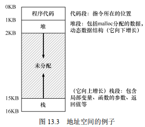

## 概述

大部分计算机有两种运行模式：`内核态`和`用户态`，软件中最基础的部分是`操作系统`，它运行在`内核态`中，内核态也称为`管态`和`核心态`，它们都是操作系统的运行状态，只不过是不同的叫法而已。操作系统具有硬件的访问权，可以执行机器能够运行的任何指令。软件的其余部分运行在`用户态`下。


`用户接口程序(shell或者GUI)`处于用户态中，并且它们位于用户态的最低层，允许用户运行其他程序，例如Web浏览器、电子邮件阅读器、音乐播放器等。而且，越靠近用户态的应用程序越容易编写，如果你不喜欢某个电子邮件阅读器你可以重新写一个或者换一个，但你不能自行写一个操作系统或者是中断处理程序。这个程序由硬件保护，防止外部对其进行修改。

操作系统与运行操作系统的内核硬件关系密切。操作系统扩展了计算机指令集并管理计算机的资源。因此，操作系统因此必须足够了解硬件的运行。

虚拟化（virtualization）、并发（concurrency）和持久性（persistence）。这是操作系统的 3 个关键概念。通过学习这 3 个概念，我们将理解操作系统是如何工作的，包括它如何决定接下来哪个程序使用 CPU，如何在虚拟内存系统中处理内存使用过载，虚拟机监控器如何工作，如何管理磁盘上的数据。

通过虚拟化CPU、虚拟化内存，好像一个进程在独占CPU和内存一样。多个进程同时运行，会涉及到上下文切换、资源竞争等问题，操作系统有大量的底层机制和高级策略应对并发导致的问题。IO往往成为程序运行的的瓶颈，操作系统会使用缓冲区、碎片整理等操作加速IO。

## 虚拟化CPU

### 受限直接执行

一个进程占用CPU开始运行时，操作系统就无法控制CPU了。怎么确保这个进程不会做一些危害计算机的事情，同时怎么确保这个进程不会一直占用CPU不放手？OS提供了受限直接执行机制来解决这个问题。

受限直接执行（limited direct execution）是实现 CPU 虚拟化的关键底层机制。基本思路很简单：就让你想运行的程序在 CPU 上运行，但首先确保设置好硬件，以便在没有操作系统帮助的情况下限制进程可以执行的操作。

进程启动时首先运行在用户模式，这一模式有很多限制。例如，在用户模式下运行时，进程不能发出 I/O 请求。这样做会导致处理器引发异常，操作系统可能会终止进程。
与用户模式不同的内核模式（kernel mode），操作系统（或内核）就以这种模式运行。在此模式下，运行的代码可以做它喜欢的事，包括特权操作，如发出 I/O 请求和执行所有类型的受限指令。

OS 首先（在启动时）设置陷阱处理程序（trap table）并启动时钟中断，然后仅在受限模式下运行进程，以此为 CPU 提供防护。当一个进程想要进入内核模式时，它可以进行的操作都会受到陷阱表的限制。通过设置陷阱表，操作系统可以决定是继续运行进程还是切换其他进程。

当然如果OS想实现强制的进程切换还需要硬件的支持，硬件提供时钟中断，使得CPU的控制权重新回到OS手中。

### 调度策略

OS的底层机制是实现进程切换的保证，但具体要如何切换进程还取决于OS的调度策略。OS X为系统动画赋予了更高的调度优先级，使得系统看起来更加流畅。

首先定义 $T_{周转时间} = T_{完成时间} - T_{到达时间}$。假设有三个任务a、b、c同时到达，每个任务需要10秒运行时间，那么第10秒a运行完成，第20秒b运行完成，第30秒c运行完成，平均的周转时间是 $(10 + 20 + 30)/3 = 20$秒。

同样是上面的例子，这次a任务运行时间需要100秒，如果还是FIFO的策略，平均的周转时间是 $(100 + 110 + 120)/3 = 110$秒。显然因为a运行的时间太长，b、c不得不等待很长的时间，所以现代的OS都不会采用FIFO调度策略了。

一种非常简单的想法是把运行时间最短的任务先执行，这个新的调度准则被称为最短任务优先（Shortest Job First，SJF），先运行最短的任务，然后是次短的任务，如此下去。我们用上面的例子，但以SJF作为调度策略，我们先运行b和c，最后运行a，SJF将平均周转时间从110s 降低到50s（（10 + 20 + 120） /3 = 50）。事实上，考虑到所有工作同时到达的假设，我们可以证明SJF确实是一个最优（optimal）调度算法。

> 在过去的批处理计算中，开发了一些非抢占式（non-preemptive）调度程序。这样的系统会将每项工作做完，再考虑是否运行新工作。几乎所有现代化的调度程序都是抢占式的（preemptive），非常愿意停止一个进程以运行另一个进程。这意味着调度程序采用了我们之前学习的机制。特别是调度程序可以进行上下文切换，临时停止一个运行进程，并恢复（或启动）另一个进程。

上面的例子有个问题：如果a先到达并开始执行了，然后b、c才到达，我们需要中断a并切换运行b和c吗？向 SJF 添加抢占，称为最短完成时间优先（Shortest Time-to-Completion First，STCF）。每当新工作进入系统时，它就会确定剩余工作和新工作中，谁的剩余时间最少，然后调度该工作。

如果我们知道任务长度，而且任务只使用 CPU，而我们唯一的衡量是周转时间，STCF 将是一个很好的策略。事实上，对于许多早期批处理系统，这些类型的调度算法有一定的意义。然而，引入分时系统改变了这一切。现在，用户将会坐在终端前面，同时也要求系统的交互性好。因此，一个新的度量标准诞生了：响应时间（response time）。$T_{响应时间} = T_{首次运行} - T_{到达时间}$。

例如，如果我们有上面的调度（ A 在时间 0 到达， B 和 C 在时间 10 达到），每个作业的响应时间如下：作业 A 为 0， B 为 0， C 为 10（平均： 3.33）。你可能会想，STCF和相关方法在响应时间上并不是很好。例如，如果 3 个工作同时到达，第三个工作必须等待前两个工作全部运行后才能运行。这种方法虽然有很好的周转时间，但对于响应时间和交互性是相当糟糕的。假设你在终端前输入，不得不等待 10s 才能看到系统的回应，只是因为其他一些工作已经在你之前被调度：你肯定不太开心。因此，我们还有另一个问题：如何构建对响应时间敏感的调度程序？

为了解决这个问题，我们将介绍一种新的调度算法，通常被称为轮转（ Round-Robin，RR）调度。基本思想很简单：RR 在一个时间片（time slice，有时称为调度量子，scheduling quantum）内运行一个工作，然后切换到运行队列中的下一个任务，而不是运行一个任务直到结束。它反复执行，直到所有任务完成。请注意，时间片长度必须是时钟中断周期的倍数。因此，如果时钟中断是每 10ms 中断一次，则时间片可以是 10ms、20ms或10ms的任何其他倍数。

时间片长度对于 RR 是至关重要的。越短，RR 在响应时间上表现越好。但是时间片太短，将会有更多资源浪费在上下文切换，这需要系统的设计者去衡量。

### 多级反馈队列 MLFQ

多级反馈队列（Multi-level Feedback Queue，MLFQ）是现代OS中使用的调度策略。它需要解决两方面的问题。首先，它要优化周转时间。这通过先执行短工作来实现。然而，操作系统通常不知道工作要运行多久，而这又是SJF（或 STCF）等算法所必需的。其次，MLFQ 希望给交互用户（如用户坐在屏幕前，等着进程结束）很好的交互体验，因此需要降低响应时间。然而，像 RR 这样的算法虽然降低了响应时间，周转时间却很差。

MLFQ 中有许多独立的队列（queue），每个队列有不同的优先级（priority level）。任何时刻，一个工作只能存在于一个队列中。MLFQ 总是优先执行较高优先级的工作（即在较高级队列中的工作）。当然，每个队列中可能会有多个工作，因此具有同样的优先级。在这种情况下，我们就对这些工作采用轮询调度。

MLFQ 调度策略的关键在于如何设置优先级。MLFQ 没有为每个工作指定不变的优先级，而是根据运行情况不断调整优先级。例如，如果一个工作不断放弃CPU 去等待键盘输入，这是交互型进程的可能行为，MLFQ 因此会让它保持高优先级。相反，如果一个工作长时间地占用 CPU，MLFQ 会降低其优先级。通过这种方式， MLFQ 在进程运行过程中学习其行为，从而利用工作的历史来预测它未来的行为。

一些经过优化的MLFQ规则是：

1. 如果A的优先级 > B的优先级，运行A
2. 如果A的优先级 = B的优先级，运行B
3. 工作进入系统时，放在最高优先级
4. 一旦工作用完了在某一层中的时间额度，就降低其优先级
5. 经过一段时间S，就将系统中所有工作重新加入最高优先级队列 

设计规则3的原因：如果不知道工作是短工作还是长工作，那么就在开始的时候假设其是短工作，并赋予最高优先级。如果确实是短工作，则很快会执行完毕，否则将被慢慢移入低优先级队列，而这时该工作也被认为是长工作了。通过这种方式，MLFQ 近似于 SJF。

设计规则4和5的原因是：会有饥饿（starvation）问题。如果系统有“太多”交互型工作，就会不断占用CPU，导致长工作永远无法得到 CPU（它们饿死了）。即使在这种情况下，我们希望这些长工作也能有所进展。

关于 MLFQ 调度算法还有一些问题。其中一个大问题是如何配置一个调度程序，例如，配置多少队列？每一层队列的时间片配置多大？为了避免饥饿问题以及进程行为改变，应该多久提升一次进程的优先级？这些问题都没有显而易见的答案，因此只有利用对工作负载的经验，以及后续对调度程序的调优，才会导致令人满意的平衡。

例如，大多数的 MLFQ 变体都支持不同队列可变的时间片长度。高优先级队列通常只有较短的时间片（比如 10ms 或者更少），因而这一层的交互工作可以更快地切换。 相反、低优先级队列中更多的是 CPU 密集型工作，配置更长的时间片会取得更好的效果。

### 比例份额

比例份额（proportional-share）调度程序，有时也称为公平份额（fair-share）调度程序。比例份额算法基于一个简单的想法：调度程序的最终目标，是确保每个工作获得一定比例的 CPU 时间，而不是优化周转时间和响应时间。

比例份额调度有两种实现：彩票调度和步长调度。

彩票调度就是给每个任务分配一定数量的彩票，每个任务获得的彩票数量占总彩票数量的比例就是它能够使用CPU的时间比例。每隔一段时间就随机抽出一张彩票，谁拥有这张彩票就获得了运行的机会。

步长调度也很简单。系统中的每个工作都有自己的步长，这个值与票数值成反比。假设 A、 B、 C 这 3 个工作的票数分别是 100、 50 和 250，我们通过用一个大数分别除以他们的票数来获得每个进程的步长。比如用 10000 除以这些票数值，得到了 3 个进程的步长分别为 100、 200 和 40。我们称这个值为每个进程的步长（stride）。每次进程运行后，我们会让它的计数器 [称为行程（pass）值] 增加它的步长，记录它的总体进展。之后，调度程序使用进程的步长及行程值来确定调度哪个进程。基本思路很简单：当需要进行调度时，选择目前拥有最小行程值的进程，并且在运行之后将该进程的行程值增加一个步长。

彩票调度通过随机值，聪明地做到了按比例分配。步长调度算法能够确定的获得需要的比例。虽然两者都很有趣，但由于一些原因，并没有作为 CPU 调度程序被广泛使用。

一个原因是这两种方式都不能很好地适合 I/O；另一个原因是其中最难的票数分配问题并没有确定的解决方式，例如，如何知道浏览器进程应该拥有多少票数？通用调度程序（像前面讨论的 MLFQ 及其他类似的 Linux 调度程序）做得更好，因此得到了广泛的应用。

结果，比例份额调度程序只有在这些问题可以相对容易解决的领域更有用（例如容易确定份额比例）。例如在虚拟（virtualized）数据中心中，你可能会希望分配 1/4 的 CPU 周期给 Windows 虚拟机，剩余的给 Linux 系统，比例分配的方式可以更简单高效。

## 虚拟化内存

### 地址空间

操作系统提供一个易用的物理内存抽象。这个抽象叫作地址空间（ address space），是运行的程序看到的系统中的内存。理解这个基本的操作系统内存抽象，是了解内存虚拟化的关键。

一个进程的地址空间包含运行的程序的所有内存状态。比如：程序的代码（ code，指令）必须在内存中，因此它们在地址空间里。当程序在运行的时候，利用栈（ stack）来保存当前的函数调用信息，分配空间给局部变量，传递参数和函数返回值。最后，堆（ heap）用于管理动态分配的、 用户管理的内存， 就像你从 C 语言中调用 malloc()或面向对象语言（如 C ++或 Java）中调用 new 获得内存。当然，还有其
他的东西（例如，静态初始化的变量），但现在假设只有这 3 个部分：代码、栈和堆。

下面的示意图和代码展示了进程在内存中的占用的位置。



```c
#include <stdio.h>
#include <stdlib.h>

int main(void) {
    printf("location of code : %p\n", (void *)main);
    printf("location of heap : %p\n", (void *) malloc(1));
    int x = 3;
    printf("location of stack : %p\n", (void *) &x);
    return 0;
}
```

每个进程会被 OS 加载到内存的任意物理地址，但他们都拥有相同的地址空间：从0开始（不考虑随机化内存地址）。这是 OS 在虚拟化内存。

虚拟内存（VM）系统的一个主要目标是透明（transparency）。操作系统实现虚拟内存的方式，应该让运行的程序看不见。因此，程序不应该感知到内存被虚拟化的事实，相反，程序的行为就好像它拥有自己的私有物理内存。在幕后，操作系统（和硬件）完成了所有的工作，让不同的工作复用内存，从而实现这个假象。

虚拟内存的另一个目标是效率（efficiency）。操作系统应该追求虚拟化尽可能高效（efficient），包括时间上（即不会使程序运行得更慢）和空间上（即不需要太多额外的内存来支持虚拟化）。在实现高效率虚拟化时，操作系统将不得不依靠硬件支持，包括 TLB 这样的硬件功能。

最后，虚拟内存第三个目标是保护（protection）。操作系统应确保进程受到保护（protect），不会受其他进程影响，操作系统本身也不会受进程影响。当一个进程执行加载、存储或指令提取时，它不应该以任何方式访问或影响任何其他进程或操作系统本身的内存内容（即在它的地址空间之外的任何内容）。因此，保护让我们能够在进程之间提供隔离（isolation）的特性，每个进程都应该在自己的独立环境中运行，避免其他出错或恶意进程的影响。
