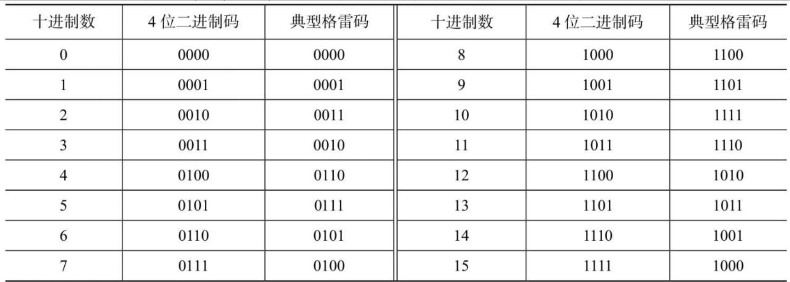
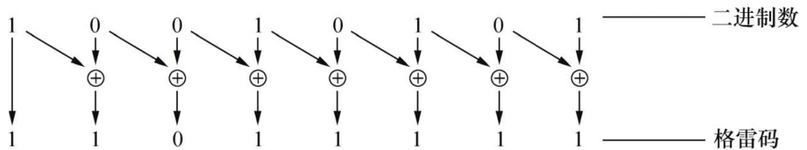
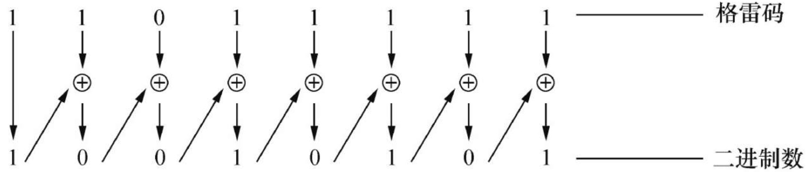
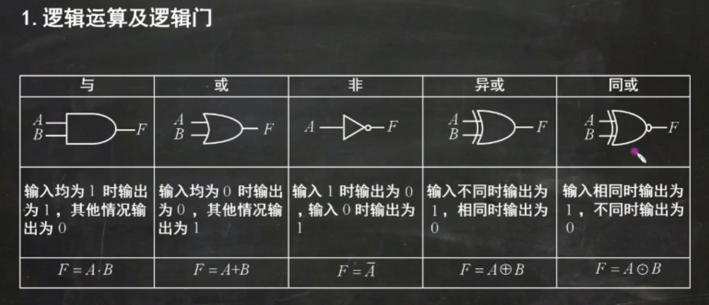

# 数字电路与逻辑设计

## 半导体技术发展历程

20世纪初电子二极管、三极管问世。电子三极管的发明及其放大原理的发现，标志着人类科技史进入电子时代。

1947年发明点触型晶体管，1950年发明面结型晶体管。

现在：集成电路时代。

## 基本知识

### 数字信号系统

1. 模拟信息：信号的变化在时间和数值上都是连续的。
2. 离散信号：信号的变化在时间和数值上都是离散的。这种变化可以用数字反映，也叫做数字信号。

A/D-模数转换：analog-digital

D/A-数模转换：digital-analog

模拟信号转为数字信号需要采样和量化：

1. 采样：在时间轴上按照间隔采集波形上的一些点。采集的点如果太少会失真，奈奎斯特定理表示，当采样的频率大于波形的最大频率的两倍时，采样无失真。
2. 量化：对于每个采样点使用几个bit来保存。bit少了，每个点四舍五入就不准，显然bit越多越精确。

### 数字系统层次结构

1. 电子元件：二极管、电阻
2. 基本逻辑器件：逻辑门、触发器
3. 逻辑功能部件：加法器、计数器、乘法器
4. 复杂逻辑功能部件：微处理器
5. 复杂数字系统：由第2级到第4级的逻辑部件组成

### 数字逻辑电路类型

在任何一个电路中，信号只能取有限个分立值，这种电路成为逻辑电路。三种逻辑运算：与或非可以使用晶体管实现，形成的电路模块成为逻辑门。多个逻辑门组成的网络就是逻辑电路。

1. 是否有记忆功能
   1. 组合逻辑电路（Combinational Logic Circuit）：无记忆功能。输出只取决于当前的输入，与历史输入无关。
   2. 时序逻辑电路（Sequential Logic Circuit）：有记忆功能。输出受到历史输入影响。

时序逻辑电路，按是否有统一的时钟信号进行同步，分为：

1. 同步时序逻辑电路
2. 异步时序逻辑电路

### 编码

1. BCD（Binary Coded Decimal）编码：使用4为二进制数表示一位10进制数，也就是只能表示0-9。常用的是8421BCD编码，编码方式和二级制无符号数相同。除此之外还有5421码、2421码、余3码
2. 格雷码：是一种可靠性编码，特点是任意两个相邻的数，其格雷码仅有一位不同。
   采用格雷码可以避免代码在形成或者变换过程中产生错误。在数字系统中，当数据按升序或降序变化时，若采用普通二进制数，则每次增1或者减1时，可能引起若干位发生变化。而使用格雷码只会有一位发生变化。

3. 奇偶检验码（Parity Check Code）:是一种用来检验代码在传送过程中是否产生错误的代码。二进制信息在传送时，可能由于外界干扰或其他原因而发生错误，即可能由1错为0或者由0错为1，奇偶检验码能够检查出这类错误。
   奇偶检验码由两部分组成：一是信息位，即需要传递的信息本身，可以是位数不限的一组二进制代码；二是奇偶检验位，仅有一位。奇偶检验位的编码方式有两种：**一种是使信息位和检验位中“1”的个数为奇数，称为奇检验；另一种是使信息位和检验位中“1”的个数为偶数，称为偶检验。**例如，二进制代码1010111，采用奇校验时，因为信息位已经是奇数个1了，所以校验位为0；采用偶校验时，校验位是1，这样就刚好有偶数个1了。
   采用奇偶检验码进行错误检测时，在发送端由编码器根据信息位编码产生奇偶检验位，形成奇偶检验码发往接收端；接收端通过检测器检查代码中含“1”个数的奇偶，判断信息是否出错。例如，当采用偶检验时，若收到的代码中含奇数个“1”，则说明发生了错误。但判断出错后，并不能确定是哪一位出错，也就无法纠正。因此，奇偶检验码只有检错能力，没有纠错能力。其次，这种代码只能发现单错，不能发现双错，但由于数据传输中单错的概率远远大于双错，所以这种编码是具有实用价值的。加之它编码简单、容易实现，因而，在数字系统中被广泛采用。

#### 格雷码和普通二进制码的转换

设二进制码为`B=Bn-1Bn-2…Bi+1Bi…B1B0`，与之对应的格雷码为`G=Gn-1Gn-2…Gi-1Gi…G1G0`，则有`Gn-1=Bn-1Gi=Bi+1⊕Bi　0≤i≤n-2`

反之，设格雷码为`G=Gn-1Gn-2…Gi+1Gi…G1G0`，与之对应的二进制码为`B=Bn-1Bn-2…Bi+1Bi…B1B0`，则有`Bn-1=Gn-1Bi=Bi+1⊕Gi　0≤i≤n-2`

### 三态门

三态门：普通门电路只能输出高电平、低电平两种状态，而三态门还可以输出第三种状态：高阻态。

### 完备集

可以证明，与非门、或非门都是完备集。

也就是说与或非三种逻辑门电路组合才能完成的功能，与非门、或非门单独就能完成。实际中的电路都是使用NAND、NOR。

### 功能等效网络

一个现有的逻辑电路，弄清楚它的输入输出对应关系（逻辑函数）的过程叫做分析。而根据需要的功能，设计一个逻辑电路的过程叫做综合。

许多不同的网络对于相同的输入有同样的输出，称作功能等效网络。学习逻辑表达式的化简方法可以帮助设计出最简单的等效网络。

最低成本的功能等效网络使得：逻辑门总数+输入端总数之和最小。

## 布尔代数

布尔代数是逻辑运算和集合运算的基础。

### 逻辑门

注意同或、异或互反。

### 逻辑函数的相等

对于任意的输入，两个逻辑函数的输出都相等，则称为函数相等。

### 重要规则

#### 代入规则

任何一个含有变量A的逻辑等式，如果将所有出现A的位置都代之以同一个逻辑函数F，则等式仍然成立。这个规则称为代入规则。例如，给定逻辑等式$A + \overline{A}B = A + B$，若将等式中的A都用$A+C$代替，则该逻辑等式仍然成立。即$(A+C) + \overline{(A+C)}B = A+C + B$.

代入规则的正确性是显然的，因为任何逻辑函数都和逻辑变量一样，只有0和1两种可能的取值。甚至可以把逻辑变量替换成逻辑函数。

#### 反演规则

若将逻辑函数表达式F中所有的“·”变成“+”，“+”变成“·”，“0”变成“1”，“1”变成“0”，原变量变成反变量，反变量变成原变量，并保持原函数中的运算顺序不变，则所得到的新的函数为原函数$F$的反函数$\overline{F}$。这一规则称为反演规则。

例如，已知函数$F = \overline{A}B + C\overline{D}$，根据反演规则可得到$\overline{F}=(A+\overline{B})(\overline{C}+D)$

反演规则实际上是德摩根定律的推广。显然，运用反演规则可以很方便地求出一个函数的反函数。使用反演规则时，应注意保持原函数式中运算的优先顺序不变。

#### 对偶规则

如果将逻辑函数表达式F中所有的“·”变成“+”，“+”变成“·”，“0”变成“1”，“1”变成“0”，并保持原函数中的运算顺序不变，则所得到的新的逻辑表达式称为函数F的对偶式，并记为F′。

例如：$F = \overline{A}B + B(\overline{C} + 0), F' = (\overline{A}+B)\cdot(B+\overline{C}\cdot1) $

如果将逻辑函数表达式F中所有的“·”变成“+”，“+”变成“·”，“0”变成“1”，“1”变成“0”，并保持原函数中的运算顺序不变，则所得到的新的逻辑表达式称为函数F的对偶式，并记为F′。

若由相同变量构成的逻辑函数F和逻辑函数G相等，则其对偶式F′和G′也相等。这一规则称为对偶规则。根据对偶规则，当已证明某两个逻辑表达式相等时，便可得知它们的对偶式也相等。

### 如何写出逻辑表达式

考虑如何实现下面的逻辑电路：

| x1   | x2   | f(x1,x2) |
| ---- | ---- | -------- |
| 0    | 0    | 1        |
| 0    | 1    | 1        |
| 1    | 0    | 0        |
| 1    | 1    | 1        |

通用的办法是：对应于真值表为1的每一行构成乘积项以实现逻辑函数，然后进行化简：`f(x1,x2) = !x1*!x2 + !x1*x2 + x1*x2`。化简之后为：`f(x1, x2) = !x1 + x2`

还有另一种方法：使得真值表为0的和项取反：`f(x1, x2) = !(x1*!x2)`。用德摩根定律可以证明两种方式一样。

[第8章-数字电路基础知识-8.7最小项与卡诺图 - 知乎 (zhihu.com)](https://zhuanlan.zhihu.com/p/368788065)

### 非完整定义函数（无关项）

在数字系统中，有些输入情况永远不会发生，比如双刀双掷开关作为输入。这些不可能出现的输入叫做无关条件，包含无关条件的函数称为非完整定义函数。

设计电路时对于无关条件的输出可以任意假定，只要能使逻辑电路的成本最低即可。

## 组合逻辑电路

