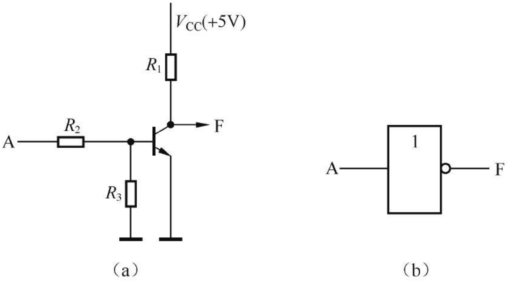

# 数字电路与逻辑设计

## 半导体技术发展历程

20世纪初电子二极管、三极管问世。电子三极管的发明及其放大原理的发现，标志着人类科技史进入电子时代。

1947年发明点触型晶体管，1950年发明面结型晶体管。

现在：集成电路时代。SSI -> MSI -> LSI -> VLSI（Very Large Scale Integration超大规则集成电路）

## 基本知识

### 数字信号系统

1. 模拟信息：信号的变化在时间和数值上都是连续的。
2. 离散信号：信号的变化在时间和数值上都是离散的。这种变化可以用数字反映，也叫做数字信号。

A/D-模数转换：analog-digital

D/A-数模转换：digital-analog

模拟信号转为数字信号需要采样和量化：

1. 采样：在时间轴上按照间隔采集波形上的一些点。采集的点如果太少会失真，奈奎斯特定理表示，当采样的频率大于波形的最大频率的两倍时，采样无失真。
2. 量化：对于每个采样点使用几个bit来保存。bit少了，每个点四舍五入就不准，显然bit越多越精确。

### 数字系统层次结构

1. 电子元件：二极管、电阻
2. 基本逻辑器件：逻辑门、触发器
3. 逻辑功能部件：加法器、计数器、乘法器
4. 复杂逻辑功能部件：微处理器
5. 复杂数字系统：由第2级到第4级的逻辑部件组成

### 数字逻辑电路类型

在任何一个电路中，信号只能取有限个分立值，这种电路成为逻辑电路。三种逻辑运算：与或非可以使用晶体管实现，形成的电路模块成为逻辑门。多个逻辑门组成的网络就是逻辑电路。

1. 是否有记忆功能
   1. 组合逻辑电路（Combinational Logic Circuit）：无记忆功能。输出只取决于当前的输入，与历史输入无关。
   2. 时序逻辑电路（Sequential Logic Circuit）：有记忆功能。输出受到历史输入影响。

时序逻辑电路，按是否有统一的时钟信号进行同步，分为：

1. 同步时序逻辑电路
2. 异步时序逻辑电路

### 编码

1. BCD（Binary Coded Decimal）编码：使用4为二进制数表示一位10进制数，也就是只能表示0-9。常用的是8421BCD编码，编码方式和二级制无符号数相同。除此之外还有5421码、2421码、余3码
2. 格雷码：是一种可靠性编码，特点是任意两个相邻的数，其格雷码仅有一位不同。
   采用格雷码可以避免代码在形成或者变换过程中产生错误。在数字系统中，当数据按升序或降序变化时，若采用普通二进制数，则每次增1或者减1时，可能引起若干位发生变化。而使用格雷码只会有一位发生变化。

3. 奇偶检验码（Parity Check Code）:是一种用来检验代码在传送过程中是否产生错误的代码。二进制信息在传送时，可能由于外界干扰或其他原因而发生错误，即可能由1错为0或者由0错为1，奇偶检验码能够检查出这类错误。
   奇偶检验码由两部分组成：一是信息位，即需要传递的信息本身，可以是位数不限的一组二进制代码；二是奇偶检验位，仅有一位。奇偶检验位的编码方式有两种：**一种是使信息位和检验位中“1”的个数为奇数，称为奇检验；另一种是使信息位和检验位中“1”的个数为偶数，称为偶检验。**例如，二进制代码1010111，采用奇校验时，因为信息位已经是奇数个1了，所以校验位为0；采用偶校验时，校验位是1，这样就刚好有偶数个1了。
   采用奇偶检验码进行错误检测时，在发送端由编码器根据信息位编码产生奇偶检验位，形成奇偶检验码发往接收端；接收端通过检测器检查代码中含“1”个数的奇偶，判断信息是否出错。例如，当采用偶检验时，若收到的代码中含奇数个“1”，则说明发生了错误。但判断出错后，并不能确定是哪一位出错，也就无法纠正。因此，奇偶检验码只有检错能力，没有纠错能力。其次，这种代码只能发现单错，不能发现双错，但由于数据传输中单错的概率远远大于双错，所以这种编码是具有实用价值的。加之它编码简单、容易实现，因而，在数字系统中被广泛采用。

#### 格雷码和普通二进制码的转换

设二进制码为`B=Bn-1Bn-2…Bi+1Bi…B1B0`，与之对应的格雷码为`G=Gn-1Gn-2…Gi-1Gi…G1G0`，则有`Gn-1=Bn-1Gi=Bi+1⊕Bi　0≤i≤n-2`

反之，设格雷码为`G=Gn-1Gn-2…Gi+1Gi…G1G0`，与之对应的二进制码为`B=Bn-1Bn-2…Bi+1Bi…B1B0`，则有`Bn-1=Gn-1Bi=Bi+1⊕Gi　0≤i≤n-2`

### 三态门

三态门：普通门电路只能输出高电平、低电平两种状态，而三态门还可以输出第三种状态：高阻态。

### 功能等效网络

一个现有的逻辑电路，弄清楚它的输入输出对应关系（逻辑函数）的过程叫做分析。而根据需要的功能，设计一个逻辑电路的过程叫做综合。

许多不同的网络对于相同的输入有同样的输出，称作功能等效网络。学习逻辑表达式的化简方法可以帮助设计出最简单的等效网络。

最低成本的功能等效网络使得：逻辑门总数+输入端总数之和最小。

## 布尔代数

布尔代数是逻辑运算和集合运算的基础。

### 逻辑门

注意同或、异或互反。

### 逻辑函数的相等

对于任意的输入，两个逻辑函数的输出都相等，则称为函数相等。

### 重要规则

#### 代入规则

任何一个含有变量A的逻辑等式，如果将所有出现A的位置都代之以同一个逻辑函数F，则等式仍然成立。这个规则称为代入规则。例如，给定逻辑等式$A + \overline{A}B = A + B$，若将等式中的A都用$A+C$代替，则该逻辑等式仍然成立。即$(A+C) + \overline{(A+C)}B = A+C + B$.

代入规则的正确性是显然的，因为任何逻辑函数都和逻辑变量一样，只有0和1两种可能的取值。甚至可以把逻辑变量替换成逻辑函数。

#### 反演规则

若将逻辑函数表达式F中所有的“·”变成“+”，“+”变成“·”，“0”变成“1”，“1”变成“0”，原变量变成反变量，反变量变成原变量，并保持原函数中的运算顺序不变，则所得到的新的函数为原函数$F$的反函数$\overline{F}$。这一规则称为反演规则。

例如，已知函数$F = \overline{A}B + C\overline{D}$，根据反演规则可得到$\overline{F}=(A+\overline{B})(\overline{C}+D)$

反演规则实际上是德摩根定律的推广。显然，运用反演规则可以很方便地求出一个函数的反函数。使用反演规则时，应注意保持原函数式中运算的优先顺序不变。

#### 对偶规则

如果将逻辑函数表达式F中所有的“·”变成“+”，“+”变成“·”，“0”变成“1”，“1”变成“0”，并保持原函数中的运算顺序不变，则所得到的新的逻辑表达式称为函数F的对偶式，并记为F′。

例如：$F = \overline{A}B + B(\overline{C} + 0), F' = (\overline{A}+B)\cdot(B+\overline{C}\cdot1) $

如果将逻辑函数表达式F中所有的“·”变成“+”，“+”变成“·”，“0”变成“1”，“1”变成“0”，并保持原函数中的运算顺序不变，则所得到的新的逻辑表达式称为函数F的对偶式，并记为F′。

若由相同变量构成的逻辑函数F和逻辑函数G相等，则其对偶式F′和G′也相等。这一规则称为对偶规则。根据对偶规则，当已证明某两个逻辑表达式相等时，便可得知它们的对偶式也相等。

### 逻辑表达式形式

1. 基本形式：
   1. 与或式：又称为“积之和”表达式。例如：$F = AB + \overline{A}C$
   2. 或与式：又称为“和之积”表达式。例如：$F = (A+B)(A+C)$
2. 标准形式：基本形式显然不唯一，为了在逻辑问题的研究中使逻辑函数可以和唯一的逻辑表达式对应，引入了逻辑函数表达式的两种标准形式
   1. 最小项：如果一个具有n个变量的函数的与项包含全部n个变量，每个变量都以原变量或反变量的形式出现一次，且仅出现一次，则该与项被称为最小项。有时又将最小项称为标准与项。**由若干最小项相“或”构成的逻辑表达式称为标准与或表达式，也叫做最小项表达式。**
      为了书写方便，通常用mi表示最小项。下标i的取值规则是：按照变量顺序将最小项中的原变量用1表示，反变量用0表示，由此得到一个二进制数，与该二进制数对应的十进制数即下标i的值。例如，3变量A、B、C构成的最小项$A\overline{B}C$可用m5表示。
   2. 最大项：如果一个n个变量函数的或项包含全部n个变量，每个变量都以原变量或反变量的形式出现一次，且仅出现一次，则该或项被称为最大项。有时又将最大项称为标准或项。**由若干最大项相“与”构成的逻辑表达式称为标准或与表达式，也叫做最大项表达式。**
      最大项的书写和最小项相反，是原变量为0，反变量为1。比如$A + \overline{B} + C$表示为M2。

最小项和最大项之间存在互补关系：$\overline{m_i} = M_i$。例如，由3个变量A、B、C构成的最小项m6和最大项M6之间有$\overline{m_6} = \overline{AB\overline{C}}=\overline{A}+\overline{B}+C=M_6, $

### 逻辑表达式的转换

将一个任意逻辑函数表达式转换成标准表达式有两种常用方法，一种是代数转换法，另一种是真值表转换法。

代数转换法比较自由，但是有难度。真值表转换法通用性好，但是变量多的时候写起来比较麻烦。

令真值表上使函数值为1的变量取值组合对应的最小项相“或”，即可得到一个函数的标准与或表达式；令真值表上使函数值为0的变量取值组合对应的最大项相“与”，即可构成一个函数的标准或与表达式。

例：将函数$F(A,B,C)=\overline{A}C + A\overline{B}\cdot\overline{C}$变换成最小项之和表达式和最大项之积表达式

[第8章-数字电路基础知识-8.7最小项与卡诺图 - 知乎 (zhihu.com)](https://zhuanlan.zhihu.com/p/368788065)

### 逻辑函数化简

一般来说，逻辑函数表达式越简单，设计出来的相应逻辑电路也就越简单。为了降低系统成本、简化电路结构、提高系统可靠性，逻辑设计时必须对逻辑函数进行简化。

1. 代数化简法：缺点是变量太多时不确定是不是化到了最简。
2. 卡诺图

#### 卡诺图

卡诺图是把真值表变成二维的表格得到的。

在n个变量的卡诺图中，相邻的格子只有一个变量取值不同（只有一个变量取值不同的称为相邻最小项）。卡诺图的构造特点使之能从图形上直观地找出相邻最小项合并。

当给定逻辑函数为标准与—或表达式时，只需在卡诺图上找出和表达式中最小项对应的小方格填上1，其余小方格填上0，即可得到该函数的卡诺图。

例：用卡诺图化简逻辑函数F(A,B,C,D)=∑m(0,3,5,6,7,10,11,13,15)。

答：先画出卡诺图，最小项为1的方格圈起来。得到$F=BD+CD+A\overline{B}C + \overline{A}\cdot\overline{B}\cdot\overline{C}\cdot\overline{D}$

当变量数目太大时，一般不再用卡诺图进行手工化简。为了进一步解决化简问题，通常采用列表化简法，列表法最早由Quine-Mcluskey提出，因此又称为Q-M法。列表法化简逻辑函数的基本思想与卡诺图化简法类似，即找出相邻项进行合并。但该方法采用表格形式，其优点是规律性强，对变量数较多的函数，尽管工作量很大，但总可以经过反复比较、合并得到最简结果。列表法很适合计算机辅助处理，有关该方法的详细介绍可查阅相关资料，在此不再赘述。

## 集成逻辑门

### 数字继承电路的分类

按半导体器件分：

根据所采用的半导体器件不同，常用的数字集成电路可以分为两大类：一类是采用双极型半导体器件作为元件的双极型集成电路；另一类是采用金属—氧化物—半导体场效应管（Metal-Oxide-Semiconductor Field Effect Transistor，MOSFET）作为元件的单极型集成电路，简称为MOS集成电路。相对而言，双极型集成电路的特点是速度快、负载能力强，但功耗较大、结构较复杂，因而使集成规模受到一定限制；MOS型集成电路的特点是结构简单、制造方便、集成度高、功耗低，但速度一般比双极型集成电路稍慢。
双极型集成电路又可分为TTL（Transistor-Transistor Logic，晶体管—晶体管逻辑）电路、ECL（Emitter Coupled Logic，射极耦合逻辑）电路和I2L（Integrated Injection Logic，集成注入逻辑）电路等类型。
MOS集成电路又可分为PMOS（P-channel Metal-Oxide-Semiconductor，P沟道MOS）、NMOS（N-Channel Metal-Oxide-Semiconductor，N沟道MOS）和CMOS（Complement Metal-Oxide-Semiconductor，互补MOS）等类型。CMOS电路是由PMOS增强型管和NMOS增强型管组成的互补MOS电路，这种电路是继TTL电路问世之后所开发的第2种广泛应用的电路，它以其优越的综合性能被应用于各种不同规模的集成逻辑器件中。

按功能分：

可分为非定制电路（Non-custom design IC）、全定制电路（Full-custom design IC）和半定制电路（Semi-custom design IC）。
非定制电路又称为标准集成电路，这类电路具有生产量大、使用广泛、价格便宜等优点，例如，各种小、中、大规模通用集成电路产品。
目前广泛使用的可编程逻辑器件（Programmable Logic Device，PLD）即属于半定制电路。

### 半导体器件特性

晶体二极管是由P型半导体和N型半导体形成的PN结。二极管的正向可以通电，反向不能通电。正向的导通电压一般是0.7V。二极管的这种单向导电性可以用作整流器，把交流电变成直流电。

晶体三极管由集电结和发射结两个PN结构组成，三条引线分别称为基极b、集电极c和发射极e。发射极e发出电子可以被集电极c收集到，从而形成电流。而在基极b上施加不同的正负电压，形成的电场可以增加或减少到达集电极的电流。简单说三极管的功能就是一个放大器，到达集电极的电流会与基极的电流同步波动。三极管有截止、放大、饱和三种状态。

### 逻辑门电路器件实现

与门：

图中，A、B为输入端，F为输出端。输入信号为低电平0V或者高电平+5V。假定二极管正向电阻为0，反向电阻无穷大，则根据输入信号取值的不同，可分为如下两种工作情况。

① 当两个输入端A、B的电压均为低电平（0V），或者其中的一个为低电平0V时，输入为低电平的二极管将处于导通状态，从而使得输出端F的电压被钳制在0V附近，即VF≈0V。② 当两个输入端A、B的电压均为高电平+5V时，二极管D1、D2均截止，输出端F的电压等于电源电压VCC，即VF=+5V。

或门：

按照前面与门中的假定，该电路根据输入信号取值的不同，同样可分为如下两种工作情况。

① 当两个输入端A、B的电压均为低电平（0V）时，二极管D1、D2均截止，输出端F的电压为低电平，即VF≈0V。② 当两个输入端A、B的电压均为+5V，或者其中的一个为+5V时，输入为+5V的二极管将处于导通状态，从而使得输出端F的电压为高电平，即VF≈+5V。

非门：

根据三极管工作原理可知：当输入A为低电平时，三极管截止，从而使得输出端F的电压为高电平，即VF≈+5V；当输入A为高电平时，三极管饱和导通，输出端F的电压为低电平，即VF≈0V。

### 完备集

可以证明，与非门、或非门都是完备集。

也就是说与或非三种逻辑门电路组合才能完成的功能，与非门、或非门单独就能完成。实际中的电路都是使用NAND、NOR。

## 组合逻辑电路

如果一个逻辑电路在任何时刻产生的稳定输出仅仅取决于该时刻各输入取值的组合，而与过去的输入取值无关，则称该电路为组合逻辑电路。

组合电路具有两个特点：

第一，电路由逻辑门电路组成，不包含任何记忆元件；

第二，电路中信号是单向传输的，不存在任何反馈回路。

### 组合逻辑电路分析

一致性电路：当输入相同时输出为1，否则为0。

列出真值表：

| A    | B    | C    | F    |
| ---- | ---- | ---- | ---- |
| 0    | 0    | 0    | 1    |
| 1    | 1    | 1    | 1    |
| ...  | ...  | ...  | 0    |

逻辑函数为：$F=\overline{A}\cdot\overline{B}\cdot\overline{C} + ABC = ABC + \overline{(A+B+C)}$

电路图为：

### 多输出逻辑电路

当一组输入对应多个输出时，不能简单地把每个最简的逻辑电路拼在一起，而要综合考虑多个电路之间如何共享逻辑门，使得总的电路最简。

基本的方法是画出卡诺图，使得多个电路的卡诺图中尽量多的最小项被相同的圈圈中。

例：设计一个全加器。

真值表：

### 非完整定义函数（无关项）

在数字系统中，有些输入情况永远不会发生，比如双刀双掷开关作为输入。这些不可能出现的输入叫做无关条件，包含无关条件的函数称为非完整定义函数。

设计电路时对于无关条件的输出可以任意假定，只要能使逻辑电路的成本最低即可。

### 常用中规模组合逻辑器件

集成电路由SSI发展到MSI之后，单个芯片的功能得到了加强。常用的中规模组合逻辑器件有加法器、编码器、译码器、多路选择器和多路分配器。

## 集成触发器

触发器是一种具有记忆功能的存储器件，是组成时序逻辑电路的基本器件。
