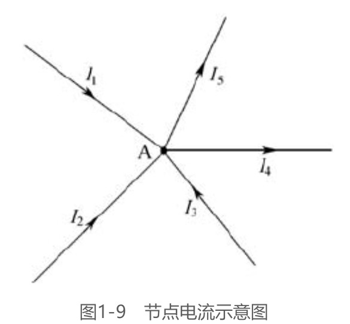
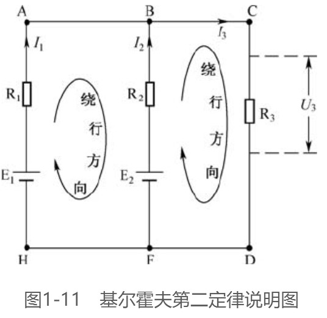

# 复杂电路分析

在分析简单电路时，一般应用欧姆定律和电阻的串、并联规律，但用它们来分析复杂电路就比较困难。这里的简单电路通常是指只有一个电源的电路，而复杂电路通常是指有两个或两个以上电源的电路。对于复杂电路，常用到基尔霍夫定律、叠加定理和戴维南定理进行分析。

## 基本概念

### 1. 支路

支路是指由一个或几个元件首尾相接构成的一段无分支的电路。在同一支路内，流过所有元件的电流相等。下图所示电路中，它有三条支路，即bafe支路、be支路和bcde支路。其中bafe支路和bcde支路中都含有电源，这种含有电源的支路称为有源支路。be支路没有电源，称为无源支路。

### 2. 节点

三条或三条以上支路的连接点称为节点。上图所示电路中的b点和e点都是节点。

### 3. 回路

电路中任意一个闭合的路径称为回路。上图所示电路中的abefa、bcdeb、abcdefa都是回路。

### 4. 网孔

内部不含支路的回路称为网孔。上图所示电路中的abefa、bcdeb回路是网孔，abcdefa就不是网孔，因为它含有支路be。

## 基尔霍夫定律

### 第一定律（电流定律）

基尔霍夫第一定律指出，在电路中，流入任意一个节点的电流之和等于流出该节点的电流之和，即：$ΣI_入=ΣI_出$。下面以图1-9所示的电路来说明该定律。在图1-9所示电路中，流入A点的电流有三个，即$I_1、I_2、I_3$；从A点流出的电流有两个，即$I_4、I_5$。由基尔霍夫第一定律可得：`I1 + I2 + I3 = I4 + I5`。

如果规定流入节点的电流为正，流出节点的电流为负，那么基尔霍夫第一定律也可以这样叙述：在电路中任意一个节点上，电流的代数和等于零，即$ΣI=0A$。

基尔霍夫第一定律不但适合于电路中的节点，对一个封闭面也是适用的。图1-10（a）所示示意图中流入晶体管的电流$I_b、I_c$与流出的电流$I_e$有以下关系$I_b+I_c=I_e$。在图1-10（b）所示电路中，流入三角形负载的电流I1与流出的电流$I_2、I_3$有以下关系$I_1=I_2+I_3$。

### 第二定律（电压定律）

基尔霍夫第二定律指出，电路中任一回路内各段电压的代数和等于零，即ΣU=0V。

在应用基尔霍夫第二定律分析电路时，需要先规定回路的绕行方向。当流过回路中某元件的电流方向与绕行方向一致时，该元件两端的电压取正，反之取负；电源的电动势方向（电源的电动势方向始终是由负极指向正极）与绕行方向一致时，电源的电动势取负，反之取正。

下面以图1-11所示的电路来说明这个定律。

先来分析BCDF回路的电压关系。首先在这个回路中画一个绕行方向，流过R2的电流I2和流过R3的电流I3与绕行方向一致，故I2×R2（即为U2）和I3×R3（即为U3）都取正；电源E2的电动势方向与绕行方向一致，电源E2的电动势取负。根据基尔霍夫第二定律可得出$I_2·R2+I3·R3+（-E_2）=0V$

再来分析图1-11所示电路中的ABFH回路的电压关系。先在ABFH回路中画一个绕行方向，流过R1的电流I1方向与绕行方向相同；I1×R1取正，流过R2的电流I2方向与绕行方向相反，I2×R2取负；电源E2的电动势方向（负极指向正极）与绕行方向相反，E2的电动势取正；电源E1的电动势方向与绕行方向相同，E1的电动势取负。根据基尔霍夫电压定律可得出$I_1·R_1+（-I_2·R_2）+E_2+（-E_1）=0V$

### 基尔霍夫定律的应用：支路电流法

对于复杂电路的计算常常要用到基尔霍夫第一、第二定律，并且这两个定律经常同时使用，下面介绍应用这两个定律计算复杂电路的一种方法 支路电流法。支路电流法使用时的一般步骤如下所述。①在电路上标出各支路电流的方向，并画出各回路的绕行方向。②根据基尔霍夫第一、第二定律列出方程组。③解方程组求出未知量。

下面再举例说明支路电流法的应用。图1-12所示为汽车照明电路，其中E1为汽车发电机的电动势，E1=14V；R1为发电机的内阻，R1=0.5Ω；E2为蓄电池的电动势，E2=12V；R2为蓄电池的内阻，R2=0.2Ω，照明灯电阻R=4Ω。求各支路电流I1、I2、I和加在照明灯上的电压$U_R$。

节点B的电流关系为$I_1+I_2-I=0$

回路ABEF的电压关系为$I_1R_1-I_2R_2+E_2-E_1=0V$

回路BCDE的电压关系为$I_2R_2+I_R-E_2=0V$

最终得到：I1=3.72A，I2=−0.69A，I=12.12V。

上面的I2为负值，表明I2电流实际方向与标注方向相反，即I2电流实际是流进蓄电池的，这说明发电机在为照明灯供电的同时还对蓄电池进行充电。

## 叠加定理

对于一个元件，如果它两端的电压与流过的电流成正比，这种元件就被称为线性元件。线性电路是由线性元件组成的电路。电阻就是一种最常见的线性元件。叠加定理是反映线性电路基本性质的一个重要定理。

叠加定理的内容是：在线性电路中，任一支路中的电流（或电压）等于各个电源单独作用在此支路中所产生的电流（或电压）的代数和。

> 当选择一个电源时，其他电源的处理：
>
> 1. 无内阻的电压源、无内导的电流源：电压源短路、电流源断路
> 2. 有内阻的电压源：用同值电阻代替
> 3. 有内导的电流源：用同值电导代替

下面以求图1-13（a）所示电路中各支路电流I1、I2、I的大小来说明叠加定理的应用，图中的E1=14V，R1=0.5Ω，E2=12V，R2=0.2Ω，R=4Ω。

解题过程如下。第一步：在图1-13（a）所示电路中标出各支路电流的方向。第二步：画出只有一个电源E1作用时的电路，把另一个电源当作短路，并标出这个电路各支路的电流方向，如图1-13（b）所示；再分别求出该电路各支路的电流大小

第三步：画出只有电源E2作用时的电路，把电源E1当作短路，并在这个电路中标出各支路电流的方向，如图1-13（c）所示；再分别求出该电路各支路的电流大小

第四步：将每一支路的电流或电压分别进行叠加。凡是与图1-13（a）所示的电路中假定的电流（或电压）方向相同的为正，反之为负。这样可以求出各支路的电流分别如下：

I1=I1′-I1′′=（20.28-16.56）A=3.72A

I2=I2′′-I2′=（18.6-19.3）A=-0.7A

I=I′+I′′=（0.98+2.04）A=3.02A

## 戴维南原理

对于一个复杂电路，如果需要求多条支路的电流大小，可以应用基尔霍夫定律或叠加定理。如果仅需要求一条支路中的电流大小，则应用戴维南定理更为方便。

在介绍戴维南定理之前，先来说明一下二端网络。任何具有两个出线端的电路都可以称为二端网络。包含有电源的二端网络称为有源二端网络，否则就称为无源二端网络。图1-14（a）所示电路就是一个有源二端网络，通常可以将它画成图1-14（b）所示的形式。

戴维南定理的内容是：任何一个有源二端网络都可以用一个等效电源电动势E0和内阻R0串联起来的电路来代替。根据该定理可以将图1-14（a）所示的电路简化成图1-14（c）所示的电路。

那么等效电源电动势E0和内阻R0如何确定呢？戴维南定理还指出：等效电源电动势E0是该有源二端网络开路时的端电压；内阻R0是指从两个端点向有源二端网络内看进去，并将电源均当成短路时的等效电阻。

下面以图1-15（a）所示的电路为例来说明戴维南定理的应用。在图1-15（a）所示的电路中，E1=14V，R1=0.5Ω，E2=12V，R2=0.2Ω，R=4Ω，求流过电阻R的电流I的大小。解题过程如下：

第一步：将电路分成待求支路和有源二端网络，如图1-15（a）所示。

第二步：假定待求支路断开，求出有源二端网络开路的端电压，此即为等效电源电动势E0，如图1-15（b）所示，即：

第三步：假定有源二端网络内部的电源都短路，求出内部电阻，即为内阻值R0，如图1-15（c）所示，即[插图]第四步：画出图1-15（a）所示电路的戴维南等效电路，如图1-15（d）所示，再求出待求支路电流的大小，即：

第四步：画出图1-15（a）所示电路的戴维南等效电路，如图1-15（d）所示，再求出待求支路电流的大小，即

## 最大功率传输定理

在电路中，往往希望负载能从电源中获得最大的功率，怎样才能做到这一点呢？如图1-16所示，E为电源，R为电源的内阻，RL为负载电阻，I为流过负载RL的电流，U为负载两端的电压。

负载RL获得的功率P=UI，当增大RL的阻值时，电压U会增大，但电流I会减小，如果减小RL的阻值，虽然电流I会增大，但电压U会减小。什么情况下功率P的值最大呢？最大功率传输定理的内容是：负载要从电源获得最大功率的条件是负载的电阻（阻抗）与电源的内阻相等。负载的电阻与电源的内阻相等又称两者阻抗匹配。

在图1-16所示电路中，负载RL要从电源获得最大功率的条件是RL=R，此时RL得到最大功率。

如果有多个电源向一个负载供电，如图1-17所示，负载RL怎样才能获得最大功率呢？这时就要先用戴维南定理求出该电路的等效内阻R0和等效电动势E0，只要RL=R0，负载就可以获得最大功率

## 阻抗变换

当负载的阻抗与电源的内阻相等时，负载才能从电源中获得最大功率，但很多电路的负载阻抗与电源的内阻并不相等，这种情况下怎么才仍能让负载获得最大功率呢？解决方法是进行阻抗变换，阻抗变换通常采用变压器。下面以图1-18所示电路为例来说明变压器的阻抗变换原理。

在图1-18（a）所示电路中，要负载从电源中获得最大功率，需让负载的阻抗Z与电源（这里为信号源）内阻R0大小相等，即Z=R0。这里的负载可以是一个元件，也可以是一个电路，它的阻抗可以用$Z=\frac{U1}{I1}$表示。

现假设负载是图1-18（b）所示点画线框内由变压器和电阻组成的电路，该负载的阻抗$Z=\frac{U1}{I1}$，变压器的匝数比为n，电阻的阻抗为ZL，根据变压器改变电压的规律$\frac{U1}{U2}=\frac{I2}{I1}=n$可得到下式，即：$Z=\frac{U1}{I1}=\frac{nU2}{\frac{I2}{n}}=n^2Z_L$

从上式可以看出，变压器与电阻组成电路的总阻抗Z是电阻阻抗$Z_L$的$n^2$倍。如果让总阻抗Z等于电源的内阻R0，变压器和电阻组成的电路就能从电源获得最大功率，又因为变压器不消耗功率，所以功率全传送给真正的负载（电阻），达到功率最大程度传送的目的。由此可以看出：**通过变压器的阻抗变换作用，真正负载的阻抗不需与电源内阻相等，同样能实现功率最大传输。**

下面举例来说明变压器阻抗变换的应用。如图1-19所示，音频信号源内阻R0=72Ω，而扬声器B的阻抗ZL=8Ω，如果将两者按图1-19（a）所示的方法直接连接起来，扬声器将无法获得最大功率，这时可以在它们之间加一个变压器T1，如图1-19（b）所示。至于选择匝数比n为多少的变压器，可用R0=n2ZL来计算，结果可得到n=3。也就是说，只要在两者之间接一个n=3的变压器，扬声器B就可以从音频信号源获得最大功率，从而发出最大的声音。

# 继电器和门电路

## 继电器的作用

## 门电路

## mosfit

