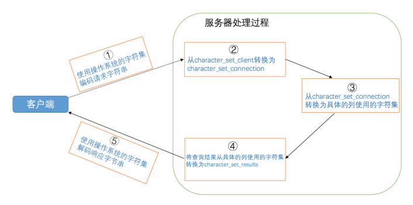
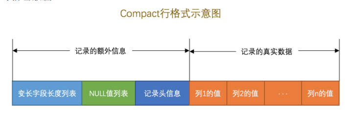

## 关系型数据库设计理论

https://pdai.tech/md/db/sql/sql-db-theory-concept.html

https://blog.csdn.net/calcular/article/details/79332453

## 架构

MySQL采用CS架构，PC上安装的程序分成客户端程序和服务器程序。

MySQL安装目录的bin目录下存放了许多可执行文件，其中一些是服务器程序（mysqld、mysqld_safe)、另一些是客户端程序（mysql、mysqladmin)。

在UNIX上启动服务器程序的方式有：

* mysqld
* mysql_safe：会同时启动mysqld和监视进程
* mysql.server
* mysqld_multi

在Windows上启动服务器进程的方式有：

* mysqld
* 将mysqld注册为服务：`net start mysqld`

客户端进程和服务器进程通信的方式有：

* TCP/IP
* 命令管道或共享内存
* UNIX域套接字

## 启动

启动选项可以调整服务器启动后的一些行为。它们可以在命令行中指定，也可以将它们写入配置文件。

配置文件中的启动选项被划分为若干个组，每个组有一个组名。

系统变量是服务器程序中维护的一些变量，这些变量影响着服务器的行为。修改系统变量的方式如下：

* 在服务器启动时添加启动选项
* 在运行时使用SET语句修改，下面两种方式都行：
  * `SET [GLOBAL | SESSION] 系统变量名 = 值;`
  * `SET [@@(GLOBAL | SESSION).]系统变量名 = 值;`

查看系统变量的方式：`SHOW [GLOBAL|SESSION] VARIABLES [LIKE 匹配的模式];`

状态变量是用来显示服务器程序运行状态的，是只读变量，可以这样查看：`SHOW [GLOBAL|SESSION] STATUS [LIKE 匹配的模式];`

## 字符集

MySQL中一个字符集对应多个比较规则。

查看字符集：`SHOW CHARSET;`

查看比较规则：`SHOW COLLATION [LIKE 匹配模式]`

MySQL有4个级别的字符集和比较规则：

1. 服务器级别，`character_set_server、collation_server`
2. 数据库级别，`character_set_database、collation_database`
3. 表级别，创建和修改表时指定，没有系统变量
4. 列级别

从发送请求到接收响应的过程中发生的字符集转换过程如下：

* 客户端发送的请求字节序列是采用哪种字符集进行编码的。这一步骤取决于操作系统当前使用的字符集，对于Windows来说，还与客户端启动时设置的 `default_character_set`有关
* 服务器接收到请求字节序列后会认为它是采用哪种字符集进行编码的。这一步骤取决于系统变量 `character_set_client`的值
* 服务器在运行过程中会把请求的字节序列转换为以哪种字符集编码的字节序列。这一步骤取决于系统变量 `character_set_connection`的值
* 服务器在向客户端返回字节序列时，是采用哪种字符集进行编码的。取决于系统变量 `character_set_results`
* 客户端在收到响应字节序列后，是如何解析的。取决于操作系统当前使用的字符集，对于windows来说还与启动选项`default_character_set`有关



## 系统变量和会话变量

系统变量影响服务器的行为，会话变量只影响某个连接的客户端。

```mysql
set [global|session] 变量名=值;
set [@@(global|session)].var_name=值;
show [global|session] variables [like 匹配的模式];
select [@@(global|session)].var_name;
```

如果省略了global或者session，默认是session。

还有一些变量只有global或者只有session到作用范围。

## InnoDB存储引擎

### 页

InnoDB将数据存储到磁盘上，处理数据时需要将数据读取到内存中，每次读取一页的大小，一般是16KB。页的大小存储在 `innodb_page_size`变量中。

### 行格式

表中的每一行在磁盘中保存的物理结构叫做行格式。InnoDB 支持4种行格式：`COMPACT、REDUNDANT、DYNAMIC、COMPRESSED`。

```sql
create table record_format
(
    c1 varchar(10),
    c2 varchar(10) not null,
    c3 char(10),
    c4 varchar(10)
)charset = ascii row_format = compact;
```

1. COMPACT：
   
2. REDUNDANT：在compact以前使用的，对于varchar类型分配存储空间不够灵活，占用的空间更大。
3. DYNAMIC 和 COMPRESSES：这两种行格式类似于COMPACT行格式，只不过在处理行溢出数据时有点儿分歧，它们不会在记录的真实数据处存储字符串的前768个字节，而是把所有的字节都存储到其他页面中，只在记录的真实数据处存储其他页面的地址。另外，Compressed 行格式会采用压缩算法对页面进行压缩。

### 索引页

页是mysql管理存储空间的基本单位，InnoDB为了不同的目的设计了不同的页，比如存放表头的页、存放change buffer的页、存放undo日志的页。最重要的是存放表中记录的页——索引页。

## 事务

事务指的是满足 ACID 特性的一组操作，可以通过 Commit 提交一个事务，也可以使用 Rollback 进行回滚。

`SHOW ENGINES` 命令来查看当前 MySQL 支持的存储引擎都有哪些,以及这些存储引擎是否支持事务。MySQL中只有InnoDB支持事务。

### ACID

1. 原子性（Atomicity)：事务被视为不可分割的最小单元，事务的所有操作要么全部提交成功，要么全部失败回滚。回滚可以用undo log来实现，日志记录着事务所执行的修改操作，在回滚时反向执行这些修改操作即可。
2. 隔离性（Isolation)：一个事务的执行不能被其他事务干扰，这通常使用锁来实现。当前数据库系统中都提供了一种粒度锁（granular lock）的策略，允许事务仅锁住一个实体对象的子集，以此来提高事务之间的并发度。
3. 持久性（Duration)：一旦事务提交，则其所做的修改将会永远保存到数据库中。即使系统发生崩溃，事务执行的结果也不能丢失。
4. 一致性（Consistency)：一致性指事务执行前后，数据从一个合法的状态转变为另一个合法的状态。这里合法的状态和业务有关。例如，在表中有一个字段为姓名，它是一个唯一约束，即在表中姓名不能重复。如果一个事务对表进行了修改，但是在事务提交或当事务操作发生回滚后，表中的数据姓名变得非唯一了，那么就破坏了事务的一致性要求。因此，事务是一致性的单位，如果事务中某个动作失败了，系统可以自动地撤销事务使其返回初始化的状态。

事务的 ACID 特性概念简单，但不是很好理解，主要是因为这几个特性不是一种平级关系:

- 只有满足一致性，事务的执行结果才是正确的。
- 在无并发的情况下，事务串行执行，隔离性一定能够满足。此时只要能满足原子性，就一定能满足一致性。
- 在并发的情况下，多个事务并行执行，事务不仅要满足原子性，还需要满足隔离性，才能满足一致性。
- 事务满足持久化是为了能应对数据库崩溃的情况。


从理论上说，事务有着极其严格的定义，它必须同时满足4个特性，即通常所说事务的ACID特性。值得注意的是，虽然理论上定义了严格的事务要求，但是数据库厂商出于各种目的并没有严格满足事务的ACID标准。例如，对于MySQL的NDB Cluster引擎来说，虽然其支持事务，但是不满足D的要求，即持久性的要求。对于Oracle数据库来说，其默认的事务隔离级别为READ COMMITTED，不满足I的要求，即隔离性的要求。虽然在大多数情况下，这并不会导致严重的结果，甚至可能会带来性能的提升，但是用户首先需要了解严谨的事务标准，并在实际的生产应用中避免可能存在的潜在问题。对于InnoDB存储引擎而言，其默认的事务隔离级别为READ REPEATABLE，完全遵循和满足事务的ACID特性。

### 并发一致性问题

https://blog.csdn.net/dududxt/article/details/80854283

在并发环境下，事务的隔离性很难保证，因此会出现很多并发一致性问题。

1. 丢失修改

T1 和 T2 两个事务都对一个数据进行修改，T1 先修改，T2 随后修改，T2 的修改覆盖了 T1 的修改。


2. 读脏数据（脏读）

T1 修改一个数据，T2 随后读取这个数据。如果 T1 撤销了这次修改，那么 T2 读取的数据是脏数据。


3. 不可重复读

T2 读取一个数据，T1 对该数据做了修改。如果 T2 再次读取这个数据，此时读取的结果和第一次读取的结果不同。


4. 幻读（错误求和）

T1 读取某个范围的数据，T2 在这个范围内插入新的数据，T1 再次读取这个范围的数据，此时读取的结果和和第一次读取的结果不同。


------

产生并发不一致性问题主要原因是破坏了事务的隔离性，解决方法是通过并发控制来保证隔离性。并发控制可以通过封锁来实现，但是封锁操作需要用户自己控制，相当复杂。数据库管理系统提供了事务的隔离级别，让用户以一种更轻松的方式处理并发一致性问题。

### 调度

用下面的方式代表一次事务：

```
1. R(A);
2. A = A - 10000;
3. W(A);
4. R(B);
5. B = B + 10000;
6. W(B);
```

When multiple transactions are running concurrently then there needs to be a sequence in which the operations are performed because at a time only one operation can be performed on the database. This sequence of operations is known as **Schedule**.

Here we have two transactions T1 & T2 which are running concurrently. In this example, all the instructions of transaction T1 are executed before the instructions of transaction T2. 

```
T1	T2
----    ----
R(X)	
W(X)	
R(Y)	
        R(Y)
        R(X)
        W(Y)
```

#### 调度类型

1. 串行调度（Serial Schedule）：一个事务执行完成后才开始另一个事务。

2. 严格调度（Strict Schedule）：直到最后一个写数据项X的事务提交之前，其他事务都不能读或写X。可以证明，严格调度的最终结果等价于串行调度。
   ```
   T1	T2
   --- ---
   R(A)
   W(A)
   commit
   	R(A)
   ```

   

### 隔离级别

读未提交（read uncommitted）：一个事务的修改，就算没有提交，其他事务也是可见到。

读已提交（read committed）：一个事务所做的修改在提交之前对其它事务是不可见的。事务T1对数据做了更新，提交之后，T2再去查询就会发现数据已经改变了。

可重复读（repeatable read）：保证在同一个事务中多次读取同样数据的结果是一样的。MySQL默认。事务T1对数据做了更新，提交之后，T2再去查询发现数据还是不变。如果T2提交了，再开启一个新事务，去查询刚才的数据才能看到刚刚 T1 所做的改变。

可串行化（serializable）：强制事务串行执行。

| 隔离级别 | 脏读 | 不可重复读 | 幻读 |
| -------- | ---- | ---------- | ---- |
| 读未提交 | √    | √          | √    |
| 读已提交 |      | √          | √    |
| 可重复读 |      |            | √    |
| 串行化   |      |            |      |

```
查看系统隔离级别：select @@global.tx_isolation;
show global variables like 'transaction_isolation';

查看会话隔离级别(5.0以上版本)：select @@tx_isolation;
查看会话隔离级别(8.0以上版本)：select @@transaction_isolation;
show variables like 'transaction_isolation';

设置全局的隔离级别
set @@transaction_isolation='read-committed';
set global transaction isolation level REPEATABLE READ;
set global transaction isolation level READ COMMITTED;
set global transaction isolation level READ UNCOMMITTED;
set global transaction isolation level SERIALIZABLE;

设置会话的隔离级别
set transaction_isolation='read-uncommitted';
set session transaction isolation level REPEATABLE READ;
set session transaction isolation level READ COMMITTED;
set session transaction isolation level READ UNCOMMITTED;
set session transaction isolation level SERIALIZABLE;

[mysqld]配置文件
transaction-isolation = REPEATABLE-READ
transaction-isolation = READ-COMMITTED
transaction-isolation = READ-UNCOMMITTED
transaction-isolation = SERIALIZABLE
```

### 如何使用事务

可以使用显式事务和隐式事务。

#### 显式事务

1. `start transaction`或者`begin`，开启一个事务。`start transaction`相较于`begin`的优势在于，后边可以加几个修饰符：
   1. ·read only：只读事务
   2. read write：读写事务
   3. with consistent snapshot：启动一致性读
2. 执行一系列DML语句
3. commit 或者 rollback

#### 隐式事务

MySQL有一个系统变量 autocommit：`show variables like 'autocommit'`。默认自动提交。

`set autocommit = off`或者`set autocommmit = 0`这样就可以关闭自动提交。
