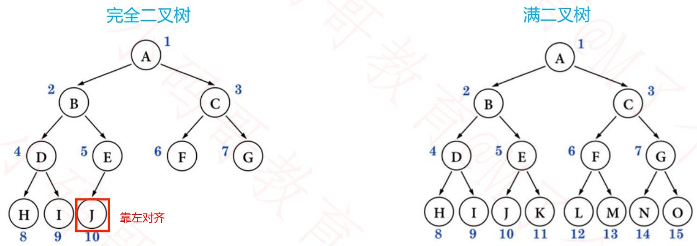
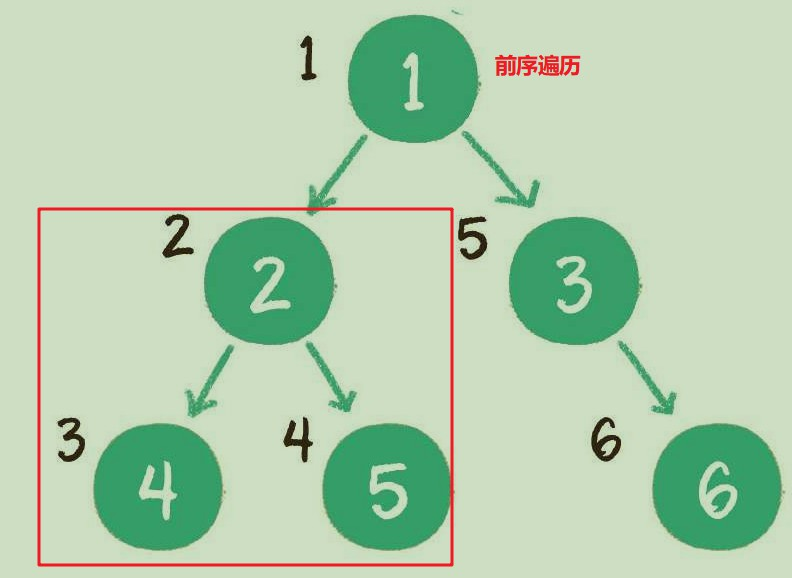
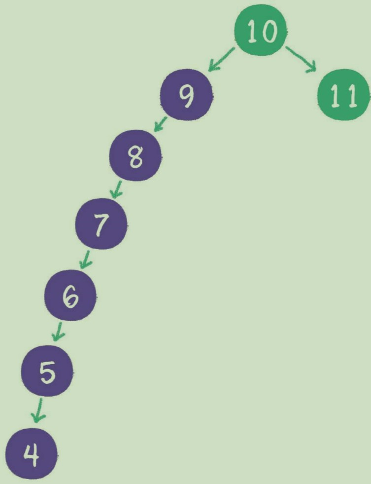
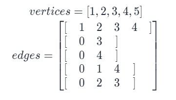

# 数据结构

## 分类

逻辑结构：

1. 集合结构：数据元素之间除了同属于一个集合之外，没有其他关系。
2. 线性结构：数据元素之间是一对一的关系。
3. 树形结构：数据元素之间存在一对多的层次关系
4. 图结构：存在多对多的关系

物理结构（存储结构）：指的是逻辑结构在计算机中的存储形式

1. 顺序存储结构：数据元素在内存中的地址是连续的
2. 链式存储结构：数据元素在内存中地址不连续，彼此之间通过指针相连。
3. 索引结构
4. hash存储

### 如何选择数据结构

1. 定义逻辑结构，明确数据元素间的关系
2. 定义数据运算，针对现实需求明确这种逻辑结构需要什么元素
3. 确定某种存储结构，实现数据结构和运算

## 线性表

### ADT（Abstract Data Type）

Data：元素之间串成一条线，除了第一个元素和最后一个元素外，中间的元素都有且仅有一个直接前驱元素和直接后继元素。

Operation：

1. init：建立一个空的线性表
2. clear：清空数据
3. isEmpty：判断线性表是否为空
4. size
5. get(int index)：获取对应位置的元素
6. insert(int index，Object o)：插入元素
7. delete(int index)：删除元素
8. find(Object o)：查找元素索引

### 顺序存储结构实现

使用叫做**动态数组**的方式实现线性表。

注意区别数组的长度和线性表的长度。数组的长度是初始化数组的时候分配的长度，而线性表的长度是数组中实际被使用了的长度。

动态数组的查找是O(1)，插入和删除都是O(n)。当涉及到扩容的时候，效率更低。

```java
public class MyArray{
    private int[] array;
    private int size;
    public MyArray(int capacity){
        this.array = new int[capacity];
        this.size = 0;
    }
    /**
     * 插入元素
     * @param element 插入的元素
     * @param index 插入的位置
     */
    public void insert(int element, int index) throws Exception{
        //判断index是否超出范围
        if(index < 0 || index > size){
            throw new IndexOutOfBoundsException("超出数组实际元素范围！");
        }
        //如果实际元素达到数组容量上限，则对数组进行扩容
        if(size>=array.length){
            resize();
        }
        
        //从右向左循环，将元素逐个右移一位
        for(int i = size-1; i >=index ; i --){
            array[i+1] = arr[i];
        }
        //腾出的位置放入新元素
        array[index] = element;
        size++;//size比最后一个元素的下标大1
    }

    /**
     * 数组扩容
     */
    public void resize(){
        int[] NewArray = int[array.length*2];
        //复制旧数组到新数组
        System.arraycopy(array,0,NewArray,0,array.length);

        array = NewArray;
    }
    /**
     * 输出数组
     */
    public void output(){
        for(int i = 0; i < size; i ++){
            System.out.println(array[i]);
        }
    }

    /**
     * 删除元素
     */
    public int delete(int index) throws Exception{
        //判断index是否超出范围
        if(index < 0 || index >= size){
            throw new IndexOutOfBoundsException("超出数据实际元素范围！");
        }
        int deleteElement = array[index];
        //从左向右循环，元素逐个左翼
        for(int i = index; i <size-1; i ++){
            array[i] = array[i+1];
        }

        size --;
        return deleteElement;
    }
}
```


### 链式存储结构实现

有单链表、双链表两种实现方式。

链表的每一个元素称为Node，Node除了有数据域保存数据之外，还有地址域，用来保存后继元素的地址。

我们还需要一个head指针，保存第一个节点的位置。同时还需要tail指针保存最后一个节点的位置。

有时候为了方便，干脆把head指针也加上数据域，扩展成为头节点。头节点的数据域可以为null，也可以用来保存链表的长度。

```java
public class SingleLinkedListTest {
    public static void main(String[] args) {

        SingleLinkedList linkedList = new SingleLinkedList();
        try {
            linkedList.add(0,100);
            linkedList.add(1,200);
            linkedList.add(2,300);
            linkedList.add(3,400);
            System.out.println("链表的长度是： "+linkedList.getSize());
            linkedList.output();
            System.out.println("---------------------");
            linkedList.remove(3);
            System.out.println("链表的长度是： "+linkedList.getSize());
            System.out.println("尾节点是： "+linkedList.getLast());
        } catch (Exception e) {
            e.printStackTrace();
        }

    }
}

//定义链表，管理所有Node对象
class SingleLinkedList{
    //先初始化一个head
    private Node head;
    private Node last;
    private int size;//链表实际长度

    //返回head
    public Node getHead(){
        return head;
    }
    //返回last
    public Node getLast(){
        return last;
    }

    //返回长度
    public int getSize(){
        return size;
    }
    /**
     * 添加节点，有三种情况：头部插入、尾部插入、中间插入
     * @param index 链表节点的下标，从1开始
     */
    public void add(int index, int data) throws Exception{
        if(index < 0 || index > size){
            throw new IndexOutOfBoundsException("超出链表节点范围！");
        }
        Node insertedNode = new Node(data);
        if(size == 0){
            //空链表
            head = insertedNode;
            last = insertedNode;
        }else if(index == 0){
            //头部插入
            insertedNode.next = head;
            head = insertedNode;
        }else if(index == size){
            //尾部插入
            last.next = insertedNode;
            last = insertedNode;
        }else{
            //中间插入
            Node preNode = get(index -1);
            insertedNode.next = preNode.next;
            preNode.next = insertedNode;
        }

        size ++;
    }
    /**
     * 链表删除元素
     */
    public Node remove(int index) throws Exception{
        if(index < 0 || index > size){
            throw new IndexOutOfBoundsException("超出链表节点范围！");
        }
        Node removeNode = null;
        if(index == 0){
            //删除头节点
            removeNode = head;
            head = head.next;
        }else if(index == size -1){
            //删除尾节点
            Node prevNode = get(index - 1);
            removeNode = prevNode.next;
            prevNode.next = null;
            last = prevNode;
        }else{
            //删除中间节点
            Node prevNode = get(index - 1);
            Node nextNode = prevNode.next.next;
            removeNode = prevNode.next;
            prevNode.next = nextNode;
        }
        size --;
        return removeNode;
    }
    /**
     * 链表查找元素
     */
    public Node get(int index) throws Exception{
        if(index < 0 || index > size){
            throw new IndexOutOfBoundsException("超出链表节点范围！");
        }
        Node temp = head;
        for(int i = 0; i < index; i ++){
            temp = temp.next;
        }
        return temp;
    }
    /**
     * 输出链表
     */
    public void output(){
        Node temp = head;
        while(temp != null){
            System.out.println(temp.data);
            temp = temp.next;
        }
    }
}

//定义节点类
class Node{
    public int data;
    public Node next;//指向下一个节点

    public Node(){}
    public Node(int data){
        this.data = data;
    }

    @Override
    public String toString() {
        return "data: "+ data + "; next: "+ next;
    }
}
```

### 栈

先入后出 FILO栈，又称下压栈。像一个圆筒一样。最早进入的元素存放的位置叫作栈底（bottom），最后进入的元素存放的位置叫作栈顶（top）。也可以想象桌子上的一摞纸。


1. 入栈：入栈（push）就是把新元素放入栈中，只允许从栈顶一侧放入，新元素的位置将会成为新的栈顶。
2. 出栈：出栈（pop）就是把元素从栈中弹出，只有栈顶元素才允许出栈，出栈元素的前一个元素将会成为新的栈顶。peek()：返回栈顶元素，但是不弹出。

stack的使用非常多，电子邮件系统、浏览器访问记录等。

通常情况下，不推荐使用 Java 的 `Vector` 以及其子类 `Stack` ，而一般将 `LinkedList` 作为栈来使用。因为 Stack 是使用数组实现的，而LinkdedList 是双端队列，就可以当栈使用，也可以当队列使用。

LinkedList提供了大量功能相同的方法，比如add() 、addLast()、push()、offer() 都可以作为入栈方法，pop()、removeLast() 都可以作为出栈方法。

```java
/**
 * 用链表实现栈
 * 容易想到把链表的尾部当作栈顶，这样入栈简单，但是出栈难，不好把栈顶指定前移
 * 如果把头部当作栈顶，入栈简单，出栈也简单，因为栈顶后移比较容易
 */
public class MyStack {
    private Node top; //栈顶的指针
    private int size;

    public MyStack(){
        top = null;
        size = 0;
    }
    public boolean isEmpty(){
        return size == 0;
    }
    public int getSize(){
        return size;
    }
    public void push(Object e){
        Node newNode = new Node(e,top); //入栈的元素放到链表头部
        top = newNode; //移动栈顶指针
        size ++;
    }
    public Object pop(){
        if(isEmpty()){
            return null;
        }else {
            Node oldTop = top;
            top = top.next;
            size --;
            return oldTop.element;
        }
    }
    public Object peek(){
        if(isEmpty()){
            return null;
        }else {
            return top.element;
        }
    }

    static class Node{
        Object element;
        Node next;
        Node(){
            this(null,null);
        }
        Node(Object e, Node n){
            element = e;
            next = n;
        }
    }
}
```

JavaScript代码

```html
<!DOCTYPE html>
<head></head>
<body>
    <script>
        //定义栈
        function Stack() {
            //保存元素的数组
            this.items = []

            //栈的相关操作
            // //this.push相当于给当前实例添加push方法
            // this.push = function () {

            // }
            //推荐下面这种方式，相当于为类添加方法
            Stack.prototype.push = function (element) {
                this.items.push(element)
            }

            Stack.prototype.pop = function () {
                return this.items.pop()
            }

            Stack.prototype.peek = function () {
                return this.items[this.items.length - 1]
            }

            Stack.prototype.isEmpty = function () {
                return this.items.length == 0
            }

            Stack.prototype.toString = function () {
                var resultString = ""
                for (var i = 0; i < this.items.length; i++) {
                    resultString += this.items[i] + ' '
                }
                return resultString
            }
        }
        //栈的使用
        var s = new Stack();
        s.push(10)
        s.push(20)
        s.push(30)
        alert(s)
    </script>
</body>
</html>
```

### 队列

先入先出 FIFO。像排队一样。队列的出口端叫作队头 （front），队列的入口端叫作队尾 （rear）。

队列可以用数组和链表实现。如果用数组实现时，每次出队都需要将后面的元素向前挪动，很麻烦。为此可以使用两个指针，front 和 rear。front 始终等于Queue首元素在数组中的下标，即指向下次出队元素的位置。rear始终等于Queue末元素的加标加一，即指向下次入队元素的位置。一开始，front = rear = 0，每次有元素入队时，将其存放在Q[rear] ，然后 rear + 1。每次有元素出队时，也将 front + 1，指向新的队首元素。


1. 入队：enqueue只允许在队尾的位置放入元素，新元素的下一个位置将会成为新的队尾。
2. 出队：dequeue只允许在队头一侧移出元素，出队元素的后一个元素将会成为新的队头。

用链表实现的队列入队出队的复杂度都是O(1)，也可以用数组实现O(1) 复杂度的队列，使用的方法是环形队列。

Java 提供了双端队列接口 Deque，即前端与后端都可以添加或删除元素，LinkedList 是其实现类。双端队列的实现需要双向链表，双向链表每个节点都有next 和 prev 两个指针。和单链表不同的是：front 指针在实际的头节点的前面，rear 在实际尾节点的后面，两个指针不保存任何数据，叫做 Dummy node(哑巴节点)，起到哨兵的作用，为的是插入和删除元素的方便。而且如果是空队列，也有 front 和 rear 互相指向对方，插入元素也很简单。


```java
/**
实现环形队列
 */
class CircleQueue{
    private int front;//头部指针，指向下一个出队的元素
    private int rear;//尾部指针，指向下一个入队元素的位置
    private int[] arr;

    public CircleQueue(Integer capacity){
        arr= new int[capacity];
    }
    //判断队列是否为空
    public boolean isEmpty(){
        return rear==front; // 这里有问题，队列满了的时候也有 rear==front，所以禁止元素数量超过 length-1。下面的isFull()就是这种思想。
    }
    //判断队列满了吗
    public boolean isFull(){
        return (rear+1)%arr.length == front;
    }
    //入队
    public void enQueue(int num){
        //队列满了先扩容
        if(isFull()){
            throw new RuntimeException("Queue 满了");
        }
        arr[rear] = num;
        rear = (rear+1)%arr.length;
    }
    //出队
    public int deQueue(){
        if(isEmpty()){
            throw new RuntimeException("队列为空，不能取数据");
        }
        int value = arr[front];
        front = (front + 1)%arr.length;
        return value;
    }
    //队列长度
    public int size(){
        return (rear+arr.length-front)%arr.length;
    }
    //输出队列
    public void output(){
        if(isEmpty()){
            System.out.println("数列是空的");
        }
        //从front遍历到rear
        for(int i = front; i < front + size(); i ++){
            System.out.println(arr[i%arr.length]);
        }
//        for(int i = front; i != rear; i = (i + 1)%arr.length){
//            System.out.println(arr[i]);
//        }
    }
}

/**
 * 通过链表出现队列
 */
public class MyQueue {
    Node front;
    Node rear;
    int size;
    public MyQueue(){
        this.front = null;
        this.rear = null;
        this.size = 0;
    }
    public int getSize() {
        return size;
    }
    public boolean isEmpty(){
        return size == 0;
    }
    public void enQueue(Object e){
        Node newNode = new Node(e,null);
        if(isEmpty()){
            front = newNode; //空链表
        }else{
            rear.next = newNode;
        }
        rear = newNode;
        size ++;
    }
    public Object deQueue(){
        if(isEmpty()){
            return null;
        }else{
            Node oldFront = front;
            front = front.next;
            size --;
            if(isEmpty()) rear = null;
            return oldFront.element;
        }
    }

    static class Node{
        Object element;
        Node next;
        Node(){
            this(null,null);
        }
        Node(Object e, Node n){
            element = e;
            next = n;
        }
    }
}
```

#### stack和queue的应用

栈的输出顺序和输入顺序相反，所以栈通常用于对“历史”的回溯，也就是逆流而上追溯“历史”。

例如实现递归的逻辑，就可以用栈来代替，因为栈可以回溯方法的调用链。

栈还有一个著名的应用场景是面包屑导航，使用户在浏览页面时可以轻松地回溯到上一级或更上一级页面。


队列的输出顺序和输入顺序相同，所以队列通常用于对“历史”的回放，也就是按照“历史”顺序，把“历史”重演一遍。

例如在多线程中，争夺公平锁的等待队列，就是按照访问顺序来决定线程在队列中的次序的。

再如网络爬虫实现网站抓取时，也是把待抓取的网站URL存入队列中，再按照存入队列的顺序来依次抓取和解析的。

```java
/**
 * 栈的应用：判断括号是否匹配
 * 如果遇到左括号就入栈，遇到右括号就出栈，如果栈为空就不匹配。
 * 如果遍历完了，栈非空也不匹配。
 */
public boolean ParenMatch(String s){
    char[] chars = s.toCharArray();
    Stack<Character> stack = new Stack<>();
    for (char aChar : chars) {
        if(aChar == '('){
            stack.push(aChar);
        }else if(aChar == ')'){
            if(stack.isEmpty()){
                return false;
            }else{
                stack.pop();
            }
        }
    }
    if(stack.isEmpty()){
        return true;
    }else{
        return false;
    }
}
```

### 优先队列

优先队列分为最大优先队列和最小优先队列。在最大优先队列中，无论入队顺序如何，当前最大的元素都会优先出队，这是通过最大堆实现的。最小优先队列是通过最小堆实现的。

普通队列插入一个元素会被放在后端，优先队列插入一个元素会和其他元素进行比较，然后放到正确的位置。

```html
<!DOCTYPE html>
<head></head>
<body>
    <script>
        //优先队列
        function PriorityQueue() {
            //内部类
            function QueueElement(element, priority){
                this.element = element
                this.priority = priority
            }

            //属性，用数组保存内部类的实例
            this.items = []
            
            //插入方法
            PriorityQueue.prototype.enqueue = function(element, priority) {
                //1. 创建QueueElement对象
                let newObject = new QueueElement(element, priority)
                //2. 
                if(this.items.length == 0){
                    this.items.push(newObject)
                }else{
                    let added = false
                    for(let i = 0; i < this.items.length; i ++){
                        if(newObject.priority > this.items[i].priority){
                            this.items.splice(i, 0, newObject)
                            added = true
                            break
                        }
                    }
                    if(!added){
                        this.items.push(newObject)
                    }
                }

                //弹出方法
                PriorityQueue.prototype.dequeue = function(){
                    return this.items.shift()
                }

                PriorityQueue.prototype.isEmpty = function(){
                    return this.items.length == 0
                }

                PriorityQueue.prototype.size = function(){
                    return this.items.length
                }

                PriorityQueue.prototype.front = function(){
                    return this.items[0]
                }

                PriorityQueue.prototype.toString = function(){
                    let resultString = ''
                    for(let i = 0; i < this.items.length; i ++){
                        resultString += this.items[i].element + ' ' + this.items[i].priority + ';'
                    }
                    return resultString
                }
            }

        }

        //测试
        let pq = new PriorityQueue();
        pq.enqueue('nba', 100)
        pq.enqueue('cba', 50)
        pq.enqueue("fiba", 70)
        alert(pq)
    </script>
</body>
</html>
```

### 哈希表

哈希表以键值对形式存储数据，只要给出一个key，就可以通过哈希函数计算出value的存储地址，时间复杂度接近O(1)。数组的索引查找效率高，内容查找效率低，而hash table这两种操作都很高。hash table在本质上也是一个数组。

如果只有key，没有伴随数据value，使用Java的HashSet，如果既有key，也有value，使用HashMap，两种类型的底层实现都是HashMap。

放入哈希表的东西，如果是基础类型，内部按值传递，保存的是值；如果是引用类型，保存的是地址。

哈希表是无序的，如果想要其有序可以使用有序表TreeSet和TreeMap，内部是平衡二叉树来实现的。

```java
TreeMap<Integer, String> treeMap1 = new TreeMap<>();
    treeMap1.put(7, "我是7");
    treeMap1.put(5, "我是5");
    treeMap1.put(4, "我是4");
    treeMap1.put(3, "我是3");
    treeMap1.put(9, "我是9");
    treeMap1.put(2, "我是2");
    System.out.println(treeMap1.containsKey(5));
    System.out.println(treeMap1.get(5));
    System.out.println(treeMap1.firstKey() + ", 我最小");
    System.out.println(treeMap1.lastKey() + ", 我最大");
    System.out.println(treeMap1.floorKey(8) + ", 在表中所有<=8的数中，我离8最近");
    System.out.println(treeMap1.ceilingKey(8) + ", 在表中所有>=8的数中，我离8最近");
    System.out.println(treeMap1.floorKey(7) + ", 在表中所有<=7的数中，我离7最近");
    System.out.println(treeMap1.ceilingKey(7) + ", 在表中所有>=7的数中，我离7最近");
    treeMap1.remove(5);
    System.out.println(treeMap1.get(5) + ", 删了就没有了哦");
    System.out.println("========6=========");
```

在Java及大多数面向对象的语言中，每一个对象都有属于自己的hashcode，这个hashcode是区分不同对象的重要标识。无论对象自身的类型是什么，它们的hashcode都是一个整形变量。只要按照数组长度进行取模运算，就能把key对应的value的索引找到。
`index = HashCode(key)%Array.length`，hashcode一般是通过字符串每个字符的ASCII码经过幂乘得到的。

数组的长度有限，对长度取模运算一定会有很多key计算出来的索引一样，这种情况叫做**哈希冲突**。 哈希冲突是无法避免的，解决哈希冲突的方法主要有两种，一种是开放寻址法，一种是链表法。开放寻址法的原理很简单，当一个Key通过哈希函数获得对应的数组下标已被占用时，就向后寻找下一个空档位置。在Java中，ThreadLocal所使用的就是开放寻址法。另一种方法是链表法，就是把下标相同的Entry串成一个链表，HashMap就采用这种方式。

哈希表的搜索、插入删除都很快，但是元素无序，不能按照顺序遍历。同时不能快速找出表中的最值。

操作：

1. 写：put就是在散列表中插入新的键值对
2. 读：get就是通过给定的Key，在散列表中查找对应的Value。
3. 扩容：当经过多次元素插入，散列表达到一定饱和度时，发生哈希冲突的概率会逐渐提高。这样一来，大量元素拥挤在相同的数组下标位置，形成很长的链表，对后续插入操作和查询操作的性能都有很大影响。这时，散列表就需要扩展它的长度，也就是进行resize。
   1. 对于JDK中的散列表实现类HashMap来说，影响其扩容的因素有两个。Capacity ，即HashMap的当前长度；LoadFactor ，即HashMap的负载因子，默认值为0.75f
   2. 扩容条件：HashMap.Size >= Capacity×LoadFactor
   3. 扩容时：创建一个新的Entry空数组，长度是原数组的2倍。遍历原来的hash table，重新计算hashCode，将元素重填到新的数组中。
   4. 注意：关于HashMap的实现，JDK 8和以前的版本有着很大的不同。当多个Entry被Hash到同一个数组下标位置时，为了提升插入和查找的效率，HashMap会把Entry的链表转化为红黑树这种数据结构。

## 树

线性表可以基于数组实现或者基于链表实现。就其效率而言，这两种实现方式各有长短。数组查询快，增删慢，链表反之。有没有一个数据结构可以结合二者的优点呢？那就是树结构。

### 概念

- 节点：根节点、父节点、子节点、兄弟节点。
- 注意下图的5、6不是兄弟节点，因为它们没有相同的父节点
- 一个节点有多少个子节点就有多少个子树
- 度(degree)：任一节点的孩子的数量
- 树的度：所有节点度的最大值
- 叶子：度为0的节点
- 层数：根节点是第1层，下面是第2层......。有些书把root当作第0层。
- 深度：从上往下数节点的层数。
- 高度：从下往上数节点的层数。


二叉树就是每个节点最多只有两个子节点。真二叉树：节点的度要么是0、要么是2。


一个二叉树的所有非叶子节点都存在左右孩子，并且所有叶子节点都在同一层级上，那么这个树就是满二叉树。完全二叉树的条件没有满二叉树那么苛刻：满二叉树要求所有分支都是满的；而**完全二叉树只需保证最后一个节点之前的节点都齐全即可。注意如果叶子不满，至少要靠左对齐。**



### 性质

- 二叉树第i层，最多 $2^{i-1}$
- 高度为h的二叉树，最多$2^h-1$个节点
  - 满二叉树高度和节点数的关系：$n = 2^h-1, h = log_{2}(n + 1)$
  - 完全二叉树
    - $2^{h-1} \leq n \leq 2^{h}-1, h-1 \leq log_{2}n \le h$，所以h=floor($log_{2}n$)+1
    - 一棵有 n 个节点的完全二叉树，从上到下、从左到右对节点从 1 开始进行编号，对任意第 i 个节点
      - 如果 i = 1 ，它是根节点
      - 如果 i > 1 ，它的父节点编号为 floor( i / 2 )
      - 如果 2i ≤ n ，它的左子节点编号为 2i
      - 如果 2i > n ，它无左子节点
      - 如果 2i + 1 ≤ n ，它的右子节点编号为 2i + 1
      - 如果 2i + 1 > n ，它无右子节点
    - 一棵有 n 个节点的完全二叉树，从上到下、从左到右对节点从 0 开始进行编号，对任意第 i 个节点
      - 如果 i = 0 ，它是根节点
      - 如果 i > 0 ，它的父节点编号为 floor( (i – 1) / 2 )
      - 如果 2i + 1 ≤ n – 1 ，它的左子节点编号为 2i + 1
      - 如果 2i + 1 > n – 1 ，它无左子节点
      - 如果 2i + 2 ≤ n – 1 ，它的右子节点编号为 2i + 2
      - 如果 2i + 2 > n – 1 ，它无右子节点
      - 注意：通过上面的规律可以用数组表示完全二叉树，但是对于非完全二叉树不适合，有很大的空间浪费。
- 对于任何一棵非空二叉树，如果叶子节点个数为 n0，度为 2 的节点个数为 n2，则有: **n0 = n2 + 1**
  1. 假设度为 1 的节点个数为 n1，那么二叉树的节点总数 n = n0 + n1 + n2
  2. 树中节点的数量等于边数加一，因为除了root，每个节点上面都有一条边。
  3. 二叉树的边数 T = n1 + 2 * n2 = n – 1 = n0 + n1 + n2 – 1。
  4. 因此 n0 = n2 + 1

### 存储结构

二叉树可以用链表或数组实现

链表实现：


数组实现：使用数组存储时，会按照层级顺序把二叉树的节点放到数组中对应的位置上。如果某一个节点的左孩子或右孩子空缺，则数组的相应位置也空出来。为什么这样设计呢？因为这样可以更方便地在数组中定位二叉树的孩子节点和父节点。假设一个父节点的下标是parent，那么它的左孩子节点下标就是2×parent + 1
 ；右孩子节点下标就是2×parent + 2 。反过来，假设一个左孩子节点的下标是leftChild，那么它的父节点下标就是（leftChild-1）/ 2 。


还有一种儿子兄弟表示法，可以用来存储任意类型的树：


### 二叉搜索树

这里我们介绍一种特殊的二叉树：二叉查找树（binary search tree）。二叉查找树在二叉树的基础上增加了以下几个条件：如果左子树不为空，则左子树上所有节点的值均小于根节点的值；如果右子树不为空，则右子树上所有节点的值均大于根节点的值；左、右子树也都是二叉查找树。


对于一个节点分布相对均衡的二叉查找树来说，如果节点总数是n，那么搜索节点的时间复杂度就是O(logn) ，和树的深度是一样的。这种依靠比较大小来逐步查找的方式，和二分查找算法非常相似。

```java
package tree;

/**
 * 标准二叉搜索树
 * @param <AnyType>
 */
public class BinarySearchTree<AnyType extends Comparable> {
    private BinaryNode<AnyType> root;

    public BinarySearchTree(){
        root = null;
    }

    public void clear(){
        root = null;
    }

    public boolean isEmpty(){
        return root == null;
    }

    /**
     * 二叉树是否包含元素
     * @param x
     * @return
     */
    public boolean contains(AnyType x){
        return contains(x, root);
    }
    private boolean contains(AnyType x, BinaryNode<AnyType> node){
        if(node == null) return false;

        int compareResult = x.compareTo(node.element);
        if(compareResult < 0) {
            return contains(x, node.left);
        }else if(compareResult > 0){
            return contains(x, node.right);
        }else {
            return true;
        }
    }

    /**
     * 返回值最大的节点：找到最右的节点
     * @return
     */
    public BinaryNode<AnyType> findMax(){
        if(isEmpty()){
            return null;
        }else {
            return findMax(root);
        }
    }
    private BinaryNode<AnyType> findMax(BinaryNode<AnyType> node) {
        if(node != null){
            while(node.right != null){
                node = node.right;
            }
        }
        return node;
    }

    /**
     * 返回最小值的节点
     * 采用尾递归的方式，可以和while循环轻松的替换
     * @return
     */
    public BinaryNode<AnyType> findMin(){
        if(isEmpty()){
            return null;
        }else {
            return findMin(root);
        }
    }
    private BinaryNode<AnyType> findMin(BinaryNode<AnyType> node) {
        if(node.left == null) return node;
        else return findMin(node.left);
    }

    /**
     * 向二叉树插入元素
     * 有重复元素就替换
     * @param x
     */
    public void insert(AnyType x){

    }

    /**
     * 这个递归相当抽象，挺难理解的
     * @param x
     * @param node
     * @return
     */
    private BinaryNode<AnyType> insert(AnyType x, BinaryNode<AnyType> node){
        if(node == null){
            return new BinaryNode<>(x, null, null);
        }

        int compareResult = x.compareTo(node.element);

        if(compareResult < 0) {
            node.left = insert(x, node.left);
        }else if(compareResult > 0) {
            node.right = insert(x, node.right);
        }else { //元素存在就替换
            node.element = x;
        }
        return node;
    }

    /**
     * 删除节点的方法
     * 这是最难的方法，涉及到树的重新调整
     * @param x
     */
    public void remove(AnyType x){
        remove(x, root);
    }

    /**
     * leaf可以直接删除
     * 度为1的节点删除后，将子节点提升上来、
     * 度为2的节点： 用右子树的最小值替换该节点，并删除最小值所在的节点。（或者用左子树的最大值替换该节点
     * 因为最小值所在的节点不可能有左孩子，所以度是0或1，删除起来比较容易
     * @param x
     * @param node
     * @return
     */
    private BinaryNode<AnyType> remove(AnyType x, BinaryNode<AnyType> node){
        if(node == null) return null;

        int compareResult = x.compareTo(node.element);
        if(compareResult < 0) {
            node.left = remove(x, node.left);
        }else if(compareResult > 0) {
            node.right = remove(x, node.right);
        }else if(node.left != null && node.right != null){ //要删除的节点度为2
            //找到右子树最小值，用来替换要删除的节点值
            node.element = findMin(node.right).element;
            node.right = remove(node.element, node.right);
        }else { //要删除的节点度为0或1
            //如果有左孩子，用左孩子替换要删除的节点。否则用右孩子替换
            //度为0说明孩子为null，将当前节点删除就是将其变为null
            node = (node.left != null)?node.left:node.right;
        }
        return node;
    }

    /**
     * 打印树，
     */
    public void printTree(){

    }

    private void printTree(BinaryNode<AnyType> node){

    }
    /**
     * 根据值返回对应的节点
     * @param x
     * @return
     */
    private BinaryNode<AnyType> findNodeByValue(AnyType x){
        return null;
    }
    /**
     * 节点类
     * @param <AnyType>
     */
    private static class BinaryNode<AnyType> {
        AnyType element;
        BinaryNode<AnyType> left;
        BinaryNode<AnyType> right;

        public BinaryNode(AnyType element) {
            this(element, null, null);
        }
        public BinaryNode(AnyType element, BinaryNode<AnyType> left, BinaryNode<AnyType> right) {
            this.element = element;
            this.left = left;
            this.right = right;
        }
    }
}
```

### 遍历

二叉树，是典型的非线性数据结构，遍历时需要把非线性关联的节点转化成一个线性的序列，以不同的方式来遍历，遍历出的序列顺序也不同。

二叉树的遍历方式可以分为两类：

1. 深度优先遍历（Depth-First Search DFS）：简单说就是一头扎到底。如果先输出根节点就是前序遍历，最后输出根节点就是后序遍历。
   1. 前序遍历：输出顺序是根节点、左子树、右子树。
      
   2. 中序遍历：输出顺序是左子树、根节点、右子树。中序遍历输出的元素是有序的。中序遍历时的前一个节点是前驱节点predecessor，同理还有后驱节点successor。
   3. 后序遍历：输出顺序是左子树、右子树、根节点。
2. 广度优先遍历（Breadth-First Search BFS）
    1. 层序遍历：一层一层遍历，从左向右。

#### 递归实现

```java
void traversal(Node root) {
    //1. 第一次访问机会
    traversal(root.left);
    //2. 遍历完左子树后返回这里，第二次访问机会
    traversal(root.right);
    //3. 遍历完右子树后返回这里，第三次访问机会
}
```

对于上图的子树，递归序是：1,2,4,4,4,2,5,5,5,2,1,3,6,6,6,3,7,7,7,3,1。

如果是先序遍历，就利用第一次的访问机会，所以打印顺序是：1,2,4,5,3,6,7

中序遍历利用第二次访问机会：4,2,5,1,6,3,7

后序遍历利用第三次访问机会：4,5,2,6,7,3,1

#### 非递归实现

先序遍历：首先头节点入栈，然后弹出。每次弹出之后将节点的右孩子、左孩子入栈（如果有的话）。

后序遍历：需要两个栈，一个栈是头右左，一次弹出放入另一个栈就变成了左右头。

中序遍历：压入左边界，然后依次弹出。弹出的节点都要看他有没有右树，有的话就移动到右节点，然后继续压入左边界，再弹出。

层序遍历：用队列先放入头节点，出队放入左右孩子。继续以上过程。

```java
public class PreInPosTraversal {
	//非递归前序遍历
	public static void preOrderUnRecur(Node head) {
		System.out.print("pre-order: ");
		if (head != null) {
			Stack<Node> stack = new Stack<Node>();
			stack.add(head);
			while (!stack.isEmpty()) {
				head = stack.pop();
				System.out.print(head.value + " ");
				if (head.right != null) {
					stack.push(head.right);
				}
				if (head.left != null) {
					stack.push(head.left);
				}
			}
		}
		System.out.println();
	}

	public static void inOrderUnRecur(Node head) {
		System.out.print("in-order: ");
		if (head != null) {
			Stack<Node> stack = new Stack<Node>();
			while (!stack.isEmpty() || head != null) {
				if (head != null) {
					stack.push(head);
					head = head.left;
				} else {
					head = stack.pop();
					System.out.print(head.value + " ");
					head = head.right;
				}
			}
		}
		System.out.println();
	}
	//后序遍历
	public static void posOrderUnRecur1(Node head) {
		System.out.print("pos-order: ");
		if (head != null) {
			Stack<Node> s1 = new Stack<Node>();
			Stack<Node> s2 = new Stack<Node>();
			s1.push(head);
			while (!s1.isEmpty()) {
				head = s1.pop();
				s2.push(head);
				if (head.left != null) {
					s1.push(head.left);
				}
				if (head.right != null) {
					s1.push(head.right);
				}
			}
			while (!s2.isEmpty()) {
				System.out.print(s2.pop().value + " ");
			}
		}
		System.out.println();
	}

	public static void posOrderUnRecur2(Node h) {
		System.out.print("pos-order: ");
		if (h != null) {
			Stack<Node> stack = new Stack<Node>();
			stack.push(h);
			Node c = null;
			while (!stack.isEmpty()) {
				c = stack.peek();
				if (c.left != null && h != c.left && h != c.right) {
					stack.push(c.left);
				} else if (c.right != null && h != c.right) {
					stack.push(c.right);
				} else {
					System.out.print(stack.pop().value + " ");
					h = c;
				}
			}
		}
		System.out.println();
	}
    //层序遍历
    public static void w(Node head) {
        if(head == null) return;
        Queue<Node> q = new LinkedList();
        q.add(head);
        while(!q.isEmpty()) {
            Node cur = q.poll();
            sout(cur.value);
            if(cur.left != null) {
                q.add(cur.left);
            }
            if(cur.right != null) {
                q.add(cur.right);
            }
        }
    }
}

```

### 重构二叉树

二叉树遍历的反问题是根据遍历得出的数据列表重构出二叉树出来。重构的关键在于确定根节点和左右子树，这需要两种遍历方式的配合。

1. 前序遍历 + 中序遍历：前序遍历第一个就是根节点，定位到中序遍历的结果就可以区分出左右子树。
2. 后序遍历 + 中序遍历：后序遍历最后一个就是根节点，以此类推找出中序遍历中的左右子树。
3. 前序遍历 + 后序遍历：可以找到唯一的真二叉树。

### 平衡二叉搜索树

如果二叉树的分布太极端，时间复杂图就会退化为O(n)。要解决这个问题就涉及二叉树的平衡了。在节点数量一定时，左右子树的高度越接近，这个二叉树就越平衡。

平衡二叉搜索树 Balanced Binary Search Tree 常见的类型有：红黑树(Linux进程调度、C++ STL、Java 的 TreeMap、TreeSet、HashMap)、AVL树(Windows NT内核中广泛使用)、树堆等。



除二叉查找树以外，二叉堆也维持着相对的顺序。不过二叉堆的条件要宽松一些，只要求父节点比它的左右孩子都大。

### AVL树

平衡因子：节点左右子树的高度差。下图的根节点7，左子树高度为2，右子树高度是4，所以平衡因子是 -2。AVL树的平衡因子只能是 -1，0，1。通过旋转来实现。AVL插入、删除效率不如红黑树，用的不多。


### B树

是一种平衡的多路搜索树，多用于文件系统、数据库的实现。1个节点可以存储多个数据，可以拥有超过2个子节点。非常平衡，每个节点的子树高度一致。整个树的高度比较矮。


### 红黑树


也叫平衡二叉B树。有5条性质：

1. 节点是红或者黑。
2. root必须是黑。
3. 叶子必须是黑色的空节点。
4. 红节点的两个子节点都是黑节点。
   1.  红的父节点都是黑节点。
   2. 从root到leaf的所有路径上不能有两个连续的红节点。
5. **从任一节点到每个叶子节点的所有路径都包含相同数量的黑节点。**

上面的5条性质，确保了红黑树的关键特性：==从根到叶子节点的最长路径不会超过最短路径的两倍，这就保证了红黑树的相对平衡。==

插入一个新节点会破环红黑树的平衡，有三种变换可以实现再平衡：

1. 换色
   1. **新插入的节点默认是红色。**因为直接插入黑色绝对需要再平衡，而插入红色节点可能不需要再平衡，就算需要平衡也比较简单。
2. 左旋转
3. 右旋转


插入情况的讨论：

1. 新节点位于根节点，直接将红色变为黑色。
2. 父黑，不用变换，为新节点补上两个空子节点。
3. 父红叔红 --> 父黑叔黑祖红。如果G是root，将其变为黑色。
4. 父红叔黑祖黑，新节点是左孩子 --> 父黑、祖红、右旋转
5. 父红叔黑祖黑、新节点是右孩子 --> 以父为根左旋转、变成情况4

红黑树的删除操作比插入操作还要复杂，理解了红黑树的插入操作足以应付大厂面试，不会让你手写插入删除代码的。

### 二叉堆

堆结构本质就是用数组实现的完全二叉树，二叉堆分为两个类型：最大堆(大根堆)和最小堆。什么是最大堆呢？最大堆的任何一个父节点的值，都大于或等于它左、右孩子节点的值。

二叉堆的根节点叫作堆顶。最大堆和最小堆的特点决定了：最大堆的堆顶是整个堆中的最大元素；最小堆的堆顶是整个堆中的最小元素。

假设父节点的下标是parent，那么它的左孩子下标就是 2×parent+1；右孩子下标就是2×parent+2。如果孩子的下标是child，父节点的下标就是(child - 1)/2。如果有N个节点，则层数为logN。


大根堆的实现很容易：
先push第一个元素，下标为0。在push第二个元素，保存到下标1；然后通过(child - 1)/2 得到父节点的下标，此元素和父节点比较，如果更大，就和父节点交换位置。以此类推。
poll方法先弹出首元素，然后将最后一个元素放到首位，heapSize - 1。然后调用heapify方法重新调整元素位置。

```java
class MaxHeap{
    private int[] data;
    private int heapSize = 0;
    public MaxHeap(int capacity){
        data = new int[capacity];
    }
    //入队方法
    public void push(int val){
        if(heapSize == capacity) return; //数组满了
        insertHeap(data, heapSize);
        heapSize ++;
    }
    private void insertHeap(int[] arr, int index){
        //当child小于parent时退出while
        //当index等于0时，(index - 1)/2也等于0，会退出while
        while(arr[index] > arr[(index - 1)/2]){
            swap(arr, index, (index - 1)/2);
            index = (index - 1)/2;
        }
    }
    private void swap(int[] arr, int index, int parent){
        int tmep = arr[parent];
        arr[parent] = arr[index];
        arr[index] = temp;
    }
    //出队方法
    public void poll(){
        int ans = data[0];//弹出队首
        swap(data, 0, --heapSize); //将最后一个元素移入队首
        heapify(data, 0, heapSize); //重新调整位置
        return ans;
    }
    //从index往后，不断下沉
    //直到我的孩子都不再比我大，或者没有孩子了
    private void heapify(int[] arr, int index, int heapSize){
        int left = index*2 + 1;
        while(left < heapSize){
            //左右两个孩子谁大，谁的下标就是largest
            //1.要有右孩子 2.右孩子的值比左孩子的大
            //否则，记住左孩子的下标
            int largest = left + 1 < heapSize && arr[left + 1] > arr[left] ? left + 1 : left;

            largest = arra[largest] > arr[index] ? largest : index;
            if(largest == index) break;

            swap(arr, largest, index);
            index = largest;
            left = index*2 + 1;
        }
    }
}
```

通过使用「优先队列」的「压入 `push()`」和「弹出 `poll()`」操作，即可完成堆排序，实现代码如下：

```java
// 初始化z
Queue<Integer> heap = new PriorityQueue<>();

// 元素入堆
heap.add(1);
heap.add(4);
heap.add(2);
heap.add(6);
heap.add(8);

// 元素出堆（从小到大）
heap.poll(); // -> 1
heap.poll(); // -> 2
heap.poll(); // -> 4
heap.poll(); // -> 6
heap.poll(); // -> 8
```

#### 堆排序

将要排序的数组元素挨个取出，放入最大堆中。然后每次将队首元素和队尾元素交换，heapSize - 1，重新调整最大堆。以此类推就完成了自然排序。

```java
//堆排序
public void heapSort(int[] arr){
    if(arr == null || arr.length == 1) return;
    MaxHeap heap = new MaxHeap(arr.length);
    //生成最大堆
    for(int i = 0; i < arr.length; i ++){
        heapInsert(arr, i);
    }
    int heapSize = arr.length;
    swap(arr, 0, --heapSize);
    while(heapSize > 0){
        heapify(arr, 0, heapSize);
        swap(arr, 0, --heapSize);
    }
}
```

## 图

图是一种非线性数据结构，由「顶点 vertex」和「边 edge」组成，每条边连接一对顶点。根据边的方向有无，图可分为「有向图」和「无向图」。如下图所示，此无向图的顶点和边集合分别为：

顶点集合： vertices = {1, 2, 3, 4, 5}
边集合： edges = {(1, 2), (1, 3), (1, 4), (1, 5), (2, 4), (3, 5), (4, 5)}
一个顶点的度是相邻顶点的数量
路径：一个顶点到另一个顶点的走过的边
带权图：边带有权重


表示图的方法通常有两种：

邻接矩阵： 使用数组vertices存储顶点，邻接矩阵edges存储边； 对角线都是0，代表顶点；无向图是对称的，有向图不对称；无权图边都是1，带权图的边是各自的权重。

$vertices = [1,2,3,4,5]\\edges = \begin{bmatrix} 0&1&1&1&1\\ 1&0&0&1&0\\ 1&0&0&0&1\\ 1&1&0&0&1\\ 1&0&1&1&0\\ \end{bmatrix}$

邻接表： 使用数组 vertices 存储顶点，邻接表 edges 存储边。edges 为一个二维容器，第一维 i 代表顶点索引，第二维 edges [i] 存储此顶点对应的边集和；例如 edges[0] = [1, 2, 3, 4] edges[0]=[1,2,3,4] 代表 vertices[0] 的边集合为 [1, 2, 3, 4] 。



```html
<!DOCTYPE html>
<html>
<head>
</head>
<body>
    <script>
        //封装图结构--邻接表实现
        function Graph(){
            //属性：顶点(数组) 边(字典)
            this.vertexes = []
            this.edges = new Dict()
            //方法
            //添加顶点
            Graph.prototype.addVertex = function(v){
                this.vertexes.push(v)
                this.edges.set(v, [])
            }
            //添加边
            Graph.prototype.addEdge = function(v1, v2){
                //无向图，需要分别设置v1和v2的字典
                this.edges.get(v1).push(v2)
                this.edges.get(v2).push(v1)
            }
            //toString
            Graph.prototype.toString = function(){
                let resultString = ""
                //遍历顶点
                for(let i = 0; i < this.vertexes.length; i ++){
                    resultString += this.vertexes[i] + '->'
                    //遍历顶点对应的边
                    let vedges = this.edges.get(this.vertexes[i])
                    for(let j = 0; j < vedges.length; j ++){
                        resultString += vedges[j] + ' '
                    }
                    resultString += '\n'
                }
                return resultString
            }

            //内部类--字典
            function Dict() {
                //字典属性
                this.items = {}
                //字典方法
                Dict.prototype.set = function (key, value) {
                    this.items[key] = value
                }
                Dict.prototype.has = function (key) {
                    return this.items.hasOwnProperty(key)
                }
                Dict.prototype.remove = function (key) {
                    if (!this.has(key)) return false

                    delete this.items[key]
                    return true
                }
                Dict.prototype.get = function (key) {
                    return this.has(key) ? this.items[key] : undefined
                }
                Dict.prototype.keys = function () {
                    return Object.keys(this.items)
                }
                Dict.prototype.values = function () {
                    return Object.values(this.items)
                }
                Dict.prototype.size = function () {
                    return this.keys().length
                }
                Dict.prototype.clear = function () {
                    this.items = {}
                }
            }

        }

        //测试
        var g = new Graph()
        //添加顶点
        var vertexArr = ['A', 'B', 'C', 'D', 'E', 'F', 'G', 'H', 'I']
        for(let i = 0; i < vertexArr.length; i ++){
            g.addVertex(vertexArr[i])
        }
        //添加边
        g.addEdge('A', 'B')
        g.addEdge('A', 'C')
        g.addEdge('A', 'D')
        g.addEdge('B', 'E')
        g.addEdge('B', 'F')
        g.addEdge('C', 'D')
        g.addEdge('C', 'G')
        g.addEdge('D', 'G')
        g.addEdge('D', 'H')
        g.addEdge('E', 'I')

        alert(g)
    </script>
</body>
</html>
```

邻接矩阵的大小只与节点数量有关，即 N^2。当边数量明显少于节点数量时，使用邻接矩阵存储图会造成较大的内存浪费。
因此，邻接表适合存储稀疏图（顶点较多、边较少）；邻接矩阵 适合存储稠密图（顶点较少、边较多）。

# 算法

## 贪心算法

贪心算法总是做出当前最好的选择，期望通过局部最优选择得到全局最优的解决方案。有点像囚徒困境里的占优策略。贪心算法正是“活在当下，看清楚眼前”的算法，从问题的初始解开始，一步歩地做出当前最好的选择，逐步逼近问题的目标，尽可能得到最优解；即使得不到最优解，也可以得到最优解的近似解。

加入有一个挑选苹果的问题，只能拿10个苹果。那么贪心算法就是拿最大的苹果，重复10次。

## 分治算法

在算法设计中，常常引入分而治之的策略，称之为分治算法，其本质就是将一个大规模的问题分解为若干规模较小的相同子问题，分而治之。

归并排序、快速排序就是典型的分治算法。

## 复杂度

把一个大问题分成a个小问题，每个小问题的数据量是原来的b分之一，这样的递归复杂度使用master公式计算：$T(N) = a*T(N/b) + O(N^d)$。

1. $log_{b} a > d$，复杂度为$O(N^{log_{b} a})$
2. $log_{b} a = d$，复杂度为$O(N^d \times log_{b} a)$
3. $log_{b} a < d$，复杂度为$O(N^d)$

## 位运算

- 在处理整形数值时，可以直接对组成整形数值的各个位进行操作。这意味着可以使用屏蔽技术获得整数中的各个位
- &(与)、| (或)、^(异或)、~ (非/取反)
- ">>“和”<<"运算符将二进制位进行右移或者左移操作
- ">>>"运算符将用0填充高位; >>运算符用符号位填充高位，没有<<<运算符
- 对于int型，1<<35与1<<3是相同 的，而左边的操作数是long型时需对右侧操作数模64
- 与:都为1结果为1，或:有一个为1结果为1，异或:二者不同时结果为1
- 异或，可以理解为不进位加法:1+1=0 , 0+0=0 , 1+0=1 
  - 对于任何数x ,都有**x^x=0 , x^0=x,**同自己求异或为0 ,同0求异或为自己
  - 奇数个x异或结果为x，偶数个x异或结果为0
  - 结合律 a^b 等于 b^a。即只要字母一样，顺序无关

| a    | b    | ~a   | a&b  | a\|b | a^b  |
| ---- | ---- | ---- | ---- | ---- | ---- |
| 1    | 1    | 0    | 1    | 1    | 0    |
| 0    | 1    | 1    | 0    | 1    | 1    |
| 0    | 0    | 1    | 0    | 0    | 0    |

- 判断奇偶数 x&1=1为奇数 =0为偶数。原因：奇数最后一位是1，&1后为1，偶数最后一位为0，&1后为0

- 获取二进制位是1还是0，比如判断86的二进制第5位是1还是0？ (两种解决方案)

  - 1先左移4位和86与运算，结果再右移，和为1则为，为0则为0。
  - 86右移4位，再和1与运算，结果1则为1，为0则为0。86>>4&1

- 交换两个整数变量的值

  ```java
  int a=2,b=1;
  a=a^b;
  b=a^b;
  a=a^b;
  ```

- 不用判断语句，求整数的绝对值

  ```java
  int a=-88;
  System.out.println((a^a>>31)+(a>>>31));
  结果：88
  ```

## 排序


### 冒泡排序

#### 优化

如果某一轮没有元素交换，说明已经有序了，可以直接跳出循环。

```java
public void BubbleSort(int arr[]){
    for(int i = 0; i < arr.length -1; i ++){
        //有序标记，每一轮初始值都是true
        boolean isSorted = true;
        for(int j = 0; j < arr.length -1 -i; j ++){
            int temp = 0;
            if(arr[j] > arr[j+1]){
                temp = arr[j];
                arr[j] = arr[j+1];
                arr[j+1] = temp;
                //元素进行了交换，改变isSorted
                isSorted = false;
            }
        }
        if(isSorted){
            break;
        }
    }
}
```

内循环每次区间都会缩小1，其实完全能缩小的更多。可以在每一轮排序后，记录下来最后一次元素交换的位置，该位置即为无序数列的边界，再往后就是有序区了。

```java
public void BubbleSort(int arr[]){
    //记录最后一次交换的位置
    int lastExchangeIndex = 0;
    //无序数列的边界，每次比较只用到这里为止
    int sortBorder = arr.length - 1;
    for(int i = 0; i < arr.length -1; i ++){  
        boolean isSorted = true;
        for(int j = 0; j < sortBorder; j ++){
            int temp = 0;
            if(arr[j] > arr[j+1]){
                temp = arr[j];
                arr[j] = arr[j+1];
                arr[j+1] = temp;
                //元素进行了交换，所以改变isSorted
				isSorted = false;
				//更新最后一次交换元素的位置
				lastExchangeIndex = j;
            }
        }
		sortBorder = lastExchangeIndex;
		if(isSorted){
			break;
		}
    }
}
```

#### 鸡尾酒排序

这是冒泡排序的变种，第一轮从左到右进行比较，第二轮从右到左进行比较，第三轮从左到右比较......

```java
public void sort(int[] arr){
    int temp = 0;
    for(int i = 0; i < arr.length/2; i++){
        boolean isSorted = true;
        //奇数轮，从左向右比较和交换
        for(int j = 1; j < arr.length-1-i; j++){
			if(arr[j] > arr[j+1]){
                temp = arr[j];
                arr[j] = arr[j+1];
                arr[j+1] = temp;
                //元素进行了交换，所以改变isSorted
				isSorted = false;
            }
        }
		if(isSorted) break;
		
		//偶数轮，从右向左比较和交换
		//开始前，将isSorted重新标记为true
		isSorted = true;
		for(int j = arr.length-1-i; j>i; j--){
			if(arr[j]<arr[j-1]){
				temp = arr[j];
				arr[j] = arr[j-1];
				arr[j-1] = temp;
				isSorted = false;
			}
		}
		if(isSorted) break;
    }
}
```

大部分元素已经有序的情况，鸡尾酒排序可以减少排序的回合数。缺点是代码数量增加了一倍。

### 选择排序

```java
public class SelectionSort {
	public static void selectionSort(int[] arr) {
		if (arr == null || arr.length < 2) {
			return;
		}
        //第一轮 0 -> n-1 找最小值放到首位
        //第二轮 1 -> n-1
        //第三轮 2 -> n-1
		for (int i = 0; i < arr.length - 1; i++) {
			int minIndex = i;
			for (int j = i + 1; j < arr.length; j++) {
				minIndex = arr[j] < arr[minIndex] ? j : minIndex;
			}
			swap(arr, i, minIndex);
		}
	}
	public static void swap(int[] arr, int i, int j) {
		int tmp = arr[i];
		arr[i] = arr[j];
		arr[j] = tmp;
	}
}
```

### 插入排序

```java
public class InsertionSort {

	public static void insertionSort(int[] arr) {
		if (arr == null || arr.length < 2) {
			return;
		}
		for (int i = 1; i < arr.length; i++) {
			for (int j = i - 1; j >= 0 && arr[j] > arr[j + 1]; j--) {
				swap(arr, j, j + 1);
			}
		}
	}

	public static void swap(int[] arr, int i, int j) {
		arr[i] = arr[i] ^ arr[j];
		arr[j] = arr[i] ^ arr[j];
		arr[i] = arr[i] ^ arr[j];
	}
}
```

### 希尔排序

插入排序中，当要插入的数比较小时，需要多次移动，效率低。希尔排序是对插入排序的优化，是一种缩小增量排序。

```java
public static void shellSort(int[] a) {
    //gap是每轮排序的增量
    for(int gap = a.length; gap > 0; gap /= 2) {
        //i是将要插入的元素
        for(int i = gap; i < a.length; i ++) {
            //j是已经排好的元素，和i比较
            int j = i - gap;
            temp = a[j];
            while(j - gap>= 0 && temp < a[j - gap]) {  
                a[j] = a[j - temp];
                j -= gap;
            }
            a[j] = temp;           
        }
    }
}
```

### 归并排序

```java
public class MergeSort {

	public static void mergeSort(int[] arr) {
		if (arr == null || arr.length < 2) {
			return;
		}
		mergeSort(arr, 0, arr.length - 1);
	}

	public static void mergeSort(int[] arr, int l, int r) {
		if (l == r) {
			return;
		}
		int mid = l + ((r - l) >> 1);
		mergeSort(arr, l, mid);
		mergeSort(arr, mid + 1, r);
		merge(arr, l, mid, r);
	}

	public static void merge(int[] arr, int l, int m, int r) {
		int[] help = new int[r - l + 1];
		int i = 0;
		int p1 = l;
		int p2 = m + 1;
		while (p1 <= m && p2 <= r) {
			help[i++] = arr[p1] < arr[p2] ? arr[p1++] : arr[p2++];
		}
		while (p1 <= m) {
			help[i++] = arr[p1++];
		}
		while (p2 <= r) {
			help[i++] = arr[p2++];
		}
		for (i = 0; i < help.length; i++) {
			arr[l + i] = help[i];
		}
	}
}

```

### 快速排序

```java
public class QuickSort {

	public static void quickSort(int[] arr) {
		if (arr == null || arr.length < 2) {
			return;
		}
		quickSort(arr, 0, arr.length - 1);
	}

	public static void quickSort(int[] arr, int l, int r) {
		if (l < r) {
			swap(arr, l + (int) (Math.random() * (r - l + 1)), r);
			int[] p = partition(arr, l, r);
			quickSort(arr, l, p[0] - 1);
			quickSort(arr, p[1] + 1, r);
		}
	}

	public static int[] partition(int[] arr, int l, int r) {
		int less = l - 1;
		int more = r;
		while (l < more) {
			if (arr[l] < arr[r]) {
				swap(arr, ++less, l++);
			} else if (arr[l] > arr[r]) {
				swap(arr, --more, l);
			} else {
				l++;
			}
		}
		swap(arr, more, r);
		return new int[] { less + 1, more };
	}

	public static void swap(int[] arr, int i, int j) {
		int tmp = arr[i];
		arr[i] = arr[j];
		arr[j] = tmp;
	}
}

```


### 桶排序

所有使用容器来排序的方法统称为桶排序，又称为基数排序。

#### 计数排序

### 堆排序

```java
public class HeapSort {

	public static void heapSort(int[] arr) {
		if (arr == null || arr.length < 2) {
			return;
		}
		for (int i = 0; i < arr.length; i++) {
			heapInsert(arr, i);
		}
		int size = arr.length;
		swap(arr, 0, --size);
		while (size > 0) {
			heapify(arr, 0, size);
			swap(arr, 0, --size);
		}
	}

	public static void heapInsert(int[] arr, int index) {
		while (arr[index] > arr[(index - 1) / 2]) {
			swap(arr, index, (index - 1) /2);
			index = (index - 1)/2 ;
		}
	}

	public static void heapify(int[] arr, int index, int size) {
		int left = index * 2 + 1;
		while (left < size) {
			int largest = left + 1 < size && arr[left + 1] > arr[left] ? left + 1 : left;
			largest = arr[largest] > arr[index] ? largest : index;
			if (largest == index) {
				break;
			}
			swap(arr, largest, index);
			index = largest;
			left = index * 2 + 1;
		}
	}

	public static void swap(int[] arr, int i, int j) {
		int tmp = arr[i];
		arr[i] = arr[j];
		arr[j] = tmp;
	}
}

```

### 排序的稳定性

## 查找

### 二分查找

```java
public class BSExist {
	public static boolean exist(int[] sortedArr, int num) {
		if (sortedArr == null || sortedArr.length == 0) {
			return false;
		}
		int L = 0;
		int R = sortedArr.length - 1;
		int mid = 0;
		while (L < R) {
            //这种写法防止L + R溢出
			mid = L + ((R - L) >> 1);
			if (sortedArr[mid] == num) {
				return true;
			} else if (sortedArr[mid] > num) {
				R = mid - 1;
			} else {
				L = mid + 1;
			}
		}
		return sortedArr[L] == num;
	}
}
```

如果数组存在多个相同的N，如果找到最左边的那个？

```java
public class BSNearLeft {
	// 在arr上，找满足>=value的最左位置
	public static int nearestIndex(int[] arr, int value) {
		int L = 0;
		int R = arr.length - 1;
		int index = -1;
		while (L < R) {
			int mid = L + ((R - L) >> 1);
			if (arr[mid] >= value) {
				index = mid; //先把当前位置记下来
                //向左找看还没有value了
				R = mid - 1;
			} else {
				L = mid + 1;
			}
		}
		return index;
	}

}
```

