# 二进制系统

## 其他进制转十进制

这种转换非常简单，将数码乘以其在源系统中的位置量并求和就能得到十进制的数。

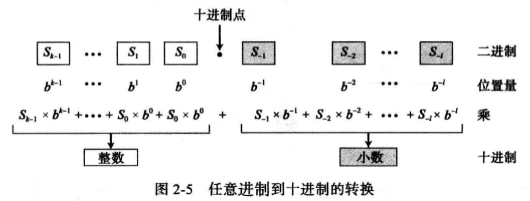

## 十进制转其他进制

将十进制数字转成其他进制，对于整数部分和小数部分有不同的规则。

整数部分要不断除并取余，小数部分要不断乘并取余。

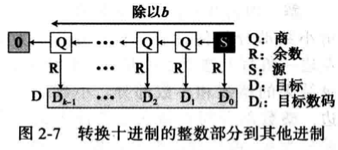

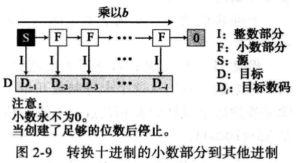

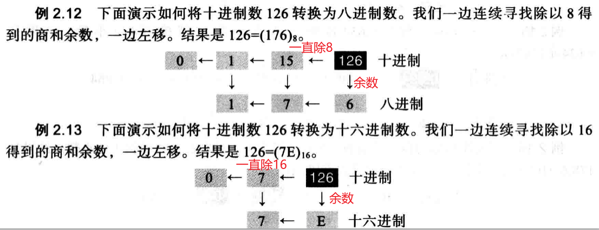

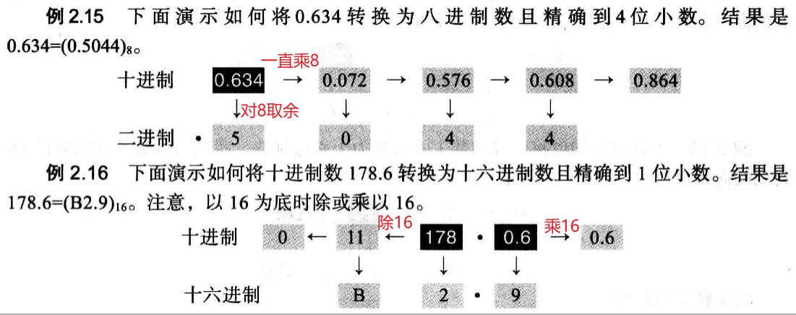

## 二进制、八进制、十六进制转换

它们之间的转换很简单，三个bit转一个8进制位，4个bit转一个16进制位。

## 有符号整型的表示

### 原码表示法

最高位表示符号，0代表正数，1代表负数。优点是使用简单，缺点是0有两种表示方法，浪费了。

### 反码表示法

将正数的每一位取反，就得到了反码。缺点也是0有两种表示，浪费了。

### 补码表示法

补码表示法的思想是：让一个正数和对应的负数相加的0。比如1的二进制位是 00000001，如果-1是11111111，那么二者相加刚好得到0。

**求补码的方法是先对正数取反码，再加一**。也可以先从右边复制位直到第一个1，返回反转其余位。

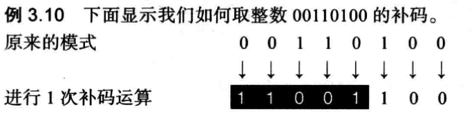

很显然，**对一个整数取两次反码会得到原来的数，其实补码也一样。**

从补码还原整数，遵循下面的步骤：

1. 如果最高位是1，取补码。最高位是0，不做操作。
2. 转成十进制。

## 浮点表示法

一个浮点数由三部分表示：符号位，位移量，定点数。

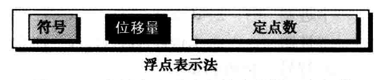

对于十进制常用的科学计数法，我们要把定点部分都化成个位数，叫做规范化，如下：

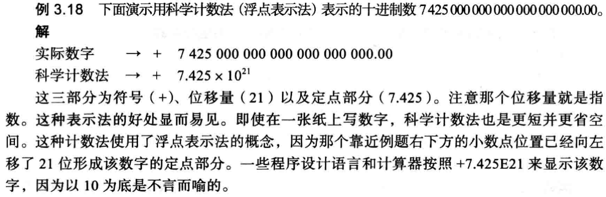

同理我们对于二进制数，要化成以1开头的定点数：

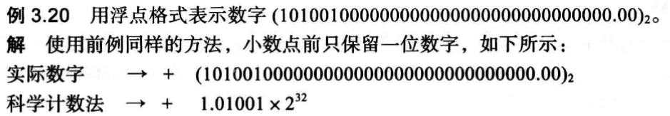

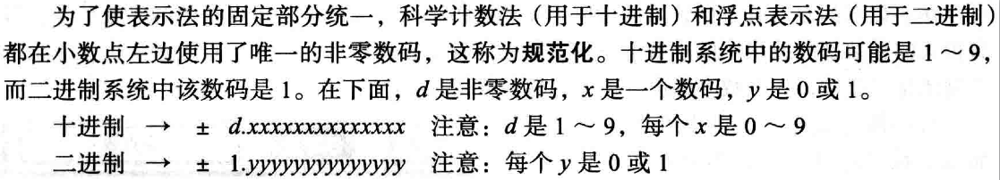

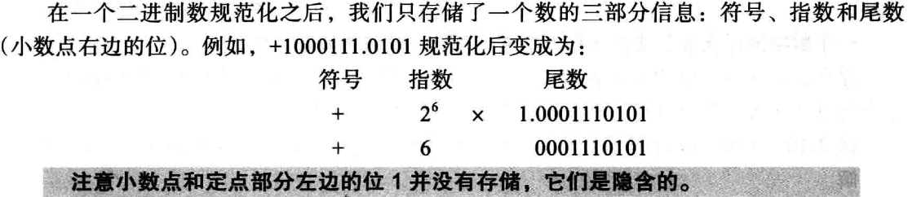

尾数可以作为无符号数存储，指数是有符号的，但是我们不用补码表示法，而是使用**余码表示法**。这种表示法会把所有的数都加上一个位移量，这样负号也会变成正数了，这个位移量是 2^m -1。

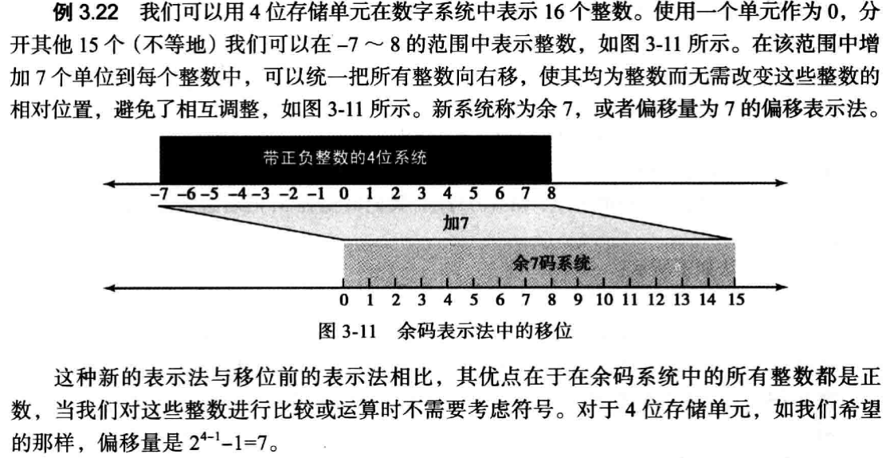

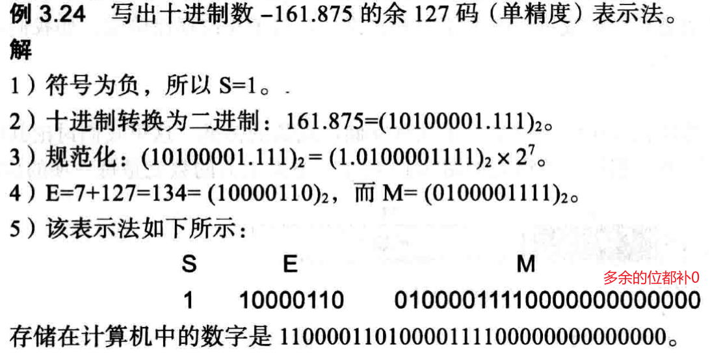

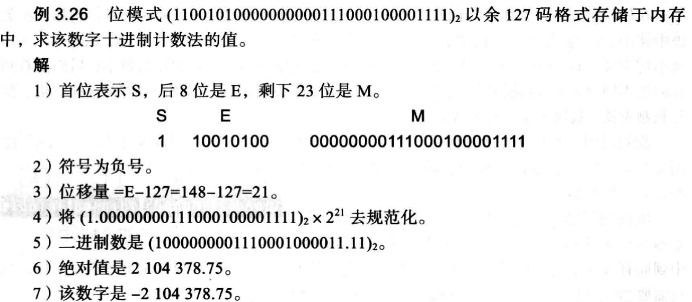

