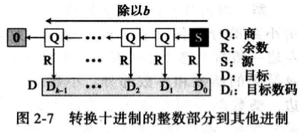

# 大学计算机课程体系组成
如果找出各大学计算机系的培养计划，你会发现，它们都有差不多十来门核心课程。其中，“计算机组成原理”是入门和底层层面的第一课。

这是为什么呢？我们直接用肉眼来看，计算机是由 CPU、内存、显示器这些设备组成的硬件，但是，计算机系的学生毕业之后，大部分却都是从事各种软件开发工作。显然，在硬件和软件之间需要一座桥梁，而“计算机组成原理”就扮演了这样一个角色，它既隔离了软件和硬件，也提供了让软件无需关心硬件，就能直接操作硬件的接口。

也就是说，你只需要对硬件有原理性的理解，就可以信赖硬件的可靠性，安安心心用高级语言来写程序。无论是写操作系统和编译器这样的硬核代码，还是写 Web 应用和手机 App 这样的应用层代码，你都可以做到心里有底。

除此之外，组成原理是计算机其他核心课程的一个“导引”。学习组成原理之后，向下，你可以学习数字电路相关的课程，向上，你可以学习编译原理、操作系统这些核心课程。如果想要深入理解，甚至设计一台自己的计算机，体系结构是必不可少的一门课，而组成原理是计算机体系结构的一个入门版本。


# 冯诺依曼体系结构

**冯·诺依曼体系结构**（Von Neumann architecture），也叫**存储程序计算机**。什么是存储程序计算机呢？这里面其实暗含了两个概念，一个是“**可编程**”计算机，一个是“**存储**”计算机。

计算机是由各种门电路组合而成的，然后通过组装出一个固定的电路版，来完成一个特定的计算程序。一旦需要修改功能，就要重新组装电路。这样的话，计算机就是“不可编程”的，因为程序在计算机硬件层面是“写死”的。最常见的就是老式计算器，电路板设好了加减乘除，做不了任何计算逻辑固定之外的事情。

我们再来看“存储”计算机。这其实是说，程序本身是存储在计算机的内存里，可以通过加载不同的程序来解决不同的问题。有“存储程序计算机”，自然也有不能存储程序的计算机。典型的就是早年的“Plugboard”这样的插线板式的计算机。整个计算机就是一个巨大的插线板，通过在板子上不同的插头或者接口的位置插入线路，来实现不同的功能。这样的计算机自然是“可编程”的，但是编写好的程序不能存储下来供下一次加载使用，不得不每次要用到和当前不同的“程序”的时候，重新插板子，重新“编程”。

冯祖师爷，基于当时在秘密开发的 EDVAC 写了一篇报告[*First Draft of a Report on the EDVAC*](https://en.wikipedia.org/wiki/First_Draft_of_a_Report_on_the_EDVAC)，描述了他心目中的一台计算机应该长什么样。这篇报告在历史上有个很特殊的简称，叫**First Draft**，其实就是《第一份草案》。

首先是一个包含算术逻辑单元（Arithmetic Logic Unit，ALU）和处理器寄存器（Processor Register）的**处理器单元**（Processing Unit），用来完成各种算术和逻辑运算。因为它能够完成各种数据的处理或者计算工作，因此也有人把这个叫作数据通路（Datapath）或者运算器。

然后是一个包含指令寄存器（Instruction Reigster）和程序计数器（Program Counter）的**控制器单元**（Control Unit/CU），用来控制程序的流程，通常就是不同条件下的分支和跳转。在现在的计算机里，上面的算术逻辑单元和这里的控制器单元，共同组成了我们说的 CPU。

接着是用来存储数据（Data）和指令（Instruction）的**内存**。以及更大容量的**外部存储**，在过去，可能是磁带、磁鼓这样的设备，现在通常就是硬盘。

最后就是各种**输入和输出设备**，以及对应的输入和输出机制。我们现在无论是使用什么样的计算机，其实都是和输入输出设备在打交道。个人电脑的鼠标键盘是输入设备，显示器是输出设备。我们用的智能手机，触摸屏既是输入设备，又是输出设备。而跑在各种云上的服务器，则是通过网络来进行输入和输出。这个时候，网卡既是输入设备又是输出设备。

任何一台计算机的任何一个部件都可以归到运算器、控制器、存储器、输入设备和输出设备中，而所有的现代计算机也都是基于这个基础架构来设计开发的。


## 和图灵机的异同

冯诺依曼确定了当代计算机体系结构，即五大部件（运算器、控制器、存储、输入设备、输出设备）、程序存储、二进制运算方式。构建了一个可编程、可存储的计算机硬件体系，为软件编程构建了逻辑抽象的计算机模型。
阿兰图灵确定了利用当代计算机的计算极限，即冯诺依曼机只能解决：1. 有解的可计算的数学问题 2. 能够在有限步骤得到解。为软件编程确立的问题域边界。

大学对应着图灵机也有一门课程，叫做”可计算性理论“。

# 如何学习计算机组成原理

具体来说，学习组成原理，其实就是学习控制器、运算器的工作原理，也就是 CPU 是怎么工作的，以及为何这样设计；学习内存的工作原理，从最基本的电路，到上层抽象给到 CPU 乃至应用程序的接口是怎样的；学习 CPU 是怎么和输入设备、输出设备打交道的。

学习组成原理，就是在理解从控制器、运算器、存储器、输入设备以及输出设备，从电路这样的硬件，到最终开放给软件的接口，是怎么运作的，为什么要设计成这样，以及在软件开发层面怎么尽可能用好它。

## 计算机组成原理知识地图

.jpg)

计算机组成原理的英文叫 Computer Organization。这里的 Organization 是“组织机构”的意思。计算机由很多个不同的部件放在一起，变成了一个“组织机构”。这个组织机构最终能够进行各种计算、控制、读取输入，进行输出，达成各种强大的功能。

在这张图里面，我们把整个计算机组成原理的知识点拆分成了四大部分，分别是计算机的基本组成、计算机的指令和计算、处理器设计，以及存储器和 I/O 设备。

首先，我们来看**计算机的基本组成**。

这一部分，你需要学习计算机是由哪些硬件组成的。这些硬件，又是怎么对应到经典的冯·诺依曼体系结构中的，也就是运算器、控制器、存储器、输入设备和输出设备这五大基本组件。除此之外，你还需要了解计算机的两个核心指标，性能和功耗。性能和功耗也是我们在应用和设计五大基本组件中需要重点考虑的因素。

了解了组成部分，接下来你需要掌握**计算机的指令和计算**。

在计算机指令部分，你需要搞明白，我们每天撰写的一行行 C、Java、PHP 程序，是怎么在计算机里面跑起来的。这里面，你既需要了解我们的程序是怎么通过编译器和汇编器，变成一条条机器指令这样的编译过程（如果把编译过程展开的话，可以变成一门完整的编译原理课程），还需要知道我们的操作系统是怎么链接、装载、执行这些程序的（这部分知识如果再深入学习，又可以变成一门操作系统课程）。而这一条条指令执行的控制过程，就是由计算机五大组件之一的**控制器**来控制的。

在计算机的计算部分，你要从二进制和编码开始，理解我们的数据在计算机里的表示，以及我们是怎么从数字电路层面，实现加法、乘法这些基本的运算功能的。实现这些运算功能的 ALU（Arithmetic Logic Unit/ALU），也就是算术逻辑单元，其实就是我们计算机五大组件之一的**运算器**。

这里面有一个在今天看起来特别重要的知识点，就是浮点数（Floating Point）。浮点数是我们在日常运用中非常容易用错的一种数据表示形式。掌握浮点数能让你对数据的编码、存储和计算能够有一个从表到里的深入理解。尤其在 AI 火热的今天，浮点数是机器学习中重度使用的数据表示形式，掌握它更是非常有必要。

明白计算机指令和计算是如何运转的，我们就可以深入到**CPU 的设计**中去一探究竟了。

CPU 时钟可以用来构造寄存器和内存的锁存器和触发器，因此，CPU 时钟应该是我们学习 CPU 的前导知识。搞明白我们为什么需要 CPU 时钟（CPU Clock），以及寄存器和内存是用什么样的硬件组成的之后，我们可以再来看看，整个计算机的数据通路是如何构造出来的。

数据通路，其实就是连接了整个运算器和控制器，并最终组成了 CPU。而出于对于性能和功耗的考虑，你要进一步理解和掌握面向流水线设计的 CPU、数据和控制冒险，以及分支预测的相关技术。

既然 CPU 作为控制器要和输入输出设备通信，那么我们就要知道异常和中断发生的机制。在 CPU 设计部分的最后，我会讲一讲指令的并行执行，看看如何直接在 CPU 层面，通过 SIMD 来支持并行计算。

最后，我们需要看一看，计算机五大组成部分之一，**存储器的原理**。通过存储器的层次结构作为基础的框架引导，你需要掌握从上到下的 CPU 高速缓存、内存、SSD 硬盘和机械硬盘的工作原理，它们之间的性能差异，以及实际应用中利用这些设备会遇到的挑战。存储器其实很多时候又扮演了输入输出设备的角色，所以你需要进一步了解，CPU 和这些存储器之间是如何进行通信的，以及我们最重视的性能问题是怎么一回事；理解什么是 IO_WAIT，如何通过 DMA 来提升程序性能。

对于存储器，我们不仅需要它们能够正常工作，还要确保里面的数据不能丢失。于是你要掌握我们是如何通过 RAID、Erasure Code、ECC 以及分布式 HDFS，这些不同的技术，来确保数据的完整性和访问性能。

## 有没有学习计算机组成原理的好办法？

相较于整个计算机科学中的其他科目，计算机组成原理更像是整个计算机学科里的“纲要”。这门课里任何一个知识点深入挖下去，都可以变成计算机科学里的一门核心课程。

比如说，程序怎样从高级代码变成指令在计算机里面运行，对应着“编译原理”和“操作系统”这两门课程；计算实现背后则是“数字电路”；如果要深入 CPU 和存储器系统的优化，必然要深入了解“计算机体系结构”。

因此，为了帮你更快更好地学计算机组成，我为你总结了三个学习方法，帮你更好地掌握这些知识点，并且能够学为所用，让你在工作中能够用得上。

首先，**学会提问自己来串联知识点**。学完一个知识点之后，你可以从下面两个方面，问一下自己。

- 我写的程序，是怎样从输入的代码，变成运行的程序，并得到最终结果的？
- 整个过程中，计算器层面到底经历了哪些步骤，有哪些地方是可以优化的？

无论是程序的编译、链接、装载和执行，以及计算时需要用到的逻辑电路、ALU，乃至 CPU 自发为你做的流水线、指令级并行和分支预测，还有对应访问到的硬盘、内存，以及加载到高速缓存中的数据，这些都对应着我们学习中的一个个知识点。建议你自己脑子里过一遍，最好时口头表述一遍或者写下来，这样对你彻底掌握这些知识点都会非常有帮助。

其次，**写一些示例程序来验证知识点。**计算机科学是一门实践的学科。计算机组成中的大量原理和设计，都对应着“性能”这个词。因此，通过把对应的知识点，变成一个个性能对比的示例代码程序记录下来，是把这些知识点融汇贯通的好方法。因为，相比于强记硬背知识点，一个有着明确性能对比的示例程序，会在你脑海里留下更深刻的印象。当你想要回顾这些知识点的时候，一个程序也更容易提示你把它从脑海深处里面找出来。

最后，**通过和计算机硬件发展的历史做对照**。计算机的发展并不是一蹴而就的。从第一台电子计算机 ENIAC（Electronic Numerical Integrator And Computer，电子数值积分计算机）的发明到现在，已经有 70 多年了。现代计算机用的各个技术，都是跟随实际应用中遇到的挑战，一个个发明、打磨，最后保留下来的。这当中不仅仅有学术层面的碰撞，更有大量商业层面的交锋。通过了解充满戏剧性和故事性的计算机硬件发展史，让你更容易理解计算机组成中各种原理的由来。

比如说，奔腾 4 和 SPARC 的失败，以及 ARM 的成功，能让我们记住 CPU 指令集的繁与简、权衡性能和功耗的重要性，而现今高速发展的机器学习和边缘计算，又给计算机硬件设计带来了新的挑战。

# CPU

## 作用

CPU 的核心是从程序或应用程序获取指令并执行计算。此过程可以分为三个关键阶段：**取指，解码和执行**。CPU从系统的 RAM 中提取指令，然后解码该指令的实际内容，然后再由 CPU 的相关部分执行该指令。

## 组成

CPU 的内部由**寄存器、控制器、运算器和时钟**四部分组成，各部分之间通过电信号连通。

- `寄存器`是中央处理器内的组成部分。它们可以用来暂存指令、数据和地址。可以将其看作是内存的一种。根据种类的不同，一个 CPU 内部会有 20 - 100个寄存器。
- `控制器`负责把内存上的指令、数据读入寄存器，并根据指令的结果控制计算机
- `运算器`负责运算从内存中读入寄存器的数据
- `时钟` 负责发出 CPU 开始计时的时钟信号

主存通过控制芯片与 CPU 进行相连，由可读写的元素构成，每个字节都带有一个地址编号，**注意地址精确到一个字节，而不是一个位**。CPU 通过地址从主存中读取数据和指令，也可以根据地址写入数据。

**CPU是寄存器的集合体：**在 CPU 的四个结构中，我们程序员只需要了解`寄存器`就可以了，其余三个不用过多关注，为什么这么说？因为程序是把寄存器作为对象来描述的。

**CPU只能执行机器语言：**计算机语言一般分为两种：低级语言（机器语言，汇编语言）和高级语言。使用高级语言编写的程序，经过编译转换成机器语言后才能运行，而汇编语言经过汇编器才能转换为机器语言。

**汇编语言和机器语言是一一对应的。**这一点和高级语言有很大的不同，通常我们将汇编语言编写的程序转换为机器语言的过程称为 `汇编`；反之，机器语言转化为汇编语言的过程称为 `反汇编`。

**机器语言的基本单词称为`指令`**，指令的二进制格式就是机器语言。一个CPU的全部指令称为`指令集 instruction set`。指令级集分类：

1. CISC复杂指令集：x86
2. RISC精简指令集：MIPS（龙芯也算）、ARMv7、ARMv8（升级到了64位）、RISC-V（开源）

### 寄存器

不同类型的 CPU ，其内部寄存器的种类，数量以及寄存器存储的数值范围都是不同的。不过，根据功能的不同，可以将寄存器划分为下面这几类：

| 种类         | 功能                                                         |
| ------------ | ------------------------------------------------------------ |
| 累加寄存器   | 存储运行的数据和运算后的数据。                               |
| 标志寄存器   | 用于反应处理器的状态和运算结果的某些特征以及控制指令的执行。 |
| 程序计数器PC | 程序计数器是用于存放下一条指令所在单元的地址的地方。         |
| 基址寄存器   | 存储数据内存的起始位置                                       |
| 变址寄存器   | 存储基址寄存器的相对地址                                     |
| 通用寄存器   | 存储任意数据                                                 |
| 指令寄存器   | 储存正在被运行的指令，CPU内部使用，程序员无法对该寄存器进行读写 |
| 栈寄存器SP   | 存储栈顶的位置                                               |

其中**程序计数器、累加寄存器、标志寄存器、指令寄存器和栈寄存器**都只有一个，其他寄存器一般有多个。

### 程序计数器

`程序计数器(Program Counter)`是用来存储下一条指令所在单元的地址。这个寄存器更合适的名字是指令地址寄存器，但我们沿用历史。

程序执行时，PC的初值为程序第一条指令的地址，在顺序执行程序时，`控制器`首先按程序计数器所指出的指令地址从内存中取出一条指令，然后分析和执行该指令，同时将PC的值加1指向下一条要执行的指令。


这是一段进行相加的操作，程序启动，在经过编译解析后会由操作系统把硬盘中的程序复制到内存中，示例中的程序是将 123 和 456 执行相加操作，并将结果输出到显示器上。由于使用机器语言难以描述，所以这是经过翻译后的结果，实际上每个指令和数据都可能分布在不同的地址上，但为了方便说明，把组成一条指令的内存和数据放在了一个内存地址上。

地址 `0100` 是程序运行的起始位置。Windows 等操作系统把程序从硬盘复制到内存后，会将程序计数器作为设定为起始位置 0100，然后执行程序，每执行一条指令后，程序计数器的数值会增加1（或者直接指向下一条指令的地址），然后，CPU 就会根据程序计数器的数值，从内存中读取命令并执行，也就是说，**程序计数器控制着程序的流程**。

> 注意，实际中两个变量的内存地址一般是加4，因为C语言的int类型是4个字节，而MIPS架构的每个寄存器的大小也刚好是32位。MIPS架构的每条指令也是32位，所以指令的内存地址也要加4。


CPU 的执行机制比较有意思，假设累加寄存器中存储的 XXX 和通用寄存器中存储的 YYY 做比较，执行比较的背后，CPU 的运算机制就会做减法运算。而无论减法运算的结果是正数、零还是负数，都会保存到标志寄存器中。结果为正表示 XXX 比 YYY 大，结果为零表示 XXX 和 YYY 相等，结果为负表示 XXX 比 YYY 小。程序比较的指令，实际上是在 CPU 内部做`减法`运算。

### 条件分支和循环机制

我们都学过高级语言，高级语言中的条件控制流程主要分为三种：`顺序执行、条件分支、循环判断`三种，顺序执行是按照地址的内容顺序的执行指令。条件分支是根据条件执行任意地址的指令。循环是重复执行同一地址的指令。

- 顺序执行的情况比较简单，每执行一条指令程序计数器的值就是 + 1。
- 条件和循环分支会使程序计数器的值指向任意的地址，这样一来，程序便可以返回到上一个地址来重复执行同一个指令，或者跳转到任意指令。

下面以条件分支为例来说明程序的执行过程（循环也很相似）


程序的开始过程和顺序流程是一样的，CPU 从0100处开始执行命令，在0100和0101都是顺序执行，PC 的值顺序+1，执行到0102地址的指令时，判断0106寄存器的数值大于0，跳转（jump）到0104地址的指令，将数值输出到显示器中，然后结束程序，0103 的指令被跳过了，这就和我们程序中的 `if()` 判断是一样的，在不满足条件的情况下，指令会直接跳过。所以 PC 的执行过程也就没有直接+1，而是下一条指令的地址。

### 标志寄存器

条件和循环分支会使用到 `jump（跳转指令）`，会根据当前的指令来判断是否跳转，上面我们提到了`标志寄存器`，无论当前累加寄存器的运算结果是正数、负数还是零，标志寄存器都会将其保存（也负责溢出和奇偶校验）

> 溢出（overflow）：是指运算的结果超过了寄存器的长度范围
>
> 奇偶校验（parity check）：是指检查运算结果的值是偶数还是奇数

CPU 在进行运算时，标志寄存器的数值会根据当前运算的结果自动设定，运算结果的正、负和零三种状态由标志寄存器的三个位表示。标志寄存器的第一个字节位、第二个字节位、第三个字节位各自的结果都为1时，分别代表着正数、零和负数。

### 函数调用机制

接下来，我们继续介绍函数调用机制，哪怕是高级语言编写的程序，函数调用处理也是通过把程序计数器的值设定成函数的存储地址来实现的。函数执行跳转指令后，必须进行返回处理，单纯的指令跳转没有意义，下面是一个实现函数跳转的例子

[](https://camo.githubusercontent.com/fe002fdce95eab8027054a9c48f9f91d8f7df08ddc3938aead67e3df52bf86cf/68747470733a2f2f696d67323031382e636e626c6f67732e636f6d2f626c6f672f313531353131312f3230313931302f313531353131312d32303139313032313133313133343730352d313334363336393738392e706e67)

图中将变量 a 和 b 分别赋值为 123 和 456 ，调用 MyFun(a,b) 方法，进行指令跳转。图中的地址是将 C 语言编译成机器语言后运行时的地址，由于1行 C 程序在编译后通常会变为多行机器语言，所以图中的地址是分散的。在执行完 MyFun(a,b)指令后，程序会返回到 MyFun(a,b) 的下一条指令，CPU 继续执行下面的指令。

函数的调用和返回很重要的两个指令是 `call` 和 `return` 指令，再将函数的入口地址设定到程序计数器之前，call 指令会把调用函数后要执行的指令地址存储在名为栈的主存内。函数处理完毕后，再通过函数的出口来执行 return 指令。return 指令的功能是把保存在栈中的地址设定到程序计数器。MyFun 函数在被调用之前，0154 地址保存在栈中，MyFun 函数处理完成后，会把0154的地址保存在程序计数器中。这个调用过程如下

[](https://camo.githubusercontent.com/0bfc4e322f9eb45493eb6ccaa2bb4a18c515f7f035535d55b41019ea72b7dbb4/68747470733a2f2f696d67323031382e636e626c6f67732e636f6d2f626c6f672f313531353131312f3230313931302f313531353131312d32303139313032313133313134323831382d313831313230363433312e706e67)

在一些高级语言的条件或者循环语句中，函数调用的处理会转换成 call 指令，函数结束后的处理则会转换成 return 指令。

### 通过地址和索引实现数组

接下来我们看一下基址寄存器和变址寄存器，通过这两个寄存器，我们可以对主存上的特定区域进行划分，来实现类似数组的操作，首先，我们用十六进制数将计算机内存上的 00000000 - FFFFFFFF 的地址划分出来。那么，凡是该范围的内存地址，只要有一个 32 位的寄存器，便可查看全部地址。但如果想要想数组那样分割特定的内存区域以达到连续查看的目的的话，使用两个寄存器会更加方便。

例如，我们用两个寄存器（基址寄存器和变址寄存器）来表示内存的值


这种表示方式很类似数组的构造，`数组`是指同样长度的数据在内存中进行连续排列的数据构造。用数组名表示数组全部的值，通过索引来区分数组的各个数据元素，例如: a[0] - a[4]，`[]`内的 0 - 4 就是数组的下标。

### CPU 指令执行过程

那么 CPU 是如何执行一条条的指令的呢？

几乎所有的冯·诺伊曼型计算机的CPU，其工作都可以分为5个阶段：**取指令、指令译码、执行指令、访存取数、结果写回**。

- `取指令`阶段是将内存中的指令读取到 CPU 中寄存器的过程，程序寄存器用于存储下一条指令所在的地址
- `指令译码`阶段，在取指令完成后，立马进入指令译码阶段，在指令译码阶段，指令译码器按照预定的指令格式（比如加法的指令格式和跳转的指令格式完全不同），对取回的指令进行拆分和解释，识别区分出不同的指令类别以及各种获取操作数的方法。
- `执行指令`阶段，译码完成后，就需要执行这一条指令了，此阶段的任务是完成指令所规定的各种操作，具体实现指令的功能。
- `访问取数`阶段，根据指令的需要，有可能需要从内存中提取数据，此阶段的任务是：根据指令地址码，得到操作数在主存中的地址，并从主存中读取该操作数用于运算。
- `结果写回`阶段，作为最后一个阶段，结果写回（Write Back，WB）阶段把执行指令阶段的运行结果数据“写回”到某种存储形式：结果数据经常被写到CPU的内部寄存器中，以便被后续的指令快速地存取；

### MIPS架构

1. 一共32个通用寄存器，每个寄存器的大小是32位
2. 寄存器编号从0到31，可以用 `$1、$30`这样的方式引用寄存器
3. 寄存器也有别名，方便引用，像`$t0 - $t7`代表临时变量寄存器，`$s0 - $s7`保存一般的变量值
4. 常数0有一个单独的寄存器 `$zero`
5. 还有额外的32个浮点数寄存器，每个大小也是32位。使用两个浮点数寄存器就可以存储double变量的值了
6. 不同的运算有不同的指令格式（像 `add $3,$1,$2`这样的汇编语句的二进制形式就是一条机器指令），分为R型（3个操作数）、I型（2个操作数和一个立即数，像lw、sw这样读取内存的指令）、J型（跳转指令）
7. 操作数都是暂存器（寄存器有不同的组织形式，早期有栈类型、累加器类型等，操作数不全是寄存器），所以要把变量的值先保存到寄存器中，运算完成的结果再存回内存中
8. 有几个操作立即数的指令（方便使用，体现了加速大概率事件的思想）

```assembly
lw $t0 12($s0) 将s0寄存器的值加12得到变量的地址，从变量地址取回一个字，保存在临时寄存器t0中
sw $t0 12($s0) 将寄存器t0里保存的字放到内存中，内存中的地址是s0的值加上12
addi $t0 $s1 10 加立即数
```

## 什么是cpu性能

性能”这个词，不管是在日常生活还是写程序的时候，都经常被提到。比方说，买新电脑的时候，我们会说“原来的电脑性能跟不上了”；写程序的时候，我们会说，“这个程序性能需要优化一下”。那么，你有没有想过，我们常常挂在嘴边的“性能”到底指的是什么呢？我们能不能给性能下一个明确的定义，然后来进行准确的比较呢？

### 什么是性能？时间的倒数

计算机的性能，其实和我们干体力劳动很像，好比是我们要搬东西。对于计算机的性能，我们需要有个标准来衡量。这个标准中主要有两个指标。

第一个是**响应时间**（Response time）或者叫执行时间（Execution time）。想要提升响应时间这个性能指标，你可以理解为让计算机“跑得更快”。

第二个是**吞吐率**（Throughput）或者带宽（Bandwidth），想要提升这个指标，你可以理解为让计算机“搬得更多”。

所以说，响应时间指的就是，我们执行一个程序，到底需要花多少时间。花的时间越少，自然性能就越好。

而吞吐率是指我们在一定的时间范围内，到底能处理多少事情。这里的“事情”，在计算机里就是处理的数据或者执行的程序指令。

和搬东西来做对比，如果我们的响应时间短，跑得快，我们可以来回多跑几趟多搬几趟。所以说，缩短程序的响应时间，一般来说都会提升吞吐率。

除了缩短响应时间，我们还有别的方法吗？当然有，比如说，我们还可以多找几个人一起来搬，这就类似现代的服务器都是 8 核、16 核的。人多力量大，同时处理数据，在单位时间内就可以处理更多数据，吞吐率自然也就上去了。

提升吞吐率的办法有很多。大部分时候，我们只要多加一些机器，多堆一些硬件就好了。但是响应时间的提升却没有那么容易，因为 CPU 的性能提升其实在 10 年前就处于“挤牙膏”的状态了，所以我们得慎重地来分析对待。下面我们具体来看。

我们一般把性能，定义成响应时间的倒数，也就是：`性能 = 1/ 响应时间`

这样一来，响应时间越短，性能的数值就越大。同样一个程序，在 Intel 最新的 CPU Coffee Lake 上，只需要 30s 就能运行完成，而在 5 年前 CPU Sandy Bridge 上，需要 1min 才能完成。那么我们自然可以算出来，Coffee Lake 的性能是 1/30，Sandy Bridge 的性能是 1/60，两个的性能比为 2。于是，我们就可以说，Coffee Lake 的性能是 Sandy Bridge 的 2 倍。

过去几年流行的手机跑分软件，就是把多个预设好的程序在手机上运行，然后根据运行需要的时间，算出一个分数来给出手机的性能评估。而在业界，各大 CPU 和服务器厂商组织了一个叫作**SPEC**（Standard Performance Evaluation Corporation）的第三方机构，专门用来指定各种“跑分”的规则。

### 计算机的计时单位：CPU 时钟

虽然时间是一个很自然的用来衡量性能的指标，但是用时间来衡量时，有两个问题。

**第一个就是时间不“准”**。如果用你自己随便写的一个程序，来统计程序运行的时间，每一次统计结果不会完全一样。有可能这一次花了 45ms，下一次变成了 53ms。

为什么会不准呢？这里面有好几个原因。首先，我们统计时间是用类似于“掐秒表”一样，记录程序运行结束的时间减去程序开始运行的时间。这个时间也叫 Wall Clock Time 或者 Elapsed Time，就是在运行程序期间，挂在墙上的钟走掉的时间。

但是，计算机可能同时运行着好多个程序，CPU 实际上不停地在各个程序之间进行切换。在这些走掉的时间里面，很可能 CPU 切换去运行别的程序了。而且，有些程序在运行的时候，可能要从网络、硬盘去读取数据，要等网络和硬盘把数据读出来，给到内存和 CPU。所以说，**要想准确统计某个程序运行时间，进而去比较两个程序的实际性能，我们得把这些时间给刨除掉**。

那这件事怎么实现呢？Linux 下有一个叫 time 的命令，可以帮我们统计出来，同样的 Wall Clock Time 下，程序实际在 CPU 上到底花了多少时间。

我们简单运行一下 time 命令。它会返回三个值，第一个是**real time**，也就是我们说的 Wall Clock Time，也就是运行程序整个过程中流逝掉的时间；第二个是**user time**，也就是 CPU 在运行你的程序，在用户态运行指令的时间；第三个是**sys time**，是 CPU 在运行你的程序，在操作系统内核里运行指令的时间。而**程序实际花费的 CPU 执行时间（CPU Time），就是 user time 加上 sys time**。

```shell
$ time seq 1000000 | wc -l
1000000
 
 
real  0m0.101s
user  0m0.031s
sys   0m0.016s
```

在我给的这个例子里，你可以看到，实际上程序用了 0.101s，但是 CPU time 只有 0.031+0.016 = 0.047s。运行程序的时间里，只有不到一半是实际花在这个程序上的。

.jpg)


**其次，即使我们已经拿到了 CPU 时间，我们也不一定可以直接“比较”出两个程序的性能差异**。即使在同一台计算机上，CPU 可能满载运行也可能降频运行，降频运行的时候自然花的时间会多一些。

除了 CPU 之外，时间这个性能指标还会受到主板、内存这些其他相关硬件的影响。所以，我们需要对“时间”这个我们可以感知的指标进行拆解，把程序的 CPU 执行时间变成 CPU 时钟周期数（CPU Cycles）和 时钟周期时间（Clock Cycle）的乘积。

`程序的 CPU 执行时间 =CPU 时钟周期数×时钟周期时间`

我们先来理解一下什么是时钟周期时间。你在买电脑的时候，一定关注过 CPU 的主频。比如我手头的这台电脑就是 Intel Core-i7-7700HQ 2.8GHz，这里的 2.8GHz 就是电脑的主频（Frequency/Clock Rate）。这个 2.8GHz，我们可以先粗浅地认为，CPU 在 1 秒时间内，可以执行的简单指令的数量是 2.8G 条。

如果想要更准确一点描述，这个 2.8GHz 就代表，我们 CPU 的一个“钟表”能够识别出来的最小的时间间隔。就像我们挂在墙上的挂钟，都是“滴答滴答”一秒一秒地走，所以通过墙上的挂钟能够识别出来的最小时间单位就是秒。

而在 CPU 内部，和我们平时戴的电子石英表类似，有一个叫晶体振荡器（Oscillator Crystal）的东西，简称为晶振。我们把晶振当成 CPU 内部的电子表来使用。晶振带来的每一次“滴答”，就是时钟周期时间。

在我这个 2.8GHz 的 CPU 上，这个时钟周期时间，就是 1/2.8G。我们的 CPU，是按照这个“时钟”提示的时间来进行自己的操作。主频越高，意味着这个表走得越快，我们的 CPU 也就“被逼”着走得越快。

如果你自己组装过台式机的话，可能听说过“超频”这个概念，这说的其实就相当于把买回来的 CPU 内部的钟给调快了，于是 CPU 的计算跟着这个时钟的节奏，也就自然变快了。

我们现在回到上面程序 CPU 执行时间的公式。

`程序的 CPU 执行时间 =CPU 时钟周期数×时钟周期时间`

最简单的提升性能方案，自然缩短时钟周期时间，也就是提升主频。换句话说，就是换一块好一点的 CPU。不过，这个是我们这些软件工程师控制不了的事情，所以我们就把目光挪到了乘法的另一个因子——CPU 时钟周期数上。如果能够减少程序需要的 CPU 时钟周期数量，一样能够提升程序性能。

对于 CPU 时钟周期数，我们可以再做一个分解，把它变成“指令数×**每条指令的平均时钟周期数**（Cycles Per Instruction，简称 CPI）”。不同的指令需要的 Cycles 是不同的，加法和乘法都对应着一条 CPU 指令，但是乘法需要的 Cycles 就比加法要多，自然也就慢。在这样拆分了之后，我们的程序的 CPU 执行时间就可以变成这样三个部分的乘积。

`程序的 CPU 执行时间 = 指令数×每条指令的平均时钟周期×Clock Cycle Time`

因此，如果我们想要解决性能问题，其实就是要优化这三者。

1. 时钟周期时间，就是计算机主频，这个取决于计算机硬件。我们所熟知的[摩尔定律](https://zh.wikipedia.org/wiki/摩尔定律)就一直在不停地提高我们计算机的主频。比如说，我最早使用的 80386 主频只有 33MHz，现在手头的笔记本电脑就有 2.8GHz，在主频层面，就提升了将近 100 倍。
2. 每条指令的平均时钟周期数 CPI，就是一条指令到底需要多少 CPU Cycle。在后面讲解 CPU 结构的时候，我们会看到，现代的 CPU 通过流水线技术（Pipeline），让一条指令需要的 CPU Cycle 尽可能地少。因此，对于 CPI 的优化，也是计算机组成和体系结构中的重要一环。
3. 指令数，代表执行我们的程序到底需要多少条指令、用哪些指令。这个很多时候就把挑战交给了编译器。同样的代码，编译成计算机指令时候，就有各种不同的表示方式。

我们可以把自己想象成一个 CPU，坐在那里写程序。计算机主频就好像是你的打字速度，打字越快，你自然可以多写一点程序。CPI 相当于你在写程序的时候，熟悉各种快捷键，越是打同样的内容，需要敲击键盘的次数就越少。指令数相当于你的程序设计得够合理，同样的程序要写的代码行数就少。如果三者皆能实现，你自然可以很快地写出一个优秀的程序，你的“性能”从外面来看就是好的。

### 总结延伸

好了，学完这一讲，对“性能”这个名词，你应该有了更清晰的认识。我主要对于“响应时间”这个性能指标进行抽丝剥茧，拆解成了计算机时钟周期、CPI 以及指令数这三个独立的指标的乘积，并且为你指明了优化计算机性能的三条康庄大道。也就是，提升计算机主频，优化 CPU 设计使得在单个时钟周期内能够执行更多指令，以及通过编译器来减少需要的指令数。

## cpu性能提升简史

上一讲，在讲 CPU 的性能时，我们提到了这样一个公式：

程序的 CPU 执行时间 = 指令数×CPI×Clock Cycle Time

这么来看，如果要提升计算机的性能，我们可以从指令数、CPI 以及 CPU 主频这三个地方入手。要搞定指令数或者 CPI，乍一看都不太容易。于是，研发 CPU 的硬件工程师们，从 80 年代开始，就挑上了 CPU 这个“软柿子”。在 CPU 上多放一点晶体管，不断提升 CPU 的时钟频率，这样就能让 CPU 变得更快，程序的执行时间就会缩短。

于是，从 1978 年 Intel 发布的 8086 CPU 开始，计算机的主频从 5MHz 开始，不断提升。1980 年代中期的 80386 能够跑到 40MHz，1989 年的 486 能够跑到 100MHz，直到 2000 年的奔腾 4 处理器，主频已经到达了 1.4GHz。而消费者也在这 20 年里养成了“看主频”买电脑的习惯。当时已经基本垄断了桌面 CPU 市场的 Intel 更是夸下了海口，表示奔腾 4 所使用的 CPU 结构可以做到 10GHz，颇有一点“大力出奇迹”的意思。

### 功耗：CPU 的“人体极限”

然而，计算机科学界从来不相信“大力出奇迹”。奔腾 4 的 CPU 主频从来没有达到过 10GHz，最终它的主频上限定格在 3.8GHz。这还不是最糟的，更糟糕的事情是，大家发现，奔腾 4 的主频虽然高，但是它的实际性能却配不上同样的主频。想要用在笔记本上的奔腾 4 2.4GHz 处理器，其性能只和基于奔腾 3 架构的奔腾 M 1.6GHz 处理器差不多。

于是，这一次的“大力出悲剧”，不仅让 Intel 的对手 AMD 获得了喘息之机，更是代表着“主频时代”的终结。后面几代 Intel CPU 主频不但没有上升，反而下降了。到如今，2019 年的最高配置 Intel i9 CPU，主频也只不过是 5GHz 而已。相较于 1978 年到 2000 年，这 20 年里 300 倍的主频提升，从 2000 年到现在的这 19 年，CPU 的主频大概提高了 3 倍。

奔腾 4 的主频为什么没能超过 3.8GHz 的障碍呢？答案就是功耗问题。什么是功耗问题呢？我们先看一个直观的例子。

一个 3.8GHz 的奔腾 4 处理器，满载功率是 130 瓦。这个 130 瓦是什么概念呢？机场允许带上飞机的充电宝的容量上限是 100 瓦时。如果我们把这个 CPU 安在手机里面，不考虑屏幕内存之类的耗电，这个 CPU 满载运行 45 分钟，充电宝里面就没电了。而 iPhone X 使用 ARM 架构的 CPU，功率则只有 4.5 瓦左右。

我们的 CPU，一般都被叫作**超大规模集成电路**（Very-Large-Scale Integration，VLSI）。这些电路，实际上都是一个个晶体管组合而成的。CPU 在计算，其实就是让晶体管里面的“开关”不断地去“打开”和“关闭”，来组合完成各种运算和功能。

想要计算得快，一方面，我们要在 CPU 里，同样的面积里面，多放一些晶体管，也就是**增加密度**；另一方面，我们要让晶体管“打开”和“关闭”得更快一点，也就是**提升主频**。而这两者，都会增加功耗，带来耗电和散热的问题。

这么说可能还是有点抽象，我还是给你举一个例子。你可以把一个计算机 CPU 想象成一个巨大的工厂，里面有很多工人，相当于 CPU 上面的晶体管，互相之间协同工作。

为了工作得快一点，我们要在工厂里多塞一点人。你可能会问，为什么不把工厂造得大一点呢？这是因为，人和人之间如果离得远了，互相之间走过去需要花的时间就会变长，这也会导致性能下降。这就好像如果 CPU 的面积大，晶体管之间的距离变大，电信号传输的时间就会变长，运算速度自然就慢了。

除了多塞一点人，我们还希望每个人的动作都快一点，这样同样的时间里就可以多干一点活儿了。这就相当于提升 CPU 主频，但是动作快，每个人就要出汗散热。要是太热了，对工厂里面的人来说会中暑生病，对 CPU 来说就会崩溃出错。

我们会在 CPU 上面抹硅脂、装风扇，乃至用上水冷或者其他更好的散热设备，就好像在工厂里面装风扇、空调，发冷饮一样。但是同样的空间下，装上风扇空调能够带来的散热效果也是有极限的。

因此，在 CPU 里面，能够放下的晶体管数量和晶体管的“开关”频率也都是有限的。一个 CPU 的功率，可以用这样一个公式来表示：

`功耗 ~= 1/2 ×负载电容×电压的平方×开关频率×晶体管数量`

那么，为了要提升性能，我们需要不断地增加晶体管数量。同样的面积下，我们想要多放一点晶体管，就要把晶体管造得小一点。这个就是平时我们所说的提升“制程”。从 28nm 到 7nm，相当于晶体管本身变成了原来的 1/4 大小。这个就相当于我们在工厂里，同样的活儿，我们要找瘦小一点的工人，这样一个工厂里面就可以多一些人。我们还要提升主频，让开关的频率变快，也就是要找手脚更快的工人。

.jpg)

> 增加晶体管数量，其实是通过提供更复杂的电路支持更多的“指令”。也就会减少运行同样程序需要的指令数。
> 打个比方，比如我们最简单的电路可以只有加法功能，没有乘法功能。乘法都变成很多个加法指令，那么实现一个乘法需要的指令数就比较多。但是如果我们增加晶体管在电路层面就实现了这个，那么需要的指令数就变少了，执行时间也可以缩短。

但是，功耗增加太多，就会导致 CPU 散热跟不上，这时，我们就需要降低电压。这里有一点非常关键，在整个功耗的公式里面，功耗和电压的平方是成正比的。这意味着电压下降到原来的 1/5，整个的功耗会变成原来的 1/25。

> 虽然动态能耗是CMOS能耗的主要来源，但是静态能耗也是存在的，因为即使在晶体管关闭的状态下，还是有泄露电流存在。目前的问题是电压继续下降会使晶体管泄露电流过大，目前40%的功耗是由于泄露造成的，如果晶体管的泄露电流再大，请求将无法收拾。

事实上，CPU 的电压已经从 5V 左右下降到了 1V 左右。这也是为什么我们 CPU 的主频提升了 1000 倍，但是功耗只增长了 40 倍。比如说，我写这篇文章用的是 Surface Go，在这样的轻薄笔记本上，微软就是选择了把电压下降到 0.25V 的低电压 CPU，使得笔记本能有更长的续航时间。

### 谬误：利用率低的CPU功耗低

实际上，只有10%的工作负载也会消耗1/3的峰值功耗。

ARM架构的芯片在低负载情况下功耗远比X86芯片低，所以手机都是使用ARM芯片。

### 并行优化，理解阿姆达尔定律

虽然制程的优化和电压的下降，在过去的 20 年里，让我们的 CPU 性能有所提升。但是从上世纪九十年代到本世纪初，软件工程师们所用的“面向摩尔定律编程”的套路越来越用不下去了。“写程序不考虑性能，等明年 CPU 性能提升一倍，到时候性能自然就不成问题了”，这种想法已经不可行了。

于是，从奔腾 4 开始，Intel 意识到通过提升主频比较“难”去实现性能提升，边开始推出 Core Duo 这样的多核 CPU，通过提升“吞吐率”而不是“响应时间”，来达到目的。

提升响应时间，就好比提升你用的交通工具的速度，比如原本你是开汽车，现在变成了火车乃至飞机。本来开车从上海到北京要 20 个小时，换成飞机就只要 2 个小时了，但是，在此之上，再想要提升速度就不太容易了。我们的 CPU 在奔腾 4 的年代，就好比已经到了飞机这个速度极限。

那你可能要问了，接下来该怎么办呢？相比于给飞机提速，工程师们又想到了新的办法，可以一次同时开 2 架、4 架乃至 8 架飞机，这就好像我们现在用的 2 核、4 核，乃至 8 核的 CPU。

虽然从上海到北京的时间没有变，但是一次飞 8 架飞机能够运的东西自然就变多了，也就是所谓的“吞吐率”变大了。所以，不管你有没有需要，现在 CPU 的性能就是提升了 2 倍乃至 8 倍、16 倍。这也是一个最常见的提升性能的方式，**通过并行提高性能**。

这个思想在很多地方都可以使用。举个例子，我们做机器学习程序的时候，需要计算向量的点积，比如向量 W=[W0,W1,W2,…,W15]W=[W0,W1,W2,…,W15] 和向量 X=[X0,X1,X2,…,X15]X=[X0,X1,X2,…,X15]，W⋅X=W0∗X0+W1∗X1+W·X=W0∗X0+W1∗X1+
W2∗X2+…+W15∗X15W2∗X2+…+W15∗X15。这些式子由 16 个乘法和 1 个连加组成。如果你自己一个人用笔来算的话，需要一步一步算 16 次乘法和 15 次加法。如果这个时候我们把这个人物分配给 4 个人，同时去算 W0～W3W0～W3, W4～W7W4～W7, W8～W11W8～W11, W12～W15W12～W15 这样四个部分的结果，再由一个人进行汇总，需要的时间就会缩短。

.jpg)

但是，并不是所有问题，都可以通过并行提高性能来解决。如果想要使用这种思想，需要满足这样几个条件。

第一，需要进行的计算，本身可以分解成几个可以并行的任务。好比上面的乘法和加法计算，几个人可以同时进行，不会影响最后的结果。

第二，需要能够分解好问题，并确保几个人的结果能够汇总到一起。

第三，在“汇总”这个阶段，是没有办法并行进行的，还是得顺序执行，一步一步来。

这就引出了我们在进行性能优化中，常常用到的一个经验定律，**阿姆达尔定律**（Amdahl’s Law）。这个定律说的就是，对于一个程序进行优化之后，处理器并行运算之后效率提升的情况。具体可以用这样一个公式来表示：

优化后的执行时间 = 受优化影响的执行时间 / 加速倍数 + 不受影响的执行时间

在刚刚的向量点积例子里，4 个人同时计算向量的一小段点积，就是通过并行提高了这部分的计算性能。但是，这 4 个人的计算结果，最终还是要在一个人那里进行汇总相加。这部分汇总相加的时间，是不能通过并行来优化的，也就是上面的公式里面**不受影响的执行时间**这一部分。

比如上面的各个向量的一小段的点积，需要 100ns，加法需要 20ns，总共需要 120ns。这里通过并行 4 个 CPU 有了 4 倍的加速度。那么最终优化后，就有了 100/4+20=45ns。即使我们增加更多的并行度来提供加速倍数，比如有 100 个 CPU，整个时间也需要 100/100+20=21ns。

.jpg)

### 总结延伸

我们可以看到，无论是简单地通过提升主频，还是增加更多的 CPU 核心数量，通过并行来提升性能，都会遇到相应的瓶颈。仅仅简单地通过“堆硬件”的方式，在今天已经不能很好地满足我们对于程序性能的期望了。于是，工程师们需要从其他方面开始下功夫了。

在“摩尔定律”和“并行计算”之外，在整个计算机组成层面，还有这样几个原则性的性能提升方法。

1.**加速大概率事件**。最典型的就是，过去几年流行的深度学习，整个计算过程中，99% 都是向量和矩阵计算，于是，工程师们通过用 GPU 替代 CPU，大幅度提升了深度学习的模型训练过程。本来一个 CPU 需要跑几小时甚至几天的程序，GPU 只需要几分钟就好了。Google 更是不满足于 GPU 的性能，进一步地推出了 TPU。后面的文章，我也会为你讲解 GPU 和 TPU 的基本构造和原理。

2.**通过流水线提高性能**。现代的工厂里的生产线叫“流水线”。我们可以把装配 iPhone 这样的任务拆分成一个个细分的任务，让每个人都只需要处理一道工序，最大化整个工厂的生产效率。类似的，我们的 CPU 其实就是一个“运算工厂”。我们把 CPU 指令执行的过程进行拆分，细化运行，也是现代 CPU 在主频没有办法提升那么多的情况下，性能仍然可以得到提升的重要原因之一。我们在后面也会讲到，现代 CPU 里是如何通过流水线来提升性能的，以及反面的，过长的流水线会带来什么新的功耗和效率上的负面影响。

3.**通过预测提高性能**。通过预先猜测下一步该干什么，而不是等上一步运行的结果，提前进行运算，也是让程序跑得更快一点的办法。典型的例子就是在一个循环访问数组的时候，凭经验，你也会猜到下一步我们会访问数组的下一项。后面要讲的“分支和冒险”、“局部性原理”这些 CPU 和存储系统设计方法，其实都是在利用我们对于未来的“预测”，提前进行相应的操作，来提升我们的程序性能。

# 二进制系统

## 其他进制转十进制

这种转换非常简单，将数码乘以其在源系统中的位置量并求和就能得到十进制的数。


## 十进制转其他进制

将十进制数字转成其他进制，对于整数部分和小数部分有不同的规则。

整数部分要不断除并取余，小数部分要不断乘并取余。




## 二进制、八进制、十六进制转换

它们之间的转换很简单，三个bit转一个8进制位，4个bit转一个16进制位。

## 有符号整型的表示

### 原码表示法

最高位表示符号，0代表正数，1代表负数。优点是使用简单，缺点是0有两种表示方法，浪费了。

### 反码表示法

将正数的每一位取反，就得到了反码。缺点也是0有两种表示，浪费了。

### 补码表示法

补码表示法的思想是：让一个正数和对应的负数相加的0。比如1的二进制位是 00000001，如果-1是11111111，那么二者相加刚好得到0。

**求补码的方法是先对正数取反码，再加一**。也可以先从右边复制位直到第一个1，返回反转其余位。


很显然，**对一个整数取两次反码会得到原来的数，其实补码也一样。**

从补码还原整数，遵循下面的步骤：

1. 如果最高位是1，取补码。最高位是0，不做操作。
2. 转成十进制。

## 浮点表示法

一个浮点数由三部分表示：符号位，位移量，定点数。


对于十进制常用的科学计数法，我们要把定点部分都化成个位数，叫做规范化，如下：


同理我们对于二进制数，要化成以1开头的定点数：


尾数可以作为无符号数存储，指数是有符号的，但是我们不用补码表示法，而是使用**余码表示法**。这种表示法会把所有的数都加上一个位移量，这样负号也会变成正数了，这个位移量是 2^m -1。


# 位运算

## 逻辑运算

NOT、AND、OR、XOR。其中XOR相同为0，不同为1。

假设有个字节是：`10101010`，还有一个字节`11110000`和它做逻辑运算。

AND常用来复位：可以把左边4个bit保留，右边4个bit复位。

OR用来置位：可以把左边4个bit变成1，右边4个bit不变。

XOR用来取反：左边4个bit取反，右边4bit不变。

## 移位运算

右移分为逻辑右移和算术右移，对于有符号整数来说，算术右移之后空出来的bit都补上符号位。

总结：

算术右移：最高位填充符号位。正数填充0，负数填充1。java使用 `>>`。
逻辑右移：最高位填充0。java使用 `>>>`。
左移都是补0

[(45条消息) 算术移位和逻辑移位详解_TuneG的博客-CSDN博客_算术移位](https://blog.csdn.net/cg2258911936/article/details/103574604)

获取二进制位：

```java
public class Client {
    public static void main(String[] args) {
        int a = 'a';
        System.out.println(getBinaryBits(a));
    }
    
    public static String getBinaryBits(Integer num) {
        StringBuilder bits = new StringBuilder();
        for (int i = 31; i >= 0; i --) {
            int bit = num >> i;
            bits.append(bit & 1);
        }
        return bits.toString();
    }
}
```

## 符号拓展

**将数据进行符号扩展是为了产生一个位数加倍、但数值大小不变的结果，以满足有些指令对操作数位数的要求，例如倍长于除数的被除数，再如将数据位数加长以减少计算过程中的误差。**

以8位二进制为例，符号扩展就是指在保持值不变的前提下将其转换成为16位和32位的二进制数。将`0111 1111`这个正的 8位二进制数转换成为 16位二进制数时，很容易就能够得出`0000 0000 0111 1111`这个正确的结果，但是像 `1111 1111`这样的补数来表示的数值，该如何处理？直接将其表示成为`1111 1111 1111 1111`就可以了。也就是说，不管正数还是补数表示的负数，只需要将 0 和 1 填充高位即可。

