# 计算机网络

## 如何接入网络

互联网的入口线路称为接入网。一般来说，我们可以用电话线、ISDN、ADSL、有线电视、光线、专线等多种通信线路来接入互联网，这些通信线路统称为接入网。接入网连接到签约的网络运营商，并接入被称为接入点（Point of Presence, PoP）的设备。

接入点的实体是一台专为运营商设计的路由器，我们可以把它理解为离你家最近的邮局。从各个邮筒中收集来的信件会在邮局进行分拣，然后被送往全国甚至全世界，互联网也是一样，网络包首先通过接入网被发送到接入点，然后再从这里被发送到全国甚至全世界。接入点的后面就是互联网的骨干部分了。

区分点对点（point to point）和端对端（end to end）。点对点是物理上的两台主机直接相连，端对端是逻辑上的两台主机相连，将途径的路由器等转发设备当成虚拟的一条线路。TCP协议建立的就是端对端的可靠连接。

通过url访问一个网络，需要17次通信：

1. 6次通信用于获取ip地址
2. 3次通信用户建立tcp连接
3. http请求需要4次
4. 结束tcp连接需要4次

## 基本概念

带宽：网卡、网线的最大传输速度，单位是 bit/s

信道带宽：信号能够通过的频率范围。

速率：网络传输的实际速度，单位同带宽

时延：发送时延、传播时延、处理时延、排队时延。网络的带宽和数据包的大小决定了发送时延，而线路的材料性质和线路的长度决定了传播时延。`ping www.baidu.com -l 100`，ping的时候可以指定字节数

## 物理层

物理层规定了具体的传输介质的选择，电压的范围，信号的同步等。

物理层的传输一般都是串行，又分成同步串行传输和异步串行传输。同步串行传输有时钟线，传输的速率是恒定的。异步串行传输依靠起始位和停止位来同步。

### 信道复用

复用技术可以让多个用户使用同一条线路进行通信。复用技术需要解决干线起点如何共用，干线终点如何分离的问题。

1. 频分多路复用 FDM （Frequency Division  Multiplexing）：信道的频谱被分成若干段（子带）， 每个用户占据一段来传输自己的信号。相邻用户使用的频段（子带）之间，通常留有一定的 带宽，以免混淆，这个频段被称作保护带。一种更好地利用带宽的FDM叫正交频分多路复用 OFDM。OFDM没有了保护带，且子带之间相互重叠；同样的干线可以承载更多的用户。OFDM 已被广泛用于802.11、有线电视网络等。
2. 波分多路复用 WDM (Wavelength Division Multiplexing)：按照不同的波长，干线分成了若干份，承载了不同用户的光信号。
3. 时分多路复用TDM（Time  Division Multiplexing）：将时间划分为非常短的时间片， 每个用户周期性地在自己的时间片内使用整个带宽。广泛用于 电话系统和蜂窝系统系统。
4. 码分多路复用CDMA （Code Division Multiple Access）：广泛用于移动网络。

### 统计复用 Statistical Multiplexing

Data is transmitted based on demand of each flow. 流量大的连接多占用带宽，流量小的少占用带宽。有下面几种带宽分配的规则：

1. FIFO：只有一个队列，先进先出。
2. Round-Robin：每个主机都有自己的一个队列，第一个队列先发出一个包，然后第二个队列也发出一个包，以此类推，不断循环。相对FIFO，兼顾了公平。
3. Priorities (Quality-of-Service (QoS))：不同的主机有不同的权限。

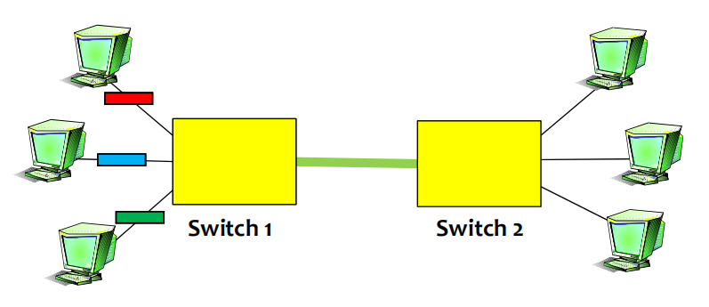

### 调制技术

来自信源的信号称为基带信号，调制技术可以增加模拟信号的频率或者改变变成数字信号的编码，以便于远距离传输。

## TCP/IP 四层架构

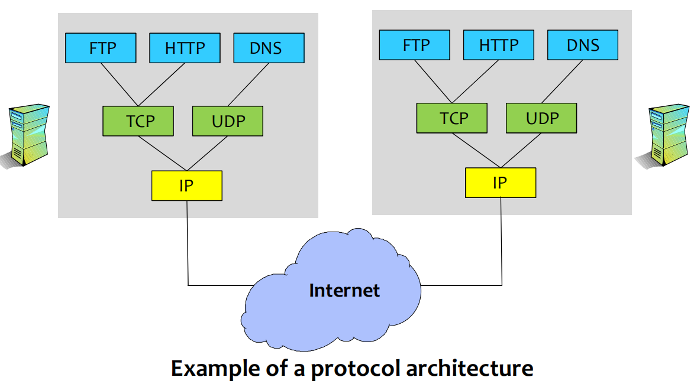

自上而下分别是：应用层Application、传输层Transport、网络层Network、链接层Link（数据链路层 + 物理层）。

发送时，下层收到上层的包并加上本层的header（数据链路层还要加上一个尾部），然后继续向下传。而在接收端则是不断向上拆包。

网络层使用的IP协议是不可靠的。运输层的TCP协议在不可靠的IP协议提供的服务之上建立的可靠的连接，FTP、HTTP等应用层协议都是用TCP协议来传输数据。UDP协议是不可靠的，无连接的，所以响应的速度比较快，DNS服务使用UDP协议。

### 网络字节序

TCP/IP协议规定了数据采用大端字节序，而x86都是小端机，也就是说网络字写序和主机字节序不一样，所以PC在网络通信的时候需要转换。C语言提供了htons()、ntohs()、htonl()、ntohl()等方法方便我们转换，需要引入头文件 <arpa/inet.h>。ntohs 是 network to host long的简写。

## OSI 参考模型

分成7层：

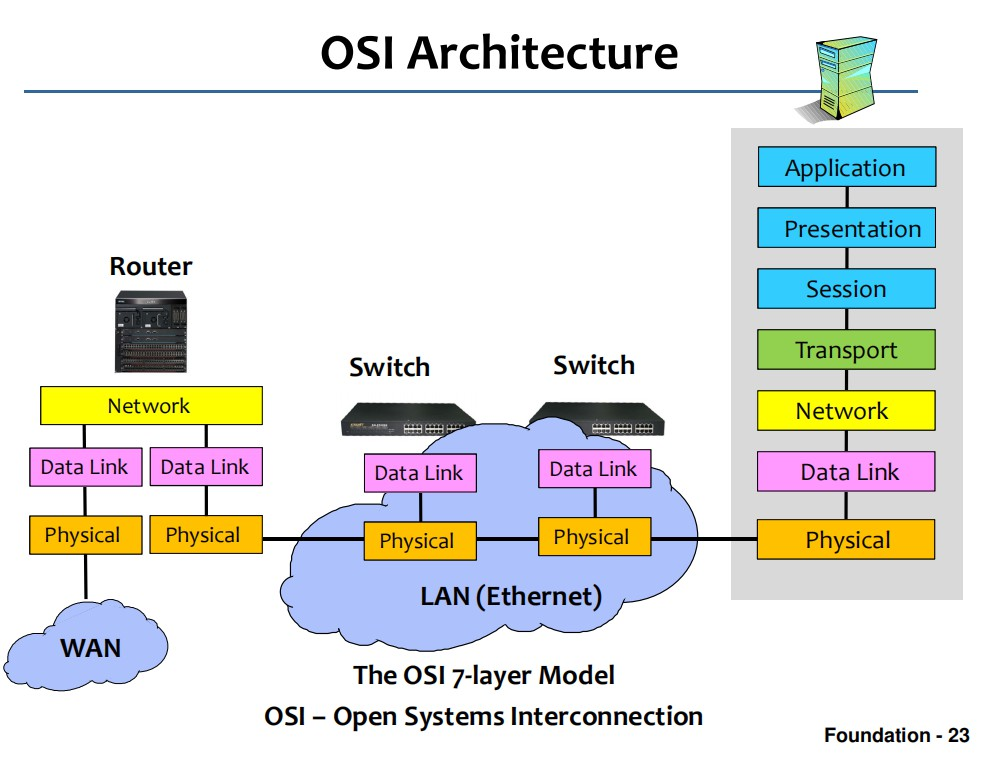

交换机和路由器的区别是交换机是交换机是第二层的设备，而路由器是第3层的设备。所以交换机是不看IP的，只看网卡地址，一般用于内网。而路由器可以查看IP，用于网络之间的通信。集线器是一层设备，和网线一样，非常傻，只能把收到的数据广播出去。

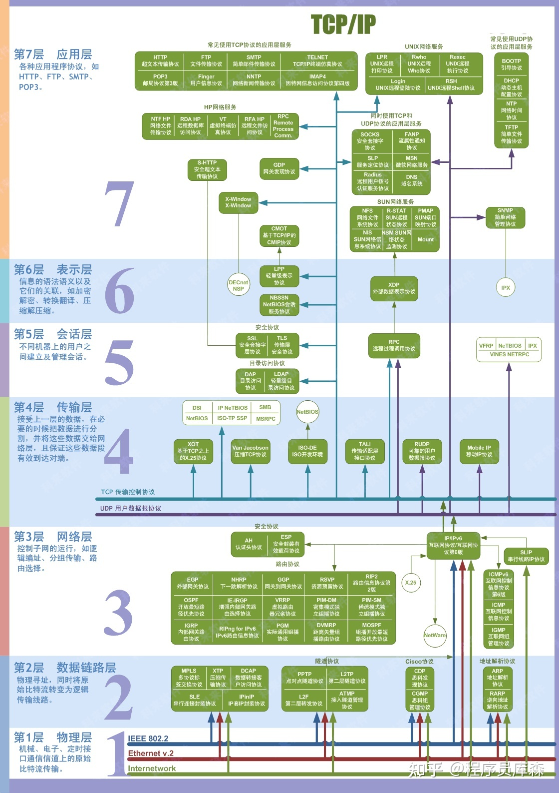

## 数据链路层（和物理层合称链接层Link）

数据链路层的传送的单位是一个Frame，会加上头尾，作用是将帧传送给直接相连的主机。

数据链路层可以根据信道可以分为广播信道和点对点信道。

广播信道最常见的是以太网，以太网的帧会在header加上MAC地址，tailer加上差错检测的bit。广播信道的数据链路层协议统称为MAC协议(Media Access Control Protocol)，主要包括以太网使用的CSMA/CD协议和Wireless LAN使用的CSMA/CA协议。

点对点信道最常用的数据链路层是PPP协议。因为是点对点的，所以PPP协议的帧不需要MAC地址。

我们常说的Ethernet、WLAN、5G等都是具体的链接层技术。

### PPP

ADSL电话拨号上网使用的就是PPP协议。

###  Ethernet

最流行的CSMA/CD协议采用了下面的措施：

1. 无连接。对传送的数据帧不进行编号，也不要求对方发回确认。当检测到差错时，直接丢弃差错帧，其他什么都不做。至于差错帧是否重传交给高层决定，如果是TCP协议，就由TCP协议来检测是否丢失数据并重传。
2. 碰撞检测。早期Ethernet使用总线型网络，总线型网络都是多点接入（multiple access），如果一条总线上有主机在发送数据，其他主机同时发送数据就会产生冲突。以太网数据链路层采用了CSMA/CD协议，每个主机在发送前都要检测信道，只有当信道空闲（idle）时才能发送。现在以太网都是星型结构，主机连接到交换机上，交换机彼此相连，不会发生冲突了，但是还是继续使用CSMA/CD协议。
3. 采用曼彻斯特编码。如果我们使用高电位代表1，低电位代表0，那么当出现连续的高电位就分不清楚到底有几个比特1了，这就是比特不同步。经常出现的问题就是发送bit的速度和接受bit的速度不一样。曼彻斯特编码解决了这个问题，他把一个码元再次分成两个间隔，如果从低电压变为高电压就代表码元1，反之为0。

以太网帧的结构：

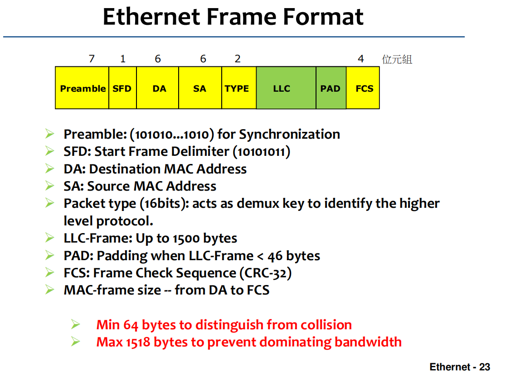

Preamble用来同步接受和发送bit的速率，SFD标记数据的开始，LLC就是传送的数据，最少46个字节，不足就用PAD补足。FCS是数据计算出来的校验值，类似MD5，用来判断传送的数据是否出错。以太网是不可靠的协议，如果帧出错了就直接丢弃，不会重传。

DA代表目的地的网卡地址。以太网传送的方式都是广播，其他主机会解析DA，如果和自己的不一样就不接收。而嗅探的原理就是无视DA，接受局域网中所有的数据。如果DA的bit都是1，就是一个 broadcast address，代表局域网中所有主机都可以接受数据。如果DA的第一个bit是1，就是一个群播地址（multicast address），这个群中的所有主机都可以接收数据。

MAC地址绑定在网卡上（不是主机），长六个字节，字节之间使用冒号隔开。不同公司生产的网卡前缀也不一样，比如 `8:0:20:e4:b1:2`就是一个AMD的网卡，AMD网卡的前三个字节都是一样的。ipconfig/all 可以查看本机的网卡地址，这台电脑有两块Realtek网卡，一块虚拟机的以太网网卡，一块因特尔的无线网卡。

###  Wireless LAN

无线局域网的中心设备叫做接入点（AP、Access Point），或者叫做无线路由器，他负责中继计算机之间的包。无线局域网的一个标准成为IEEE 802.11，俗称WiFi。

## 网络层

网络层很特殊，其上只有一个协议：Internet Protocol，俗称IP协议。我们现在使用的因特网的名字就是来源于IP协议。

IP协议发送的包叫做datagram，是无连接的，IP协议会尽力传送数据包到另一端，但是不能保证正确。是否出现差错，需要依赖TCP协议来确定。

IP的不可靠体现在以下情况：

1. 路由器阻塞时会丢包，而IP不会重传
2. 数据包可能被复制，IP无法确定
3. 每个数据包所走的路径不同，到达的顺序会乱
4. 路由器的转发表错误，导致数据包被发送到了错误的目的地
5. 数据包的bit错误

在通信中，有一个端到端原则：**如果能在端上实现的，就要在端上实现**。所以IP协议设计的非常简单，不提供可靠的服务，因为可靠的服务可以在主机上实现。

IP不会自动重传可以确保及时性，对于直播这样的应用很重要。

`tracert www.baidu.com`可以追踪经过的IP地址。

### IP协议细节

1. 阻止数据包循环：数据包从一个路由器到下一个路由器称为一跳(a hop)。为了防止数据包循环，IP协议会添加生存时间或TTL字段
   
2. 将大packet分割发送：IP会根据数据链路层的要求分割packet

3. IP数据包的首部有一个校验和：防止发错目的地
   
4. 允许添加新的首部字段

### IPV4

Protocol ID告知使用的传输协议。如果为6，代表了Data里有一个TCP segment。目前有140多种ID。

version 代表使用的版本，可以选择IPV4和IPV6。

TTL从128开始，每一跳就减一，如果减到0就丢掉数据包。

Flags，Fragment Offset帮助路由器将数据包分片成更小的（如果需要的）自包含数据包。

Checksum是整个header的校验和。

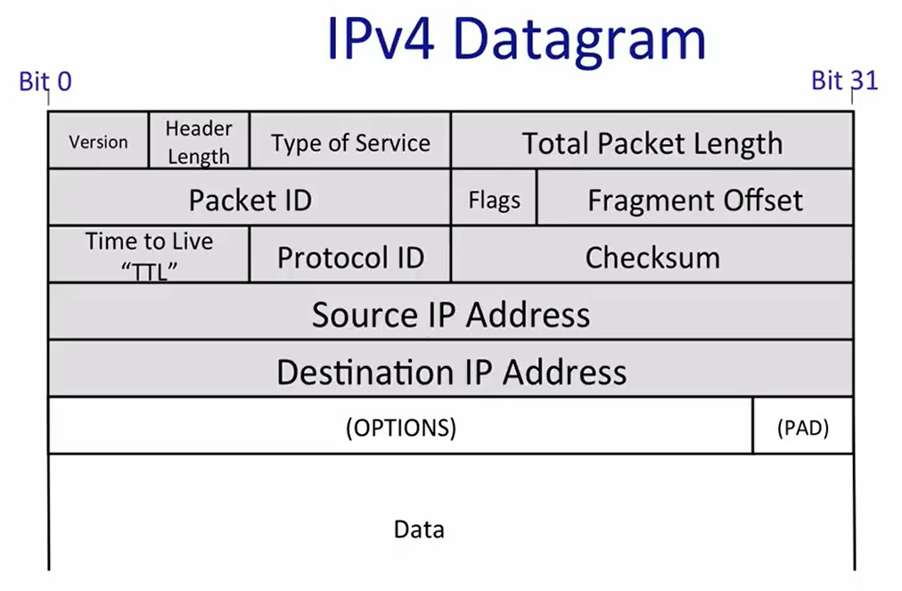

### 寻址

设置IPV4网络的时候需要设置网络掩码（最常见的是255.255.255.0）、网关地址（最常见的是192.168.0.1）和本地地址（192.168.1.X）。这样在寻址的时候会根据网络掩码判断源地址和目标地址是否在同一网络，如果不在就需要通过网关。

如果要通过网关，网关就会使用网络层的地址（最常见的是172.X.X.X）。

其实在数据链路层使用的是MAC地址，ARP协议负责将IP地址解析成MAC地址。
=======
IP协议标头前5行是必备的，所以header最少20个字节。

### IP地址

IPV4地址是32位，分成4段。

有一种特殊的地址叫做network mask或网络掩码，网络掩码告诉哪些IP地址是本地的，哪些需要通过路由器。比如网络掩码`255.255.255.0`，意味着如果两台PC的IP地址前24个bits都相同，那么他们位于同一个网络中，彼此之间的访问不用通过路由器转发到其他路由器。如果网络掩码是`255.255.252.0`意味着IP地址前22个bits相同的PC处于同一个网络中。

相同网络中的主机使用自己的IP地址和网络掩码作与运算，结果一定相同。

要想定位到一台主机需要两个地址：网络地址 + 主机地址。根据两种地址的长度又分成3中情况：

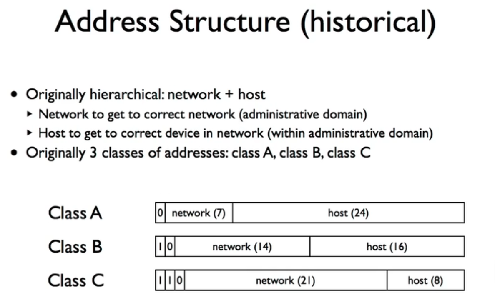

## 运输层

`netstat -nb`可以查看所有的连接。

## 应用层

### Http协议

http本身是一个会话层协议，但是最常见的是和html一起使用。

### Skype

skype协议采用了一些方法让在NAT之后的两台主机也可以通信。

如果一台主机在NAT（网络地址转换器）之后，它可以向其他主机发起连接，但是其他主机不能向他发起连接。

## 虚拟机网络设置

安装虚拟机之后，会有几种网卡可以选择：

1. VMnet0：桥接模式，会为虚拟机分配一个IP地址，使其和宿主机处于一个网络中。
2. VMnet1-VMnet7：交换机模式，如果有两台虚拟机使用相同的网卡，那么他们处于相同网络中，可以互相通信。
3. VMnet8：NAT模式，宿主机会作为虚拟机的网关。

首先在虚拟网络编辑器中设置好几种网卡，主要是为了VMnet1-VMnet8设置子网IP。然后的虚拟机的设置中选择要使用的网卡。为了安全最常用的是NAT模式。

### NAT设置

1. 设置VMnet8网卡的子网IP 和 网关的IP：
   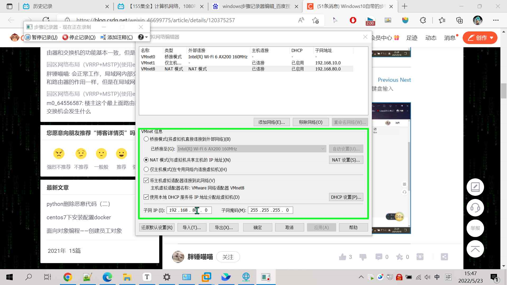
   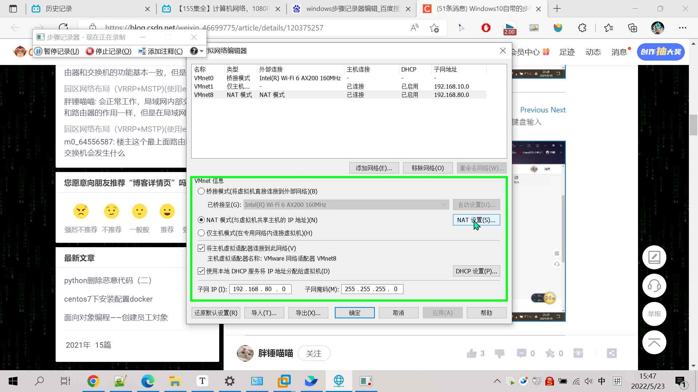

2. 设置完成之后可以查看VMnet8的状态，可以发现设置生效了：
   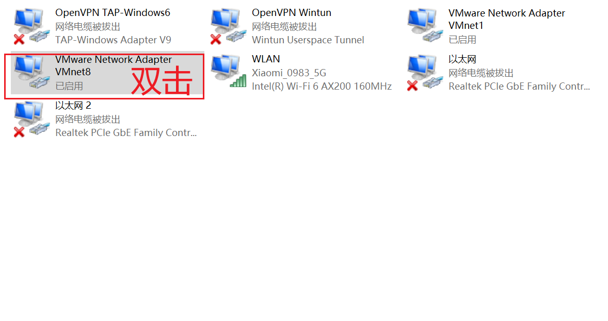

   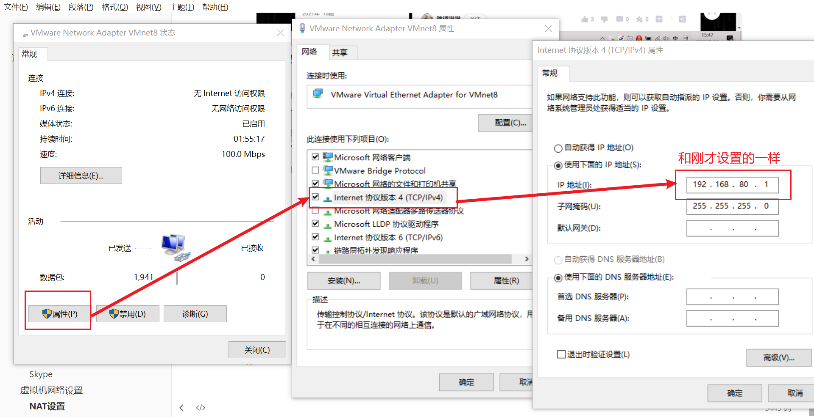

3. 设置虚拟机使用NAT模式上网：
   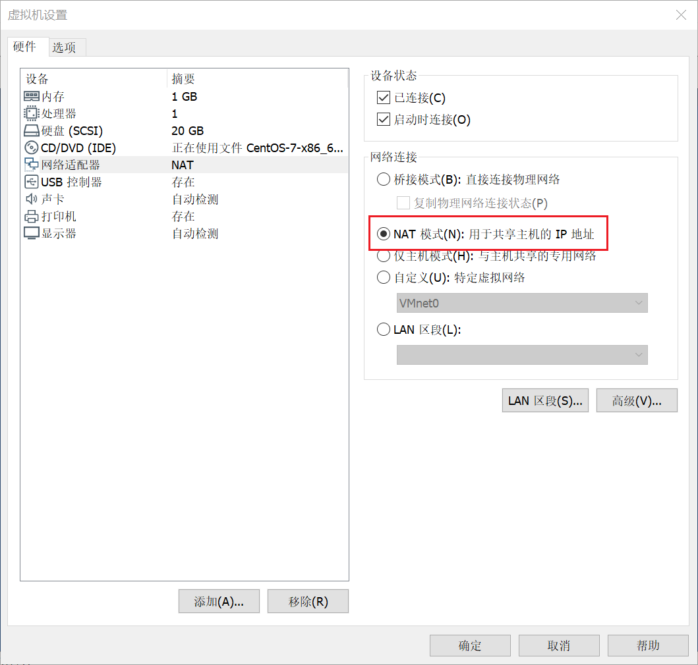

4. 设置虚拟机的静态IP：为什么要设置静态IP ? 当安装完虚拟机之后，默认的ip分配方案为DHCP,每一次开机时的ip都是有可能不同的,这样就会导致每次远程连接都需要查看ip地址.设置为静态ip后, 当前虚拟机的ip地址就不会在发生改变,, 后期配置集群相关的内容时首要的要求就是ip必须为静态, 否则由于无法得到一个准确的ip地址,集群也是构建不了的

[虚拟机网络配置 - 知乎 (zhihu.com)](https://zhuanlan.zhihu.com/p/395245616)

