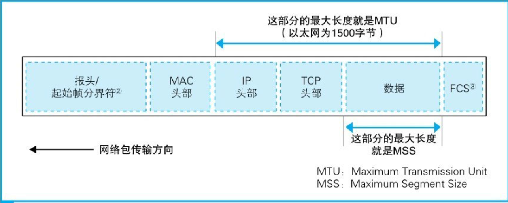
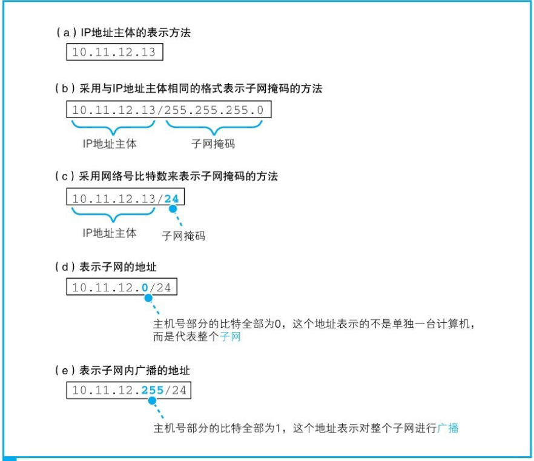
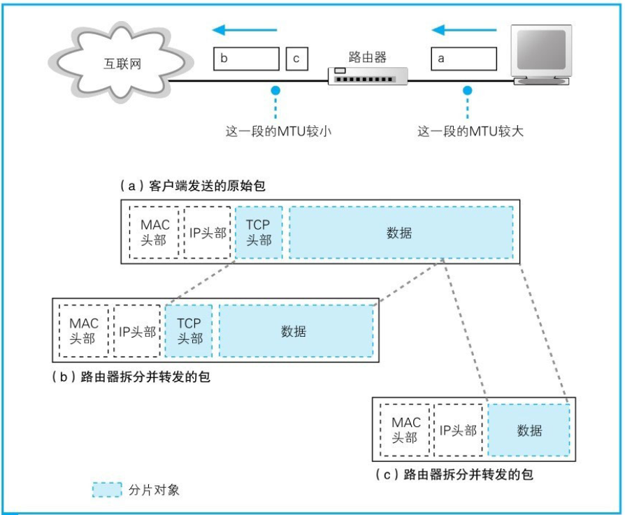
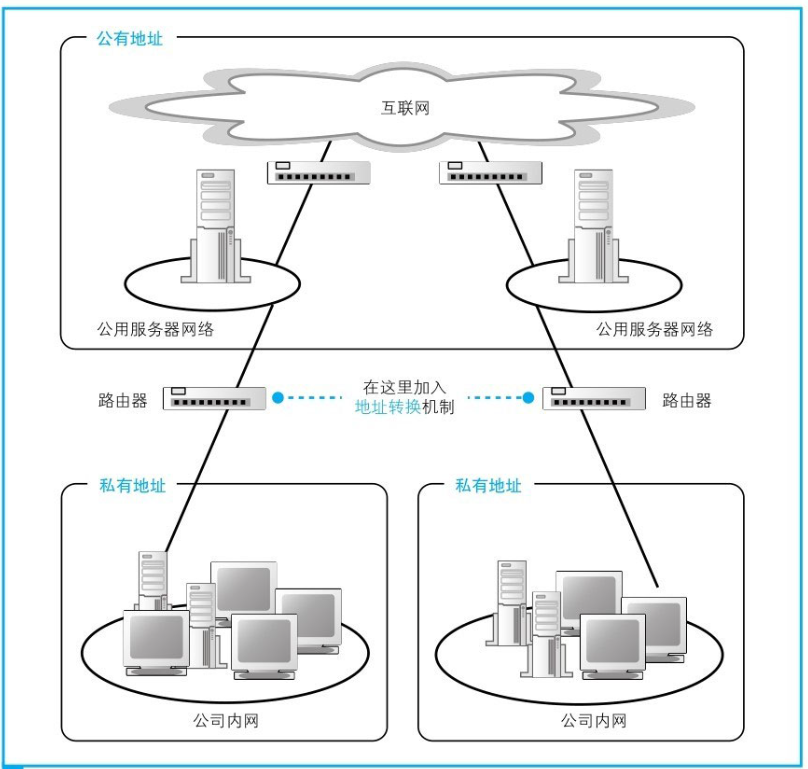
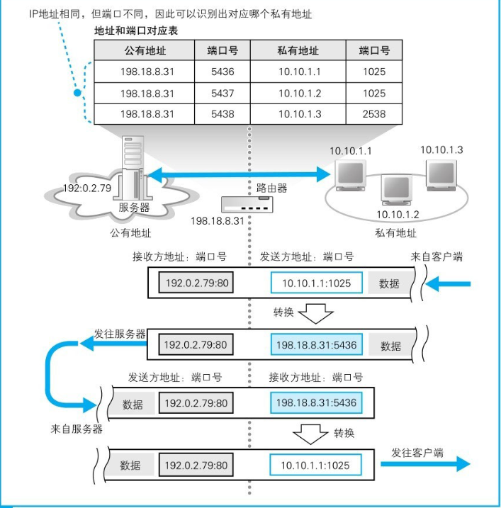
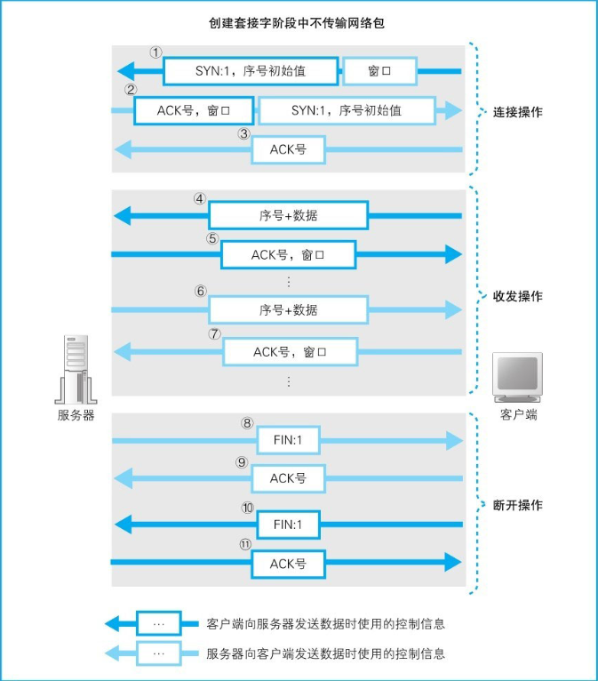
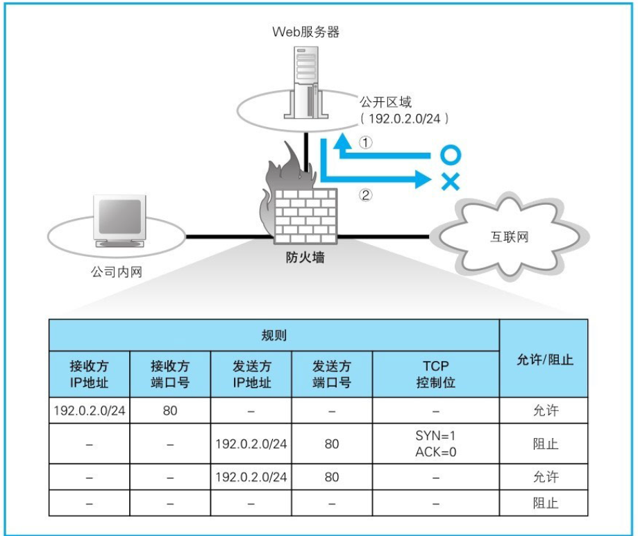

# 计算机网络

## 如何接入网络

互联网的入口线路称为接入网。一般来说，我们可以用电话线、ISDN、ADSL、有线电视、光线、专线等多种通信线路来接入互联网，这些通信线路统称为接入网。接入网连接到签约的网络运营商，并接入被称为接入点（Point of Presence, PoP）的设备。

接入点的实体是一台专为运营商设计的路由器，我们可以把它理解为离你家最近的邮局。从各个邮筒中收集来的信件会在邮局进行分拣，然后被送往全国甚至全世界，互联网也是一样，网络包首先通过接入网被发送到接入点，然后再从这里被发送到全国甚至全世界。接入点的后面就是互联网的骨干部分了。

区分点对点（point to point）和端对端（end to end）。点对点是物理上的两台主机直接相连，端对端是逻辑上的两台主机相连，将途径的路由器等转发设备当成虚拟的一条线路。TCP协议建立的就是端对端的可靠连接。

通过url访问一个网络，需要17次通信：

1. 6次通信用于获取ip地址
2. 3次通信用户建立tcp连接
3. http请求需要4次
4. 结束tcp连接需要4次

## 基本概念

带宽：网卡、网线的最大传输速度，单位是 bit/s

信道带宽：信号能够通过的频率范围。

速率：网络传输的实际速度，单位同带宽

时延：发送时延、传播时延、处理时延、排队时延。网络的带宽和数据包的大小决定了发送时延，而线路的材料性质和线路的长度决定了传播时延。`ping www.baidu.com -l 100`，ping的时候可以指定字节数

## 传输模式

1. simplex 单工
2. half-duplex 半双工
3. full-duplex 全双工

## 网络拓补

1. Mesh topology：网状拓补
2. star topology：星形拓补
3. bus topology
4. ring topology：环形拓补
5. hybrid topology：混合拓补

## 网络设备

网络接口卡（Network Interface card，NIC）：计算机网络中的每个系统或计算机都必须有一个称为网络接口卡（NIC）的卡。NIC的主要目的是格式化数据、发送和接收数据。

集线器（hub）：集线器将网络中的所有计算机相互连接。来自客户端计算机的任何请求首先由集线器接收，然后集线器通过网络广播该请求。可以把集线器简单的看成网线。

交换机（switch）：交换机类似于集线器，但它不会广播传入的请求，而是根据传入请求的MAC地址将请求传输到正确的网卡。

路由器（router）：路由器将多个计算机网络连接在一起。例如，假设一家公司在局域网上运行100台计算机，另一家公司运行另一个由150台计算机组成的局域网。这两个局域网可以通过路由器相互连接。

## 物理层

物理层规定了具体的传输介质的选择，电压的范围，信号的同步等。

物理层的传输一般都是串行，又分成同步串行传输和异步串行传输。同步串行传输有时钟线，传输的速率是恒定的。异步串行传输依靠起始位和停止位来同步。

### 信道复用

复用技术可以让多个用户使用同一条线路进行通信。复用技术需要解决干线起点如何共用，干线终点如何分离的问题。

1. 频分多路复用 FDM （Frequency Division  Multiplexing）：信道的频谱被分成若干段（子带）， 每个用户占据一段来传输自己的信号。相邻用户使用的频段（子带）之间，通常留有一定的 带宽，以免混淆，这个频段被称作保护带。一种更好地利用带宽的FDM叫正交频分多路复用 OFDM。OFDM没有了保护带，且子带之间相互重叠；同样的干线可以承载更多的用户。OFDM 已被广泛用于802.11、有线电视网络等。
2. 波分多路复用 WDM (Wavelength Division Multiplexing)：按照不同的波长，干线分成了若干份，承载了不同用户的光信号。
3. 时分多路复用TDM（Time  Division Multiplexing）：将时间划分为非常短的时间片， 每个用户周期性地在自己的时间片内使用整个带宽。广泛用于 电话系统和蜂窝系统系统。
4. 码分多路复用CDMA （Code Division Multiple Access）：广泛用于移动网络。

### 统计复用 Statistical Multiplexing

Data is transmitted based on demand of each flow. 流量大的连接多占用带宽，流量小的少占用带宽。有下面几种带宽分配的规则：

1. FIFO：只有一个队列，先进先出。
2. Round-Robin：每个主机都有自己的一个队列，第一个队列先发出一个包，然后第二个队列也发出一个包，以此类推，不断循环。相对FIFO，兼顾了公平。
3. Priorities (Quality-of-Service (QoS))：不同的主机有不同的权限。


### 调制技术

来自信源的信号称为基带信号，调制技术可以增加模拟信号的频率或者改变变成数字信号的编码，以便于远距离传输。

## TCP/IP 四层架构


自上而下分别是：应用层Application、传输层Transport、网络层Network、链接层Link（数据链路层 + 物理层）。

发送时，下层收到上层的包并加上本层的header（数据链路层还要加上一个尾部），然后继续向下传。而在接收端则是不断向上拆包。

网络层使用的IP协议是不可靠的。运输层的TCP协议在不可靠的IP协议提供的服务之上建立的可靠的连接，FTP、HTTP等应用层协议都是用TCP协议来传输数据。UDP协议是不可靠的，无连接的，所以响应的速度比较快，DNS服务使用UDP协议。

### 网络字节序

TCP/IP协议规定了数据采用大端字节序，而x86都是小端机，也就是说网络字写序和主机字节序不一样，所以PC在网络通信的时候需要转换。C语言提供了htons()、ntohs()、htonl()、ntohl()等方法方便我们转换，需要引入头文件 <arpa/inet.h>。ntohs 是 network to host long的简写。

## OSI 参考模型

分成7层：


交换机和路由器的区别是交换机是交换机是第二层的设备，而路由器是第3层的设备。所以交换机是不看IP的，只看网卡地址，一般用于内网。而路由器可以查看IP，用于网络之间的通信。集线器是一层设备，和网线一样，非常傻，只能把收到的数据广播出去。


## 数据链路层（和物理层合称链接层Link）

数据链路层的传送的单位是一个Frame，会加上头尾，作用是将帧传送给直接相连的主机。我们常说的Ethernet、WLAN、5G等都是具体的链接层技术。

### 广播信道和点对点信道

数据链路层可以根据信道可以分为广播信道和点对点信道。

广播信道最常见的是以太网，以太网的帧会在header加上MAC地址，tailer加上差错检测的bit。广播信道的数据链路层协议统称为MAC协议(Media Access Control Protocol)，主要包括以太网使用的CSMA/CD协议和Wireless LAN使用的CSMA/CA协议。

点对点信道最常用的数据链路层是PPP协议。因为是点对点的，所以PPP协议的帧不需要MAC地址。

### 同步传输和异步传输

同步传输以帧为单位传输，在起始位之前会传输同步信号，就是间隔的0、1。异步传输则是一个字节一个字节传输，每次传完一个字节就空闲一段时间。

### PPP

ADSL电话拨号上网使用的就是PPP协议。

###  Ethernet

采用CSMA/CD协议的局域网被叫做以太网。以太网经历了数次变迁，但其基本的3个性质至今仍未改变，即将包发送到MAC头部的接收方MAC地址代表的目的地，用发送方MAC地址识别发送方，用以太类型识别包的内容。因此，大家可以认为具备这3个性质的网络就是以太网

CSMA/CD协议采用了下面的措施：

1. 无连接。对传送的数据帧不进行编号，也不要求对方发回确认。当检测到差错时，直接丢弃差错帧，其他什么都不做。至于差错帧是否重传交给高层决定，如果是TCP协议，就由TCP协议来检测是否丢失数据并重传。
2. 碰撞检测。早期Ethernet使用总线型网络，总线型网络都是多点接入（multiple access），如果一条总线上有主机在发送数据，其他主机同时发送数据就会产生冲突。以太网数据链路层采用了CSMA/CD协议，每个主机在发送前都要检测信道，只有当信道空闲（idle）时才能发送。现在以太网都是星型结构，主机连接到交换机上，交换机彼此相连，不会发生冲突了，但是还是继续使用CSMA/CD协议。
3. 采用曼彻斯特编码。如果我们使用高电位代表1，低电位代表0，那么当出现连续的高电位就分不清楚到底有几个比特1了，这就是比特不同步。经常出现的问题就是发送bit的速度和接受bit的速度不一样。曼彻斯特编码解决了这个问题，他把一个码元再次分成两个间隔，如果从低电压变为高电压就代表码元1，反之为0。

以太网帧的结构：


Preamble用来同步接受和发送bit的速率，SFD标记数据的开始，LLC就是传送的数据，最少46个字节，不足就用PAD补足。FCS是数据计算出来的校验值，类似MD5，用来判断传送的数据是否出错。以太网是不可靠的协议，如果帧出错了就直接丢弃，不会重传。

DA代表目的地的网卡地址。以太网传送的方式都是广播，其他主机会解析DA，如果和自己的不一样就不接收。而嗅探的原理就是无视DA，接受局域网中所有的数据。如果DA的bit都是1，就是一个 broadcast address，代表局域网中所有主机都可以接受数据。如果DA的第一个bit是1，就是一个群播地址（multicast address），这个群中的所有主机都可以接收数据。

MAC地址绑定在网卡上（不是主机），长六个字节，字节之间使用冒号隔开。不同公司生产的网卡前缀也不一样，比如 `8:0:20:e4:b1:2`就是一个AMD的网卡，AMD网卡的前三个字节都是一样的。ipconfig/all 可以查看本机的网卡地址。

在以太网中，当没有数据在传输时，网络中会填充一种被称为连接脉冲的脉冲信号。在没有数据信号时就填充连接脉冲，这使得网络中一直都有一定的信号流过，从而能够检测对方是否在正常工作，或者说网线有没有正常连接。以太网设备的网线接口周围有一个绿色的LED指示灯，它表示是否检测到正常的脉冲信号。

### MTU

MTU：一个网络包的最大长度，以太网中一般为1500字节。

MSS：去掉首部之后，一个网络包能够容纳的TCP数据的最大长度。



###  Wireless LAN

无线局域网的中心设备叫做接入点（AP、Access Point），或者叫做无线路由器，他负责中继计算机之间的包。无线局域网的一个标准成为IEEE 802.11，俗称WiFi。

### 集线器和路由器

发送信号的操作分为两种，一种是使用集线器的半双工模式，另一种是使用交换机的全双工模式。

在半双工模式中，为了避免信号碰撞，首先要判断网线中是否存在其他设备发送的信号。如果有，则需要等待该信号传输完毕，因为如果在有信号时再发送一组信号，两组信号就会发生碰撞。当之前的信号传输完毕，或者本来就没有信号在传输的情况下，我们就可以开始发送信号了。

在使用集线器的半双工模式以太网中，一台设备发送的信号会到达连接在集线器上的所有设备。这意味着无论是不是发给自己的信号都会通过接收线路传进来，因此接收操作的第一步就是不管三七二十一把这些信号全都收进来再说。

可以简单的认为集线器相当于网线，交换机相当于一个帧转发器。

## 网络层

网络层很特殊，其上只有一个协议：Internet Protocol，俗称IP协议。我们现在使用的因特网的名字就是来源于IP协议。

IP协议发送的包叫做datagram，是无连接的，IP协议会尽力传送数据包到另一端，但是不能保证正确。是否出现差错，需要依赖TCP协议来确定。

IP的不可靠体现在以下情况：

1. 路由器阻塞时会丢包，而IP不会重传
2. 数据包可能被复制，IP无法确定
3. 每个数据包所走的路径不同，到达的顺序会乱
4. 路由器的转发表错误，导致数据包被发送到了错误的目的地
5. 数据包的bit错误

在通信中，有一个端到端原则：**如果能在端上实现的，就要在端上实现**。所以IP协议设计的非常简单，不提供可靠的服务，因为可靠的服务可以在主机上实现。

IP不会自动重传可以确保及时性，对于直播这样的应用很重要。

`tracert www.baidu.com`可以追踪经过的IP地址。原理很简单，就是先发一个TTL=1的包，得到第一个路由器的地址，然后再发TTL=2的包得到第二个路由器的地址，以此类推。pathping命令也能做到，而且功能更强大。

`route print` 命令可以打印路由表。

### IP协议细节

1. 阻止数据包循环：数据包从一个路由器到下一个路由器称为一跳(a hop)。为了防止数据包循环，IP协议会添加生存时间或TTL字段
2. 将大packet分割发送：IP会根据数据链路层的要求分割packet
3. IP数据包的首部有一个校验和：防止发错目的地
4. 允许添加新的首部字段
5. IP是分配给网卡的，不是分配给主机的

### 包格式

Protocol ID告知使用的传输协议。如果为6，代表了Data里有一个TCP segment。目前有140多种ID。

Type of Service可以在路由器里配置（QoS设置），这样就可以为不同的应用指定优先级，对于语音通话等服务有保证。

version 代表使用的版本，可以选择IPV4和IPV6。

TTL从128（windows默认的，Linux默认64）开始，每一跳就减一，如果减到0就丢掉数据包。

Flags，Fragment Offset帮助路由器将数据包分片成更小的（如果需要的）自包含数据包。因为以太网的帧最大1500字节，网络层的数据包最大6万字节，所以网络层的数据包太大就需要进行分片（现在的网络层一般也会控制数据包不超过1500字节）。

Checksum是整个header的校验和。


### IP地址

IPV4地址是32位，分成4段。IP地址由两部分组成：网络地址和主机地址。在IP地址的规则中，网络号和主机号连起来总共是32比特，但这两部分的具体结构是不固定的。在组建网络时，用户可以自行决定它们之间的分配关系，因此，我们还需要另外的附加信息来表示IP地址的内部结构。

设置IPV4网络的时候需要设置网络掩码（最常见的是255.255.255.0）、网关地址（最常见的是192.168.0.1）和本地地址（192.168.1.X）。这样在寻址的时候会根据网络掩码判断源地址和目标地址是否在同一网段，如果不在就需要通过网关。

网络掩码告诉哪些IP地址是本地的，哪些需要通过路由器。比如网络掩码`255.255.255.0`，意味着如果两台PC的IP地址前24个bits都相同，那么他们位于同一个子网，彼此之间的访问不用通过路由器转发到其他路由器。如果网络掩码是`255.255.252.0`意味着IP地址前22个bits相同的PC处于同一个子中。

相同网络中的主机使用自己的IP地址和网络掩码作与运算，结果一定相同。



顺带一提，主机号部分的比特全部为0或者全部为1时代表两种特殊的含义。主机号部分全部为0代表整个子网而不是子网中的某台设备。此外，主机号部分全部为1代表向子网上所有设备发送包，即广播。

如果要通过网关，帧里的目标地址就使用网关的MAC地址，这表示帧被发送到网关。到了网关，网关会查找转发表，把查到的MAC地址封装到帧的目标地址，然后将帧发送到下一跳。

如果在相同的网段，就使用ARP协议发广播将IP地址解析成MAC地址，把MAC地址封装到帧的目标地址，然后发送数据。

IP协议标头前5行是必备的，所以header最少20个字节。


注意：

1. 主机地址不能全是0，因为全是0代表子网段

2. 主机地址的比特不能全是1，全是1代表广播。同样的，广播的MAC地址是`ff:ff:ff:ff:ff:ff`

3. `127.0.0.1`是本地环回地址，代表本机地址。所以没有127开头的网段

4. 如果路由器的DHCP服务关闭了，主机没有被分配地址，windows会默认分配一个`169.254.x.x`的临时地址

5. 如果IP地址发生了冲突，ipconfig会显示`0.0.0.0`

6. 以下地址用于私网：

   ```
   A类：10.0.0.0/8 #子网掩码的简化表示，因为255.0.0.0有8个1
   B类：172.16.0.0 255.255.0.0 ~ 172.31.0.0 255.255.0.0
   C类：192.168.0.0 255.255.255.0 ~ 192.168.255.0 255.255.255.0
   
   私网上的主机访问外网的时候，路由器会使用NAT技术将内网地址转换成外网地址（IP和端口都会被替换）。如果一个内网中有许多主机，他们通过NAT之后都会有相同的公网IP，没办法区分，也就是说IP地址的定位不精确。
   ```

### ARP协议

当不知道MAC地址的时候，主机可以通过ARP协议发送广播，获取特定IP机器的MAC地址。

```
Destination: ff:ff:ff:ff:ff:ff //这样所有的机器都可以接收广播包
data: who has 192.168.1.123 tell 192.168.1.10
```

交换机运行在链路层，所以不知道IP地址，只知道MAC地址。所以才需要通过ARP协议将IP地址变成MAC地址。

通过交换机连接在一起的机器组成了一个广播域，这个域中的任何一台机器发送广播都会被其他机器收到。交换机和交换机之间通过路由器连接，路由器起到了隔绝不同广播域的作用。

### 路由器

路由器的各个端口都具有MAC地址和IP地址。通过路由器转发的网络包，其接收方MAC地址就是路由器端口的MAC地址。

转发的包长度超过了输出端口能传输的最大长度，就无法直接发送这个包了。遇到这种情况，可以使用IP协议中定义的分片功能对包进行拆分，缩短每个包的长度。需要注意的是，这里说的分片和TCP对数据进行拆分的机制是不同的。TCP拆分数据的操作是在将数据装到包里之前进行的，换句话说，拆分好的一个数据块正好装进一个包里。从IP分片的角度来看，这样一个包其实是一个未拆分的整体，也就是说，分片是对一个完整的包再进行拆分的过程。



路由器还有一个重要的作用是地址转换。公司内网分成两个部分，一部分是对互联网开放的服务器，另一部分是公司内部设备。其中对互联网开放的部分分配公有地址，可以和互联网直接进行通信，这一部分和之前介绍的内容是一样的。相对地，内网部分则分配私有地址，内网中的设备不能和互联网直接收发网络包，而是通过一种特别的机制进行连接，这个机制就叫地址转换。



地址转换的基本原理是在转发网络包时对IP头部中的IP地址和端口号进行改写。

首先，TCP连接操作的第一个包被转发到互联网时，会像图3.18这样，将发送方IP地址从私有地址改写成公有地址。这里使用的公有地址是地址转换设备[插图]的互联网接入端口的地址。与此同时，端口号也需要进行改写，地址转换设备会随机选择一个空闲的端口。然后，改写前的私有地址和端口号，以及改写后的公有地址和端口号，会作为一组相对应的记录保存在地址转换设备内部的一张表中。



对于从公司内网访问互联网的包，即便其发送方私有地址和端口号没有保存在对应表中也是可以正常转发的，因为用来改写的公有地址就是地址转换设备自身的地址，而端口号只要随便选一个空闲的端口就可以了，这些都可以由地址转换设备自行判断。然而，对于从互联网访问公司内网的包，如果在对应表中没有记录就无法正常转发。因为如果对应表中没有记录，就意味着地址转换设备无法判断公有地址与私有地址之间的对应关系。换个角度来看，这意味着对于没有在访问互联网的内网设备，是无法从互联网向其发送网络包的。而且即便是正在访问的设备，也只能向和互联网通信中使用的那个端口发送网络包，无法向其他端口发送包。也就是说，除非公司主动允许，否则是无法从互联网向公司内网发送网络包的。这种机制具有防止非法入侵的效果。

不过，有时候我们希望能够从互联网访问公司内网，这需要进行一些设置才能实现。之所以无法从互联网访问内网，是因为对应表里没有相应的记录，那么我们只要事先手动添加这样的记录就可以了。一般来说，用于外网访问的服务器可以放在地址转换设备的外面并为它分配一个公有地址，也可以将服务器的私有地址手动添加到地址转换设备中，这样就可以从互联网访问到这台具有私有地址的服务器了。[内网穿透_百度百科 (baidu.com)](https://baike.baidu.com/item/内网穿透/8597835?fr=aladdin)

## 运输层

`netstat -nb`可以查看所有的连接。

从TCP协议的角度看，为了能够支持各种形态的应用，最好是在数据收发层面不需要区分客户端和服务器，而是能够以左右对称的方式自由发送数据。TCP也正是在这样的背景下设计出来的。

不过，TCP协议中还是存在一个无法做到左右对称的部分，那就是连接操作。连接这个操作是在有一方等待连接的情况下，另一方才能发起连接，如果双方同时发起连接是不行的，因为在对方没有等待连接的状态下，无法单方面进行连接。因此，只有这个部分必须区分发起连接和等待连接这两个不同的角色。从数据收发的角度来看，这就是客户端与服务器的区别，也就是说，发起连接的一方是客户端，等待连接的一方是服务器。

这个区别体现在如何调用Socket库上。

首先，客户端的数据收发需要经过下面4个阶段：

1. 创建套接字
2. 建立管道连接服务器端的套接字
3. 收发数据
4. 断开管道并删除套接字

相对地，服务器是将阶段改成了等待连接，具体如下：

1. 创建套接字
2. 将套接字设置为等待连接状态
3. 接受连接
4. 收发数据
5. 断开管道并删除套接字

HTTP默认使用80端口，所以web服务器一直开启着一个套接字，监听80端口。当收到连接请求时，会创建一个新的套接字，使用随机的端口，以后都使用这个新的套接字和客户端发送数据。而80端口就继续监听其他的连接请求。

和服务器的通信结束之后，用来通信的套接字也就不会再使用了，这时我们就可以删除这个套接字了。不过，套接字并不会立即被删除，而是会等待一段时间之后再被删除，这样是为了防止误操作。

数据收发操作的第一步是创建套接字。一般来说，服务器一方的应用程序在启动时就会创建好套接字并进入等待连接的状态。客户端则一般是在用户触发特定动作，需要访问服务器的时候创建套接字。在这个阶段，还没有开始传输网络包。

创建套接字之后，客户端会向服务器发起连接操作。首先，客户端会生成一个SYN为1的TCP包并发送给服务器。这个TCP包的头部还包含了客户端向服务器发送数据时使用的初始序号，以及服务器向客户端发送数据时需要用到的窗口大小。当这个包到达服务器之后，服务器会返回一个SYN为1的TCP包。这个包的头部中也包含了序号和窗口大小，此外还包含表示确认已收到包①的ACK号。当这个包到达客户端时，客户端会向服务器返回一个包含表示确认的ACK号的TCP包。到这里，连接操作就完成了，双方进入数据收发阶段。



服务器的响应消息发送完毕之后，数据收发操作就结束了，这时就会开始执行断开操作。以Web为例，服务器会先发起断开过程。在这个过程中，服务器先发送一个FIN为1的TCP包，然后客户端返回一个表示确认收到的ACK号。接下来，双方还会交换一组方向相反的FIN为1的TCP包和包含ACK号的TCP包。最后，在等待一段时间后，套接字会被删除。

## 应用层

### HTTP

http本身是一个会话层协议，但是最常见的是和html一起使用。

浏览器的第一步工作就是对URL进行解析。url由协议、域名和文件路径组成，格式为：`scheme：[``// [user：password @] host [：port]] [/] path [？查询] [#片段]`。这里的文件路径是虚拟的，和实际的目录结构不同。Web服务器内部会将实际的目录名和供外部访问的虚拟目录名进行关联。

因为每条HTTP请求消息中只能写1个URI，所以每次只能获取1个文件，如果需要获取多个文件，必须对每个文件单独发送1条请求。比如1个网页中包含3张图片，那么获取网页加上获取图片，一共需要向Web服务器发送4条请求。

HTTP1.0对于每个请求都需要建立TCP连接，效率非常低。而HTTP1.1可以复用TCP连接，设置keep alive 为true，就可以重复使用已经建立好的TCP连接了。

keep alive虽然解决了tcp复用的问题，但是并没有解决请求阻塞的问题。一种解决办法是可以将多个小图片合成一个大图并返回每个小图的坐标，以减少请求的次数。合并资源或资源分布，本质上是为了突破http1的串行化请求响应的限制，但是却增加了架构的复杂性，最好的办法是过渡到http2，从协议层面解决此问题。

### Skype

Skype协议采用了一些方法让在NAT之后的两台主机也可以通信。

如果一台主机在NAT（网络地址转换器）之后，它可以向其他主机发起连接，但是其他主机不能向他发起连接。

### DNS

`baidu.com`这是域名，需要在域名注册网站注册。`www`这是主机名，一个域名可以有多个主机名，比如：`www.baidu.com、blog.baidu.com`。通常看主机名就知道这个网站的作用了。

主机名+域名才是完整的地址，DNS需要完整的地址来解析IP。

一个域名可以有多个IP地址，DNS可以实现负载均衡。`nslookup` 命令可以查看域名的IP。下面的例子可以看出百度有两个IP地址。

```
> nslookup www.baidu.com
服务器:  www.a.shifen.com
Addresses:  110.242.68.4
          110.242.68.3
Aliases:  www.baidu.com
*** 没有 nslookup 可以使用的 internal type for both IPv4 and IPv6 Addresses (A+AAAA)记录
```

`ipconfig /displaydns`可以查看本机缓存的DNS结果

所有的DNS服务器有一个根服务器，然后每一级，像com、cn等都有专属的DNS服务器，整个互联网的DNS服务器组成了层级结构。

实际上dns服务器之间的查询方式有两种，一种是迭代查询，一种是递归查询。

迭代查询时每个dns服务器都在“踢皮球”，通信过程可以概括为：你去问那个谁谁谁吧，他应该知道。于是最近的dns服务器会不断找其他服务器发起查询，直到找到对应信息。

递归查询指的是每个dns服务器都会直接查询下一级服务器，通信过程可以概括为：你等等，我认识人可能知道，我马上去问来告诉你。于是最近的dns服务器在一次查询后会直接拿到逐级传递过来的信息。

有时候并不需要从最上级的根域开始查找，因为DNS服务器有一个缓存功能，可以记住之前查询过的域名。并且，当要查询的域名不存在时，“不存在”这一响应结果也会被缓存。这样，当下次查询这个不存在的域名时，也可以快速响应。这个缓存机制中有一点需要注意，那就是信息被缓存后，原本的注册信息可能会发生改变，这时缓存中的信息就有可能是不正确的。因此，DNS服务器中保存的信息都设置有一个有效期，当缓存中的信息超过有效期后，数据就会从缓存中删除。而且，在对查询进行响应时，DNS服务器也会告知客户端这一响应的结果是来自缓存中还是来自负责管理该域名的DNS服务器。

### 防火墙

防火墙既可以组织外网对内网的访问，也可以组织内网对外网的访问。防火墙最常见的实现方式是包过滤方式，如下图：



服务器可以设置成允许客户端发起连接并响应客户端请求，但是不允许主动连接客户端，只需要设置TCP控制位的规则即可。如果SYN=1说明是服务器主动发起请求，这种情况下防火墙阻止请求；否则说明是服务器响应客户端的请求，应该允许请求通过。

### 负载均衡

负载均衡可以通过在DNS中设置多个IP地址、设置统一的负载均衡器（nginx网关）、代码实现客户端负载均衡等几种方式实现。

负载均衡的主要作用在于分流，但是难点在于判断什么时候不分流。当操作跨多个页面时（跨域），则不考虑Web服务器的负载，而是必须将请求发送到同一台Web服务器上。要实现这一点，关键在于我们必须要判断一个操作是否跨了多个页面。HTTP的基本工作方式是在发送请求消息之前先建立TCP连接，当服务器发送响应消息后断开连接，下次访问Web服务器的时候，再重新建立TCP连接。因此，在Web服务器看来，每一次HTTP访问都是相互独立的，无法判断是否和之前的请求相关。

人们想出了一些方案来判断请求之间的相关性。例如，可以在发送表单数据时在里面加上用来表示关联的信息，或者是对HTTP规格进行扩展，在HTTP头部字段中加上用来判断相关性的信息。这样，负载均衡器就可以通过这些信息来作出判断，将一系列相关的请求发送到同一台Web服务器，对于不相关的请求则发送到负载较低的服务器了。

### 缓存服务器

缓存服务器可以部署在web服务器一侧，叫做反向代理；也可以部署在客户端一侧，叫做正向代理。

缓存服务器使用的代理机制最早就是放在客户端一侧的，这才是代理的原型，称为正向代理（forward proxy）。正向代理刚刚出现的时候，其目的之一就是缓存，这个目的和服务器端的缓存服务器相同。不过，当时的正向代理还有另外一个目的，那就是用来实现防火墙。由于代理在转发过程中可以查看请求的内容，所以可以根据内容判断是否允许访问。也就是说，通过代理可以禁止员工访问危险的网站，或者是与工作内容无关的网站。普通的包过滤方式的防火墙只能根据IP地址和端口号进行判断，因此无法实现这一目的。

布置在服务器一侧的代理就称为反向代理了。nginx就常作为反向代理，保存常用的静态资源。

还有一种透明代理，像客户端隐藏了真实的服务器，也像服务器隐藏了真实的客户端。这种透明代理一般放在接入网的入口处，对请求进行拦截，并缓存web服务器的响应报文。用户不会注意到透明代理的存在，这就是透明一词的来历。设置透明代理的目的是ISP为了节约核心网的流量费用。

### CDN

缓存服务器部署在服务器端还是客户端，其效果是有差别的。当缓存服务器放在服务器端时，可以减轻Web服务器的负载，但无法减少互联网中的流量。这一点上，将缓存服务器放在客户端更有效。互联网中会存在一些拥塞点，通过这些地方会比较花时间。如果在客户端部署缓存服务器，就可以不受或者少受这些拥塞点的影响，让网络流量更稳定，特别是当访问内容中含有大图片或视频时效果更明显。

不过，客户端的缓存服务器是归客户端网络运营管理者所有的，Web服务器的运营者无法控制它。比如，某网站的运营者觉得最近网站上增加了很多大容量的内容，因此想要增加缓存服务器的容量。如果缓存放在服务器端，那么网站运营者可以自己通过增加磁盘空间等方式来进行扩容，但对于放在客户端的缓存就无能为力了。进一步说，客户端有没有缓存服务器还不一定呢。

一些专门从事相关服务的厂商出现了，他们来部署缓存服务器，并租借给Web服务器运营者。这种服务称为内容分发服务。这些CDN的服务器位于ISP接入网中，非常靠近用户，等同于正向代理。

HTTP规格中定义了很多头部字段，其中有一个叫作Location的字段。当Web服务器数据转移到其他服务器时可以使用这个字段，它的意思是“您要访问的数据在另一台服务器上，请访问那台服务器吧。”这种将客户端访问引导到另一台Web服务器的操作称为重定向，通过这种方法也可以将访问目标分配到最近的缓存服务器。

## 虚拟机网络设置

安装虚拟机之后，会有几种网卡可以选择：

1. VMnet0：桥接模式，会为虚拟机分配一个IP地址，使其和宿主机处于一个网络中。
2. VMnet1-VMnet7：交换机模式，如果有两台虚拟机使用相同的网卡，那么他们处于相同网络中，可以互相通信。
3. VMnet8：NAT模式，宿主机会作为虚拟机的网关。

首先在虚拟网络编辑器中设置好几种网卡，主要是为了VMnet1-VMnet8设置子网IP。然后的虚拟机的设置中选择要使用的网卡。为了安全最常用的是NAT模式。

### NAT设置

1. 设置VMnet8网卡的子网IP 和 网关的IP：
   
   

2. 设置完成之后可以查看VMnet8的状态，可以发现设置生效了：
   

   

3. 设置虚拟机使用NAT模式上网：
   

4. 设置虚拟机的静态IP：为什么要设置静态IP ? 当安装完虚拟机之后，默认的ip分配方案为DHCP,每一次开机时的ip都是有可能不同的,这样就会导致每次远程连接都需要查看ip地址.设置为静态ip后, 当前虚拟机的ip地址就不会在发生改变,, 后期配置集群相关的内容时首要的要求就是ip必须为静态, 否则由于无法得到一个准确的ip地址,集群也是构建不了的

[虚拟机网络配置 - 知乎 (zhihu.com)](https://zhuanlan.zhihu.com/p/395245616)

